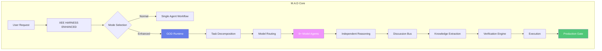

# Xee Harness Enhanced (XHE)

<p align="center">
  <strong>Xee Harness Enhanced</strong> — The Evolution of AI Agent Orchestration
</p>

<p align="center">
  
</p>

<p align="center">
  
  
  
  <a href="https://github.com/origin-labs-ai/xhe"></a>
</p>

---

## Overview

**Xee Harness Enhanced (XHE)** is a production-ready, enterprise-grade AI agent orchestration framework. This project is a **fork and significant enhancement** of the original **DSH/SeepSeek Harness**, reimagined with modern architecture, enhanced capabilities, and a focus on scalability.

### Also Known As

- **XeeCode** / **XCode** — Developer-friendly aliases
- **@origin-ai/cf** — Package registry identifier
- **XHE** — Concise abbreviation for "Xee Harness Enhanced"

### The Core Philosophy

> *"Instead of one developer working alone, imagine 8 specialists collaborating, debating, verifying, and producing the best possible code together."*

This is not just multi-model execution. This is **coordinated intelligence** through structured discussion, adversarial verification, and evidence-based decision making.

---

## 🚀 M.A.D (Multi-Agent Deployment) System

The **flagship feature** of XHE is the **M.A.D (Multi-Agent Deployment)** system — a revolutionary approach to orchestrating multiple AI agents in parallel, with intelligent task distribution, conflict resolution, and result aggregation.

### Architecture Overview



### Key Components

#### 👑 GOD Runtime
The central coordination layer that manages all aspects of multi-agent deployment:

- **State Manager** — Global state, objectives, tasks, context
- **Model Router** — Intelligent agent selection with adaptive routing
- **Scheduler** — Resource budgets, parallelism, rate limiting
- **Discussion Coordinator** — Manages shared discussion bus
- **Arbiter/Judge** — Tie-breaking, conflict resolution
- **Verification Engine** — Multi-layer verification system
- **Memory/Context Manager** — HOT/WARM/COLD memory fabric
- **Telemetry Manager** — Complete audit trail

#### 🤖 Multi-Model Mesh
Support for 8+ heterogeneous model instances:

```typescript
// Provider abstraction (from TRANSCRIPT)
Provider Account
├── Credential A → [Model X, Model Y, Model Z]
├── Credential B → [Model P, Model Q]
└── Same Model → Multiple Independent Instances
```

**Key Insight:** *8 configured models ≠ 8 actual workers* — Can be hundreds of runtime instances!

#### 🗣️ Discussion Bus
Shared communication channel where agents post claims, evidence, challenges, and counterarguments:

- **Independent Reasoning** — Each agent works privately first
- **Cross-Model Challenge** — Agents can debate each other
- **Consensus Building** — Move toward agreement or identify disagreements
- **Anti-Consensus Detection** — Flag suspicious unanimous agreement without evidence

#### 🧠 Memory Fabric
Three-tier context management:

```
┌─────────────────────────────────────┐
│         HOT (Active Context)         │
│  Current task, claims, evidence,     │
│  conflicts, decisions                │
├─────────────────────────────────────┤
│       WARM (Retrievable Memory)      │
│  SQL lookup, Vector search, FTS,     │
│  Temporal retrieval, Graph query     │
├─────────────────────────────────────┤
│       COLD (Full Telemetry Archive)  │
│  All runs, prompts, responses,       │
│  tool calls, errors, decisions, costs │
└─────────────────────────────────────┘
```

#### ✅ Verification Engine
Multi-layer quality assurance:

1. **Micro Loop** — Immediate error detection and fix
2. **General Verification** — Tests, static analysis, benchmarks
3. **Adversarial Cross-Verification** — Independent re-verification by multiple verifiers
4. **Formal Verification** — Mathematical proofs where applicable

#### 🏆 Gauntlet Loop
Disciplined quality gate system:

> *"Beat the real bar, not self-grading"*

1. **Set Bar** — Acquire real reference (URL, repo, image)
2. **Freeze & Hash** — Immutable reference snapshot
3. **Split** — Divide into gradeable units
4. **Build** — Create artifact
5. **Blind Critic** — Fresh agent compares vs bar
6. **Repeat** — Until artifact wins or user stops

#### 🔥 Production Readiness Sweep
Four-agent final audit before deployment:

| Agent | Role |
|-------|------|
| **Agent 1** | Whole-system quality check |
| **Agent 2** | TODO/FIXME/XXX/HACK hunter |
| **Agent 3** | Adversarial/failure hunter |
| **Agent 4** | User/UX/production experience |

**Production Gate Checklist:**
- [ ] Critical Blockers = 0
- [ ] High Blockers = 0  
- [ ] Regression PASS
- [ ] Security PASS
- [ ] Performance PASS
- [ ] Build/Packaging PASS
- [ ] Observability PASS
- [ ] Known Risks Reviewed
- [ ] Important Claims Verified

**Final Status:** `✅ READY` | `⚠️ READY WITH RISKS` | `❌ NOT READY`

---

## Installation

### Prerequisites

- Node.js >= 22.19.0 or >= 24.0.0
- pnpm >= 11.7.0 (recommended package manager)
- Git for version control

### Quick Start

```bash
# Clone the repository
git clone https://github.com/origin-labs-ai/xhe.git
cd xhe-repo

# Install dependencies
pnpm install

# Set up environment variables
cp .env.example .env
# Edit .env with your API keys

# Build the project
pnpm run build:lib

# Run CLI help
pnpm run xhe --help
```

### Basic Usage

```typescript
import { createXHE, xheExecute } from '@origin-ai/cf/mad'

// Option 1: Full control
const xhe = createXHE({
  mode: 'BUILD',
  providers: [
    {
      id: 'deepseek',
      key: process.env.DEEPSEEK_API_KEY!,
      provider: 'DeepSeek',
      models: [
        { id: 'v4-flash', name: 'DeepSeek V4 Flash', contextWindow: 1000000, maxOutput: 384000, capabilities: ['code-generation', 'debugging', 'analysis'] },
        { id: 'v4-pro', name: 'DeepSeek V4 Pro', contextWindow: 1000000, maxOutput: 384000, capabilities: ['reasoning', 'math'] }
      ]
    }
  ],
  discussionPolicy: { untilContextClear: true, manualStopAllowed: true },
  verificationPolicy: { level: 'ADVERSARIAL', adversarialEnabled: true }
})

// Initialize and run
await xhe.initializeTask({
  id: 'task-1',
  description: 'Build a REST API with authentication',
  mode: 'BUILD',
  requirements: ['JWT auth', 'Rate limiting', 'Input validation'],
  constraints: ['TypeScript', 'Express.js'],
  priority: 'high'
})

const report = xhe.finalize()
console.log(report.result.finalDecision)

// Option 2: Quick execute
const result = await xheExecute(
  'Debug the login flow issue',
  'DEBUG',
  { verificationPolicy: { level: 'STRICT' } }
)
```

---

## Project Structure

```
xhee-harness-enhanced/
├── README.md                    # This file - Project documentation
├── AGENTS.md                    # Agent guidelines and protocols
├── BRAND_GUIDELINES.md          # XHE branding rules
├── package.json                 # Main package config (@origin-ai/cf)
├── pnpm-workspace.yaml          # Monorepo workspace definition
├── .gitignore                   # Git ignore rules
├── .env                         # Environment variables
│
├── src/
│   └── mad/                     # M.A.D System Implementation
│       ├── index.ts             # Main exports
│       ├── types.ts             # All type definitions
│       └── core/
│           └── god-runtime.ts   # GOD Runtime implementation
│
├── archive/
│   ├── TRANSCRIPT.md            # Original design specification
│   └── XHE/                     # Archived XHE source code
│       └── src/
│           └── mad.ts           # Original MAD implementation
│
├── python/                      # Python SDK
│   └── sdk/                    # DeepSeek Harness Python client
│
├── native/                      # Native components
│   └── landlock-run/           # Security sandbox
│
├── skills/                      # AI Skill Modules
│   ├── charts/                 # Chart generation
│   ├── docx/                   # Document creation
│   ├── pdf/                    # PDF generation
│   ├── pptx/                   # Presentations
│   ├── xlsx/                   # Spreadsheets
│   └── ...                     # Additional skills
│
├── examples/                    # Example configurations
│   └── acp-agent/              # Agent examples
│
├── docs/                        # Additional documentation
└── infinity.svg                 # XHE brand logo
```

---

## M.A.D Core Rules (from TRANSCRIPT)

These 15 commandments govern all multi-agent operations:

1. **Consensus ≠ Correctness** — Agreement doesn't make it true
2. **Conversation ≠ Truth** — Discussion isn't evidence
3. **Reasoning ≠ Evidence** — Logic needs proof
4. **Completion ≠ Verification** — Done isn't correct
5. **Available Skill ≠ Loaded Skill** — Must be activated
6. **Full Telemetry ≠ Full Active Context** — Don't dump everything
7. **Failure ≠ Blame** — Fix problems, don't assign fault
8. **Confidence Must Be Earned** — Show your work
9. **Ground Truth Beats Model Opinion** — Evidence > Opinion
10. **User Controls Discussion** — They can stop anytime
11. **Fresh Critics For Each Round** — No context contamination
12. **Real Bar Beats Self-Grading** — Compare against reality
13. **Evidence Has Provenance** — Track all sources
14. **Unknown Must Stay Unknown** — Don't guess
15. **Remote Skills Stay Untrusted** — Vet before using

---

## Modes of Operation

### PLAN Mode
Agents collaborate to create detailed implementation plans:
- Discover requirements and constraints
- Independent analysis from multiple perspectives
- Architecture trade-off discussions
- Risk analysis
- Final plan decision

### BUILD Mode
Agents work together to implement and refine code:
- Parallel task assignment
- Independent build operations
- Micro-verification loops
- Code reviews and integration
- Regression testing

### DEBUG Mode
Agents analyze issues and find root causes:
- Reproduce issues systematically
- Generate independent hypotheses
- Diagnostic experiments
- Root cause identification
- Fix implementation and verification

---

## Cost Intelligence

M.A.D doesn't mean 8× cost. Smart routing makes it economical:

```
NOT:  8 models × full cost every round
YES:  Cheap exploration → Selective escalation → Expensive verification

Example workflow:
┌─────────────────────────────────┐
│ 4 fast instances investigate    │ $$
│         ↓                       │
│ 2 promising hypotheses         │ $$$
│         ↓                       │
│ 1 strong verifier              │ $$$$
│         ↓                       │
│ GOD final decision              │ Total: Optimized
└─────────────────────────────────┘
```

**Cost-saving strategies:**
- Use free/cheap models for exploration (Ox-Alpha, DSV4-Flash)
- Escalate to premium models only for critical decisions
- Adaptive parallelism based on task complexity
- Token budget controls per task and round

---

## Documentation

| Document | Description |
|----------|-------------|
| [AGENTS.md](./AGENTS.md) | Agent development guidelines |
| [BRAND_GUIDELINES.md](./BRAND_GUIDELINES.md) | XHE branding rules |
| [archive/TRANSCRIPT.md](./archive/TRANSCRIPT.md) | Original design specification |
| [examples/README.md](./examples/README.md) | Usage examples |

---

## Contributing

We welcome contributions! Please see our contributing guidelines:

1. Fork the repository
2. Create your feature branch (`git checkout -b feature/amazing-feature`)
3. Commit your changes (`git commit -m 'Add amazing feature'`)
4. Push to the branch (`git push origin feature/amazing-feature`)
5. Open a Pull Request

### Development Workflow

```bash
# Install dependencies
pnpm install

# Type check
pnpm run typecheck

# Lint
pnpm run lint:fix

# Run tests
pnpm run test

# Build
pnpm run build:lib

# Verify mermaid diagrams
pnpm run verify-mermaid
```

---

## License

This project is licensed under the MIT License - see the [LICENSE](LICENSE) file for details.

---

## Acknowledgments

- **DSH/SeepSeek Harness** — The foundation upon which XHE was built (internal reference)
- **Origin AI Team** — Core development and maintenance
- **Open Source Community** — Contributors and supporters
- **Matt Shumer** — Gauntlet Loop methodology inspiration

---

## Support

- **Issues**: [GitHub Issues](https://github.com/origin-labs-ai/xhe/issues)
- **Discussions**: [GitHub Discussions](https://github.com/origin-labs-ai/xhe/discussions)
- **Email**: support@origin-ai.dev

---

<p align="center">
  <strong>Built with ❤️ by Origin AI</strong>
</p>

<p align="center">
  <sub>Xee Harness Enhanced — Empowering AI Agents to Work Together</sub>
</p>

<p align="center">
  <em>Fork of DSH/SeepSeek Harness • Package: @origin-ai/cf • Also known as: XeeCode, XCode</em>
</p>
