# DSH-Enhanced / MAD — Design & Research Dossier

Multi-model orchestration architecture for Xee Harness: a GOD Runtime coordinating 8+ heterogeneous model instances through independent reasoning, adversarial discussion, evidence-gated verification, and production gates.

**Reading order**

1. **Master Architecture Diagram** — full-system map
2. **Part I — Research Report** — provider survey, orchestration patterns, anti-consensus, adaptive routing, cost control, risks, worked example
3. **Part II — Master Specification** — normative spec: providers/keys/models, GOD runtime, discussion bus, memory fabric, dynamic skills (incl. GitHub auto-discovery), verification, gauntlet, sweep, data flows, interfaces, roadmap
4. **Appendix** — verbatim user prompts/messages and capability map

***

## Master Architecture Diagram

> **Preview note:** 3 mermaid blocks (A/B/C) below. The 1030-line single-view diagram is at the end of this section. If preview feels slow, open that block on mermaid.live.

```mermaid
flowchart TB
%% ── Part A: Entry / Config / Providers ── (split from master for preview)

    %% ============================================================
    %% ENTRY
    %% ============================================================

    USER["👤 USER"]

    USER --> XHE_ARCH["Xee Harness Enhanced (XHE)"]

    XHE_ARCH --> NORMAL["NORMAL XH WORKFLOW"]
    XHE_ARCH --> ENHANCED["XHE / MAD"]

    NORMAL --> DIRECT["Single / Standard Agentic Execution"]

    ENHANCED --> CONFIG["MAD CONFIGURATION"]

    %% ============================================================
    %% USER CONFIGURATION
    %% ============================================================

    CONFIG --> MODES["MODE"]
    CONFIG --> DISCUSSION_POLICY["DISCUSSION POLICY"]
    CONFIG --> VERIFY_POLICY["VERIFICATION POLICY"]
    CONFIG --> BUDGETS["BUDGET / RESOURCE POLICY"]
    CONFIG --> SPAWN_LIMITS["AGENT / SUB-AGENT POLICY"]
    CONFIG --> PROVIDER_CFG["PROVIDER / MODEL CONFIGURATION"]
    CONFIG --> SKILL_POLICY["SKILL POLICY"]
    CONFIG --> TOOL_POLICY["TOOL / SECURITY POLICY"]

    MODES --> PLAN["PLAN"]
    MODES --> BUILD["BUILD"]
    MODES --> DEBUG["DEBUG"]

    DISCUSSION_POLICY --> DP_TIME["TIME LIMIT"]
    DISCUSSION_POLICY --> DP_TURNS["TURN LIMIT"]
    DISCUSSION_POLICY --> DP_CLEAR["UNTIL CONTEXT IS CLEAR"]
    DISCUSSION_POLICY --> DP_DECISION["UNTIL DECISION READY"]
    DISCUSSION_POLICY --> DP_MANUAL["MANUAL / USER STOP"]

    VERIFY_POLICY --> VERIFY_NORMAL["NORMAL"]
    VERIFY_POLICY --> VERIFY_STRICT["STRICT"]
    VERIFY_POLICY --> VERIFY_ADVERSARIAL["ADVERSARIAL"]
    VERIFY_POLICY --> VP_FORMAL["FORMAL / MATHEMATICAL"]

    BUDGETS --> TOKENS["TOKEN BUDGET"]
    BUDGETS --> TIME["TIME BUDGET"]
    BUDGETS --> COST["COST BUDGET"]
    BUDGETS --> CONCURRENCY["CONCURRENCY BUDGET"]

    SPAWN_LIMITS --> MAX_AGENTS["MAX AGENTS"]
    SPAWN_LIMITS --> MAX_DEPTH["MAX TREE DEPTH"]
    SPAWN_LIMITS --> MAX_CHILDREN["MAX CHILDREN"]
    SPAWN_LIMITS --> MAX_PARALLEL["MAX PARALLEL"]
    SPAWN_LIMITS --> CANCEL["CANCELLATION"]

    %% ============================================================
    %% PROVIDER / CREDENTIAL / MODEL / INSTANCE ABSTRACTION
    %% ============================================================

    PROVIDER_CFG --> PROVIDER_REG["🏢 PROVIDER REGISTRY"]

    PROVIDER_REG --> P1["Provider A"]
    PROVIDER_REG --> P2["Provider B"]
    PROVIDER_REG --> P3["Provider C"]
    PROVIDER_REG --> PN["..."]

    P1 --> CRED_A["Credential / API Key A"]
    P1 --> CRED_B["Credential / API Key B"]

    P2 --> CRED_C["Credential / API Key C"]

    P3 --> CRED_D["Credential / API Key D"]

    CRED_A --> MODEL_A1["Model A"]
    CRED_A --> MODEL_A2["Model B"]
    CRED_A --> MODEL_A3["Model C"]
    CRED_A --> MODEL_A4["Model D"]

    CRED_B --> MODEL_B1["Model A"]
    CRED_B --> MODEL_B2["Model E"]

    CRED_C --> MODEL_C1["Model F"]
    CRED_C --> MODEL_C2["Model G"]

    CRED_D --> MODEL_D1["Model H"]

    MODEL_A1 --> IA1["Runtime Instance A-001"]
    MODEL_A1 --> IA2["Runtime Instance A-002"]
    MODEL_A1 --> IA3["Runtime Instance A-003"]
    MODEL_A2 --> IB1["Runtime Instance B-001"]
    MODEL_A3 --> IC1["Runtime Instance C-001"]
    MODEL_A4 --> ID1["Runtime Instance D-001"]

    %% Same model can appear many times
    MODEL_A1 -. "same model, independent runtime instances" .-> MODEL_A1

    %% ============================================================
    %% GOD RUNTIME
    %% ============================================================

    ENHANCED --> GOD["👑 GOD RUNTIME"]

    GOD --> GOD_BRAIN["GOD BRAIN\nDSV4-FLASH / OX-ALPHA"]

    GOD --> GLOBAL_STATE["Global State Manager"]
    GOD --> GOD_ROUTER["Model / Agent Router"]
    GOD --> SCHEDULER["Global Scheduler"]
    GOD --> DISCUSSION["Discussion Coordinator"]
    GOD --> ARBITER["Arbiter / Judge"]
    GOD --> VERIFIER["Verification Engine"]
    GOD --> POLICY["Policy Engine"]
    GOD --> TREE_MANAGER["Agent Tree Manager"]
    GOD --> SKILL_MANAGER["Skill Manager"]
    GOD --> MEMORY_MANAGER["Memory / Context Manager"]
    GOD --> TELEMETRY_MANAGER["Telemetry Manager"]
    GOD --> TOOL_MANAGER["Tool Orchestrator"]
    GOD --> AUDIT_MANAGER["Audit / Replay"]

    %% ============================================================
    %% GOD CORE LOOP
    %% ============================================================

    GOD --> UNDERSTAND["1. UNDERSTAND"]
    UNDERSTAND --> GOAL["Goal"]
    UNDERSTAND --> REQUIREMENTS["Requirements"]
    UNDERSTAND --> CONSTRAINTS["Constraints"]
    UNDERSTAND --> USER_INTENT["User Intent"]
    UNDERSTAND --> EXISTING["Existing Project / Repository"]

    GOAL --> INITIAL_CONTEXT["Initial Context"]
    REQUIREMENTS --> INITIAL_CONTEXT
    CONSTRAINTS --> INITIAL_CONTEXT
    USER_INTENT --> INITIAL_CONTEXT
    EXISTING --> INITIAL_CONTEXT

    %% ============================================================
    %% OBSERVATION / ANOMALY DETECTION
    %% ============================================================

    INITIAL_CONTEXT --> OBSERVER["👁 OBSERVATION LAYER"]

    OBSERVER --> ANOMALY["ANOMALIES"]
    OBSERVER --> CONTRADICTION["CONTRADICTIONS"]
    OBSERVER --> MISSING_INFO["MISSING INFORMATION"]
    OBSERVER --> EDGE_CASES["EDGE CASES"]
    OBSERVER --> SUSPICIOUS["SUSPICIOUS / UNEXPECTED"]
    OBSERVER --> PREMISE_CHECK["USER PREMISE CHECK"]

    ANOMALY --> OBS_REG["Anomaly Registry"]
    CONTRADICTION --> OBS_REG
    MISSING_INFO --> OBS_REG
    EDGE_CASES --> OBS_REG
    SUSPICIOUS --> OBS_REG
    PREMISE_CHECK --> OBS_REG

    OBS_REG --> MEMORY_MANAGER

    %% ============================================================
    %% DECOMPOSITION
    %% ============================================================

    UNDERSTAND --> DECOMPOSE["2. DECOMPOSE"]

    DECOMPOSE --> TASK_GRAPH["TASK DEPENDENCY GRAPH"]

    TASK_GRAPH --> T01["Task 01"]
    TASK_GRAPH --> T02["Task 02"]
    TASK_GRAPH --> T03["Task 03"]
    TASK_GRAPH --> T04["Task 04"]
    TASK_GRAPH --> T05["Task 05"]
    TASK_GRAPH --> T06["Task 06"]
    TASK_GRAPH --> T07["Task 07"]
    TASK_GRAPH --> T08["Task 08"]
    TASK_GRAPH --> TN["... N TASKS"]

    %% ============================================================
    %% MODEL ROUTING
    %% ============================================================

    T01 --> GOD_ROUTER
    T02 --> GOD_ROUTER
    T03 --> GOD_ROUTER
    T04 --> GOD_ROUTER
    T05 --> GOD_ROUTER
    T06 --> GOD_ROUTER
    T07 --> GOD_ROUTER
    T08 --> GOD_ROUTER

    GOD_ROUTER --> ELIGIBILITY["MODEL ELIGIBILITY"]

    ELIGIBILITY --> CAPABILITY["Capability Fit"]
    ELIGIBILITY --> CONTEXT_FIT["Context Fit"]
    ELIGIBILITY --> TOOL_FIT["Tool Fit"]
    ELIGIBILITY --> PROVIDER_HEALTH["Provider Health"]
    ELIGIBILITY --> RATE_LIMITS["Declared Provider Limits"]
    ELIGIBILITY --> PERMISSIONS["Permission Fit"]
    ELIGIBILITY --> AVAILABILITY["Availability"]

    ELIGIBILITY --> ADAPTIVE_ROUTING["ADAPTIVE ROUTING"]

    ADAPTIVE_ROUTING --> HISTORICAL["Historical Success"]
    ADAPTIVE_ROUTING --> TASK_PERF["Task-Specific Performance"]
    ADAPTIVE_ROUTING --> DIVERSITY["Reasoning Diversity"]
    ADAPTIVE_ROUTING --> VOI["Expected Value of Information"]
    ADAPTIVE_ROUTING --> LATENCY_SCORE["Latency"]
    ADAPTIVE_ROUTING --> COST_SCORE["Cost"]
    ADAPTIVE_ROUTING --> CORRELATION["Correlation Risk"]

    ADAPTIVE_ROUTING --> SELECTED_PRIMARY["SELECTED PRIMARY MODEL INSTANCES"]

    %% ============================================================
    %% PRIMARY MODEL MESH
    %% ============================================================

    SELECTED_PRIMARY --> A["🤖 MODEL AGENT A"]
    SELECTED_PRIMARY --> B["🤖 MODEL AGENT B"]
    SELECTED_PRIMARY --> C["🤖 MODEL AGENT C"]
    SELECTED_PRIMARY --> D["🤖 MODEL AGENT D"]
    SELECTED_PRIMARY --> E["🤖 MODEL AGENT E"]
    SELECTED_PRIMARY --> F["🤖 MODEL AGENT F"]
    SELECTED_PRIMARY --> G["🤖 MODEL AGENT G"]
    SELECTED_PRIMARY --> H["🤖 MODEL AGENT H"]
    SELECTED_PRIMARY --> NMODELS["... MORE MODELS / INSTANCES"]

    %% ============================================================
    %% MODEL INTERNAL SUB-AGENTS
    %% ============================================================

    A --> A1["A1"]
    A --> A2["A2"]
    A --> A3["A3"]
    A --> A4["A4"]

    B --> B1["B1"]
    B --> B2["B2"]
    B --> B3["B3"]

    C --> C1["C1"]
    C --> C2["C2"]

    D --> D1["D1"]
    D --> D2["D2"]
    D --> D3["D3"]

    E --> E1["E1"]
    F --> F1["F1"]
    G --> G1["G1"]
    G --> G2["G2"]
    H --> H1["H1"]
    H --> H2["H2"]

    %% ============================================================
    %% SUB-AGENT CONTROL
    %% ============================================================

    A --> TREE_MANAGER
    B --> TREE_MANAGER
    C --> TREE_MANAGER
    D --> TREE_MANAGER
    E --> TREE_MANAGER
    F --> TREE_MANAGER
    G --> TREE_MANAGER
    H --> TREE_MANAGER

    TREE_MANAGER --> SPAWN_RULES["Spawn Rules"]
    TREE_MANAGER --> DEPTH_RULES["Depth Rules"]
    TREE_MANAGER --> PARALLEL_RULES["Parallelism Rules"]
    TREE_MANAGER --> CANCELLATION_RULES["Cancellation Rules"]
    TREE_MANAGER --> RESOURCE_RULES["Resource Rules"]

```

```mermaid
flowchart TB
%% ── Part B: GOD Runtime / Mesh / Skills / Discussion ── (split from master for preview)
    %% ============================================================
    %% HONESTY / ACCOUNTABILITY
    %% ============================================================

    A --> HONESTY["🛡 HONESTY / ACCOUNTABILITY PROTOCOL"]
    B --> HONESTY
    C --> HONESTY
    D --> HONESTY
    E --> HONESTY
    F --> HONESTY
    G --> HONESTY
    H --> HONESTY

    HONESTY --> NO_PRETEND["Never Pretend"]
    HONESTY --> NO_FAKE_TOOLS["Never Invent Tool Results"]
    HONESTY --> NO_FAKE_SOURCE["Never Claim Unseen Evidence"]
    HONESTY --> UNCERTAINTY["Explicit Uncertainty"]
    HONESTY --> NO_BLAME["No-Blame / Own-the-Failure"]
    HONESTY --> ROOT_CAUSE["Find / Route / Fix Root Cause"]
    HONESTY --> TRACEABILITY["Every Claim Is Traceable"]

    %% ============================================================
    %% SKILL REGISTRY
    %% ============================================================

    SKILL_POLICY --> SKILL_REGISTRY["📚 GLOBAL SKILL REGISTRY"]

    SKILL_REGISTRY --> SK_AUTH["Authentication"]
    SKILL_REGISTRY --> SK_BROWSER["Browser / Web"]
    SKILL_REGISTRY --> SK_GIT["Git / Repo"]
    SKILL_REGISTRY --> SK_TEST["Testing"]
    SKILL_REGISTRY --> SK_SECURITY["Security"]
    SKILL_REGISTRY --> SK_PERF["Performance"]
    SKILL_REGISTRY --> SK_DATABASE["Database"]
    SKILL_REGISTRY --> SK_REGISTRY_MATH["Mathematics / Proof"]
    SK_REGISTRY_MATH --> SK_FORMAL["Formal Verification"]
    SK_REGISTRY_MATH --> SK_SYMBOLIC["Symbolic Math"]
    SKILL_REGISTRY --> SK_GAME["Game / Graphics"]
    SKILL_REGISTRY --> SK_UI["UI / UX"]
    SKILL_REGISTRY --> SK_RESEARCH["Research"]
    SKILL_REGISTRY --> SK_MANY["... ALL OTHER SKILLS"]

    %% Lazy load
    A --> SKILL_REQUEST["Skill Request"]
    B --> SKILL_REQUEST
    C --> SKILL_REQUEST
    D --> SKILL_REQUEST
    E --> SKILL_REQUEST
    F --> SKILL_REQUEST
    G --> SKILL_REQUEST
    H --> SKILL_REQUEST

    SKILL_REQUEST --> SKILL_MANAGER

    SKILL_MANAGER --> SKILL_CHECK{"Local Skill Available?"}
    SKILL_CHECK -- "HIT" --> SKILL_LOAD["LOAD ONLY WHEN NEEDED"]
    SKILL_LOAD --> ACTIVE_SKILLS["Agent-local Active Skill Context"]
    ACTIVE_SKILLS --> A
    ACTIVE_SKILLS --> B
    ACTIVE_SKILLS --> C

    SKILL_MANAGER --> SKILL_GOD["GOD Can Force / Approve Skill Load"]
    SKILL_LOAD --> SKILL_UNLOAD["Unload When No Longer Needed"]
    SKILL_UNLOAD --> SKILL_MANAGER

    %% ============================================================
    %% REMOTE SKILL DISCOVERY (GITHUB)
    %% ============================================================

    SKILL_CHECK -- "LOCAL MISS" --> GH_DISCOVERY["🔎 GITHUB SKILL DISCOVERY"]

    GH_DISCOVERY --> GH_SEARCH["Search GitHub Skill Repos\n(topic / manifest / code search)"]
    GH_SEARCH --> GH_RANK["Rank Candidates\nstars · recency · license · task fit"]
    GH_RANK --> GH_VET["Security Vetting\nmanifest validation · prompt-injection scan\ndeclared tools / permissions review"]
    GH_VET --> GH_TRUST{"Trust Gate Pass?"}

    GH_TRUST -- "NO" --> GH_REJECT["Reject + Log Finding\n(never silent-skip)"]
    GH_REJECT --> MEMORY_MANAGER

    GH_TRUST -- "YES" --> GH_FETCH["Fetch Skill Source\nSHA-256 content-addressed cache\nrepo · commit SHA · license provenance"]
    GH_FETCH --> SKILL_REGISTRY
    GH_FETCH --> SKILL_LOAD
    GH_FETCH --> T_SKILLS

    %% ============================================================
    %% INDEPENDENT REASONING
    %% ============================================================

    A --> INDEPENDENT["3. INDEPENDENT REASONING"]
    B --> INDEPENDENT
    C --> INDEPENDENT
    D --> INDEPENDENT
    E --> INDEPENDENT
    F --> INDEPENDENT
    G --> INDEPENDENT
    H --> INDEPENDENT

    INDEPENDENT --> CLAIMS["Claims"]
    INDEPENDENT --> HYPOTHESES["Hypotheses"]
    INDEPENDENT --> ASSUMPTIONS["Assumptions"]
    INDEPENDENT --> PROPOSALS["Proposals"]
    INDEPENDENT --> INITIAL_EVIDENCE["Initial Evidence"]

    %% ============================================================
    %% SHARED DISCUSSION
    %% ============================================================

    CLAIMS --> DISCUSSION_BUS["🗣 SHARED MODEL DISCUSSION BUS"]
    HYPOTHESES --> DISCUSSION_BUS
    ASSUMPTIONS --> DISCUSSION_BUS
    PROPOSALS --> DISCUSSION_BUS
    INITIAL_EVIDENCE --> DISCUSSION_BUS

    A <--> DISCUSSION_BUS
    B <--> DISCUSSION_BUS
    C <--> DISCUSSION_BUS
    D <--> DISCUSSION_BUS
    E <--> DISCUSSION_BUS
    F <--> DISCUSSION_BUS
    G <--> DISCUSSION_BUS
    H <--> DISCUSSION_BUS

    DISCUSSION_BUS --> CHALLENGES["Challenges"]
    DISCUSSION_BUS --> QUESTIONS["Questions"]
    DISCUSSION_BUS --> COUNTERARGUMENTS["Counterarguments"]
    DISCUSSION_BUS --> ALTERNATIVES["Alternatives"]
    DISCUSSION_BUS --> AGREEMENTS["Agreements"]
    DISCUSSION_BUS --> DISAGREEMENTS["Disagreements"]
    DISCUSSION_BUS --> NEW_IDEAS["New Ideas / Recombination"]
    DISCUSSION_BUS --> ANOM_DISCUSS["Odd / Unexpected Observations"]

    %% GOD watches + intervenes
    DISCUSSION_BUS <--> GOD

    GOD --> DISC_ACTION["GOD Discussion Action"]

    DISC_ACTION --> DEMAND_PROOF["Demand Proof"]
    DISC_ACTION --> DEMAND_EVIDENCE["Demand Evidence"]
    DISC_ACTION --> ASSIGN_VERIFY["Assign Verification"]
    DISC_ACTION --> ASSIGN_ATTACK["Send Adversarial Agent"]
    DISC_ACTION --> REASSIGN["Reassign"]
    DISC_ACTION --> SPLIT_TASK["Split Task"]
    DISC_ACTION --> MERGE["Merge Findings"]
    DISC_ACTION --> CONTINUE_DISCUSSION["Continue Discussion"]
    DISC_ACTION --> END_DISCUSSION["End Discussion"]

    %% ============================================================
    %% DISCUSSION STOP POLICY
    %% ============================================================

    CONTINUE_DISCUSSION --> DISC_STATE["Discussion State"]

    DISC_STATE --> NEW_INFORMATION["New Information Rate"]
    DISC_STATE --> CONTRADICTIONS_LEFT["Unresolved Contradictions"]
    DISC_STATE --> COVERAGE["Context Coverage"]
    DISC_STATE --> DECISION_STABILITY["Decision Stability"]
    DISC_STATE --> EVIDENCE_SUFF["Evidence Sufficiency"]

    DISC_STATE --> CONTEXT_CLEAR{"CONTEXT CLEAR?"}

    CONTEXT_CLEAR -- "NO" --> DISCUSSION_BUS
    CONTEXT_CLEAR -- "YES" --> GOD

    DISC_STATE --> TIME_GATE["Time / Turn Gate"]
    DISC_STATE --> USER_GATE["User Manual Stop"]

    TIME_GATE --> GOD
    USER_GATE --> GOD

    %% ============================================================
    %% ARGUMENT / EVIDENCE GRAPH
    %% ============================================================

    DISCUSSION_BUS --> KNOWLEDGE_EXTRACT["🧠 KNOWLEDGE EXTRACTION"]

    KNOWLEDGE_EXTRACT --> FACTS["Verified Facts"]
    KNOWLEDGE_EXTRACT --> CLAIM_GRAPH["Claim / Argument Graph"]
    KNOWLEDGE_EXTRACT --> EVIDENCE_GRAPH["Evidence Graph"]
    KNOWLEDGE_EXTRACT --> FINDINGS["Findings"]
    KNOWLEDGE_EXTRACT --> DECISIONS["Decisions"]
    KNOWLEDGE_EXTRACT --> REJECTED["Rejected Hypotheses"]
    KNOWLEDGE_EXTRACT --> UNKNOWN["Unknowns"]
    KNOWLEDGE_EXTRACT --> DEAD_ENDS["Dead-End Registry"]
    KNOWLEDGE_EXTRACT --> ANOMALY_REG["Anomaly Registry"]
    KNOWLEDGE_EXTRACT --> LESSONS["Lessons"]

    %% ============================================================
    %% MEMORY FABRIC
    %% ============================================================

    KNOWLEDGE_EXTRACT --> MEMORY_FABRIC["🧠 MAD MEMORY FABRIC"]

    MEMORY_FABRIC --> HOT["HOT / ACTIVE CONTEXT"]
    MEMORY_FABRIC --> WARM["WARM / RETRIEVABLE MEMORY"]
    MEMORY_FABRIC --> COLD["COLD / FULL TELEMETRY"]

    %% ============================================================
    %% HOT CONTEXT
    %% ============================================================

    HOT --> CURRENT_TASK["Current Task"]
    HOT --> ACTIVE_CLAIMS["Active Claims"]
    HOT --> ACTIVE_EVIDENCE["Relevant Evidence"]
    HOT --> ACTIVE_CONFLICTS["Open Conflicts"]
    HOT --> USER_CONSTRAINTS["User Constraints"]
    HOT --> ACTIVE_DECISIONS["Current Decisions"]
    HOT --> CURRENT_UNKNOWN["Critical Unknowns"]
    HOT --> PROVENANCE["Source / Provenance Pointers"]

    HOT --> A
    HOT --> B
    HOT --> C
    HOT --> D
    HOT --> E
    HOT --> F
    HOT --> G
    HOT --> H

    %% ============================================================
    %% WARM RETRIEVAL
    %% ============================================================

    WARM --> SQL_LOOKUP["Structured / Exact Lookup"]
    WARM --> VECTOR_SEARCH["Semantic / Vector Search"]
    WARM --> FTS["Full Text / FTS"]
    WARM --> TEMPORAL["Recent / Temporal Retrieval"]
    WARM --> GRAPH_QUERY["Claim / Evidence Graph Retrieval"]
    WARM --> FILE_RETRIEVAL["File / Artifact Retrieval"]

    SQL_LOOKUP --> RAG["🎯 RAG / RETRIEVAL ORCHESTRATOR"]
    VECTOR_SEARCH --> RAG
    FTS --> RAG
    TEMPORAL --> RAG
    GRAPH_QUERY --> RAG
    FILE_RETRIEVAL --> RAG

    RAG --> RERANK["Re-rank Relevant Context"]
    RERANK --> DEDUP_CTX["Deduplicate"]
    DEDUP_CTX --> COMPACT_CTX["Semantic Context Compaction"]
    COMPACT_CTX --> PRESERVE_ALL["Preserve Facts / Evidence / Decisions /\nUnknowns / Rejected Ideas / Provenance"]
    PRESERVE_ALL --> HOT

    %% ============================================================
    %% COLD TELEMETRY
    %% ============================================================

    COLD --> TELEMETRY_ARCHIVE["FULL TELEMETRY ARCHIVE"]

    TELEMETRY_ARCHIVE --> T_RUNS["Runs"]
    TELEMETRY_ARCHIVE --> T_AGENTS["Agents"]
    TELEMETRY_ARCHIVE --> T_SUBAGENTS["Sub-agents"]
    TELEMETRY_ARCHIVE --> T_PROMPTS["Prompts"]
    TELEMETRY_ARCHIVE --> T_CONTEXT["Context Snapshots"]
    TELEMETRY_ARCHIVE --> T_MESSAGES["Messages"]
    TELEMETRY_ARCHIVE --> T_TOOL_CALLS["Tool Calls"]
    TELEMETRY_ARCHIVE --> T_OUTPUTS["Outputs"]
    TELEMETRY_ARCHIVE --> T_ERRORS["Errors"]
    TELEMETRY_ARCHIVE --> T_DECISIONS["Decisions"]
    TELEMETRY_ARCHIVE --> T_EVIDENCE["Evidence"]
    TELEMETRY_ARCHIVE --> T_COST["Cost / Usage"]
    TELEMETRY_ARCHIVE --> T_TIMING["Latency / Timing"]
    TELEMETRY_ARCHIVE --> T_SKILLS["Skill Loads"]
    TELEMETRY_ARCHIVE --> T_AUDIT["Audit / Replay"]

    %% ============================================================
    %% CONTENT ADDRESSING / HASHING / INDEXING
    %% ============================================================

    T_CONTEXT --> HASH["🔐 SHA-256 CONTENT IDENTITY"]
    T_OUTPUTS --> HASH
    T_EVIDENCE --> HASH
    T_TOOL_CALLS --> HASH
    T_PROMPTS --> HASH
    T_SKILLS --> HASH

    HASH --> CONTENT_STORE["Content-Addressed Object Store"]

    CONTENT_STORE --> IDX[".idx / Exact Indexes"]
    IDX --> IDX_HASH["hash → object"]
    IDX --> IDX_TASK["task → findings"]
    IDX --> IDX_AGENT["agent → events"]
    IDX --> IDX_CLAIM["claim → evidence"]
    IDX --> IDX_FILE["file → related activity"]

    %% ============================================================
    %% SQLITE / VECTOR / GRAPH
    %% ============================================================

    TELEMETRY_ARCHIVE --> SQLITE["SQLite / Local Structured Store"]

    SQLITE --> DB_RUNS["runs"]
    SQLITE --> DB_AGENTS["agents"]
    SQLITE --> DB_TASKS["tasks"]
    SQLITE --> DB_CLAIMS["claims"]
    SQLITE --> DB_EVIDENCE["evidence"]
    SQLITE --> DB_DECISIONS["decisions"]
    SQLITE --> DB_SKILLS["skills"]
    SQLITE --> DB_MODELS["models"]
    SQLITE --> DB_INSTANCES["instances"]
    SQLITE --> DB_EVENTS["events"]

    COLD --> VECTORDB["Vector Index / VectorDB"]
    VECTORDB --> EMBEDDINGS["Embeddings"]

    MEMORY_FABRIC --> CACHE["Context / Embedding / Tool Result Caches"]

    %% Telemetry feeds retrieval, but not blindly
    COLD --> WARM
    CONTENT_STORE --> WARM
    SQLITE --> WARM
    VECTORDB --> WARM

```

```mermaid
flowchart TB
%% ── Part C: Memory / Tools / Execution / Verification / Gauntlet / Production ── (split from master for preview)
    %% ============================================================
    %% TOOL ECOSYSTEM
    %% ============================================================

    TOOL_POLICY --> TOOLS_REG["🛠 TOOL REGISTRY"]

    TOOLS_REG --> FILESYSTEM["Filesystem"]
    TOOLS_REG --> GIT["Git"]
    TOOLS_REG --> TERMINAL["Terminal"]
    TOOLS_REG --> BROWSER["Browser"]
    TOOLS_REG --> WEB["Web Search"]
    TOOLS_REG --> TEST_RUNNER["Test Runner"]
    TOOLS_REG --> BUILD_TOOLS["Build / Compiler"]
    TOOLS_REG --> STATIC_TOOLS["Static Analysis"]
    TOOLS_REG --> BENCH_TOOLS["Benchmark Runner"]
    TOOLS_REG --> DB_TOOLS["Database Tools"]
    TOOLS_REG --> PYTHON["Python / Computation"]
    TOOLS_REG --> CAS["Computer Algebra"]
    TOOLS_REG --> THEOREM["Theorem Prover"]
    TOOLS_REG --> GAME_TOOLS["Game / Render Tools"]
    TOOLS_REG --> MORE_TOOLS["... ALL OTHER TOOLS"]

    TOOL_MANAGER --> TOOLS_REG

    A --> TOOL_MANAGER
    B --> TOOL_MANAGER
    C --> TOOL_MANAGER
    D --> TOOL_MANAGER
    E --> TOOL_MANAGER
    F --> TOOL_MANAGER
    G --> TOOL_MANAGER
    H --> TOOL_MANAGER

    %% ============================================================
    %% EXECUTION
    %% ============================================================

    GOD --> EXECUTION["4. EXECUTION"]

    EXECUTION --> CODE_EDIT["Code / Artifact Changes"]
    EXECUTION --> TEST_EXEC["Tests"]
    EXECUTION --> BUILD_EXEC["Build"]
    EXECUTION --> RUNTIME_EXEC["Runtime"]
    EXECUTION --> BENCH_EXEC["Benchmarks"]
    EXECUTION --> WEB_EXEC["Research / Web"]
    EXECUTION --> MATH_EXEC["Math / Formal Work"]

    %% ============================================================
    %% MICRO ERROR LOOP
    %% ============================================================

    CODE_EDIT --> MICRO_LOOP["⚡ MICRO CORRECTNESS LOOP"]

    MICRO_LOOP --> LINT["Lint"]
    MICRO_LOOP --> TYPECHECK["Typecheck"]
    MICRO_LOOP --> UNIT["Focused Tests"]
    MICRO_LOOP --> BUILD_CHECK["Build"]
    MICRO_LOOP --> RUNTIME_CHECK["Runtime"]

    LINT --> MICRO_FAIL
    TYPECHECK --> MICRO_FAIL
    UNIT --> MICRO_FAIL
    BUILD_CHECK --> MICRO_FAIL
    RUNTIME_CHECK --> MICRO_FAIL

    MICRO_FAIL{"FAILURE?"}

    MICRO_FAIL -- "NO" --> EXECUTION
    MICRO_FAIL -- "YES" --> ERROR["❌ ERROR / REGRESSION"]

    ERROR --> ACK_ERROR["ACKNOWLEDGE"]
    ACK_ERROR --> REPRODUCE["REPRODUCE"]
    REPRODUCE --> LOCALIZE_ERROR["LOCALIZE"]
    LOCALIZE_ERROR --> ROOT_CAUSE2["ROOT CAUSE"]

    ROOT_CAUSE2 --> CAUSE_SELF["My Change"]
    ROOT_CAUSE2 --> CAUSE_OTHER["Another Agent"]
    ROOT_CAUSE2 --> CAUSE_PRE["Pre-existing"]
    ROOT_CAUSE2 --> CAUSE_UNKNOWN["Unknown"]

    CAUSE_SELF --> FIX_SELF["FIX"]
    CAUSE_OTHER --> ROUTE_OWNER["ROUTE TO OWNER"]
    CAUSE_PRE --> FIX_PRE["FIX / DOCUMENT"]
    CAUSE_UNKNOWN --> INVESTIGATE_ERROR["INVESTIGATE"]

    FIX_SELF --> MICRO_LOOP
    ROUTE_OWNER --> GOD
    FIX_PRE --> MICRO_LOOP
    INVESTIGATE_ERROR --> GOD

    %% ============================================================
    %% GENERAL VERIFICATION
    %% ============================================================

    EXECUTION --> VERIFIER

    VERIFIER --> VERIFY_REPRO["Reproduce"]
    VERIFIER --> VERIFY_TESTS["Automated Tests"]
    VERIFIER --> VERIFY_STATIC["Static Analysis"]
    VERIFIER --> VERIFY_RUNTIME["Runtime Evidence"]
    VERIFIER --> VERIFY_BENCH["Benchmark"]
    VERIFIER --> VERIFY_SECURITY["Security Checks"]
    VERIFIER --> VERIFY_FORMAL["Formal Verification"]
    VERIFIER --> VERIFY_HUMAN["Human Approval if Required"]

    VERIFY_REPRO --> EVIDENCE_FINAL["Evidence Pool"]
    VERIFY_TESTS --> EVIDENCE_FINAL
    VERIFY_STATIC --> EVIDENCE_FINAL
    VERIFY_RUNTIME --> EVIDENCE_FINAL
    VERIFY_BENCH --> EVIDENCE_FINAL
    VERIFY_SECURITY --> EVIDENCE_FINAL
    VERIFY_FORMAL --> EVIDENCE_FINAL
    VERIFY_HUMAN --> EVIDENCE_FINAL

    EVIDENCE_FINAL --> PROOF_GATE["Proof / Evidence Gate"]

    PROOF_GATE --> PROOF_OK{"Sufficient?"}

    PROOF_OK -- "NO" --> CHALLENGE_GATE["Reject / Challenge / More Work"]
    CHALLENGE_GATE --> GOD_ROUTER

    PROOF_OK -- "YES" --> MULTI_VERIFY["Independent Cross-Verification"]

    %% ============================================================
    %% ADVERSARIAL VERIFICATION
    %% ============================================================

    MULTI_VERIFY --> V1["Verifier A"]
    MULTI_VERIFY --> V2["Verifier B"]
    MULTI_VERIFY --> V3["Verifier C"]
    MULTI_VERIFY --> V4["Counterexample Hunter"]
    MULTI_VERIFY --> V5["Red-Team"]
    MULTI_VERIFY --> V6["Independent Rebuilder"]

    V1 --> CROSSCHECK["Cross-Check"]
    V2 --> CROSSCHECK
    V3 --> CROSSCHECK
    V4 --> CROSSCHECK
    V5 --> CROSSCHECK
    V6 --> CROSSCHECK

    CROSSCHECK --> VERDICT{"Survives?"}

    VERDICT -- "NO" --> REPAIR["REPAIR / REFORMULATE"]
    VERDICT -- "YES" --> ACCEPTED["✅ VERIFIED"]

    REPAIR --> GOD_ROUTER
    ACCEPTED --> KNOWLEDGE_EXTRACT

    %% ============================================================
    %% MATHEMATICAL / RESEARCH LOOP
    %% ============================================================

    DEBUG --> MATH_OPTION["If Mathematical / Research Task"]

    MATH_OPTION --> CONJECTURE["Conjecture / Problem"]
    CONJECTURE --> PROOF_ATTEMPTS["Parallel Proof Attempts"]

    PROOF_ATTEMPTS --> P_M1["Proof Strategy A"]
    PROOF_ATTEMPTS --> P_M2["Proof Strategy B"]
    PROOF_ATTEMPTS --> P_M3["Proof Strategy C"]
    PROOF_ATTEMPTS --> P_M4["Counterexample Search"]
    PROOF_ATTEMPTS --> P_M5["Computational Experiment"]
    PROOF_ATTEMPTS --> P_M6["Literature Search"]
    PROOF_ATTEMPTS --> P_M7["Formalization"]
    PROOF_ATTEMPTS --> P_M8["Alternative / Novel Route"]

    P_M1 --> PROOF_DISCUSS["Proof Discussion"]
    P_M2 --> PROOF_DISCUSS
    P_M3 --> PROOF_DISCUSS
    P_M4 --> PROOF_DISCUSS
    P_M5 --> PROOF_DISCUSS
    P_M6 --> PROOF_DISCUSS
    P_M7 --> PROOF_DISCUSS
    P_M8 --> PROOF_DISCUSS

    PROOF_DISCUSS --> PROOF_CLAIMS["Proof Claims / Lemmas"]
    PROOF_CLAIMS --> LEMMA_ATTACK["Lemma-by-Lemma Attack"]
    LEMMA_ATTACK --> FORMAL_CHECK["Formal / Symbolic Check"]
    FORMAL_CHECK --> COUNTEREXAMPLE["Counterexample Search"]

    COUNTEREXAMPLE --> PROOF_SURVIVES{"Proof Survives?"}

    PROOF_SURVIVES -- "NO" --> PROOF_REPAIR["Repair Proof"]
    PROOF_SURVIVES -- "YES" --> PROOF_VERIFIED["Verified / High Confidence"]

    PROOF_REPAIR --> PROOF_DISCUSS
    PROOF_VERIFIED --> KNOWLEDGE_EXTRACT

    %% ============================================================
    %% MODE FLOWS
    %% ============================================================

    PLAN --> PLAN_FLOW["PLAN FLOW"]
    PLAN_FLOW --> PLAN_DISCOVER["Discover"]
    PLAN_FLOW --> PLAN_INDEPENDENT["Independent Analysis"]
    PLAN_FLOW --> PLAN_DISCUSSION["Architecture / Trade-off Discussion"]
    PLAN_FLOW --> PLAN_RISK["Risk Analysis"]
    PLAN_FLOW --> PLAN_DECISION["GOD Decision"]
    PLAN_FLOW --> PLAN_OUTPUT["Plan / Task Graph"]

    BUILD --> BUILD_FLOW["BUILD FLOW"]
    BUILD_FLOW --> BUILD_ASSIGN["Assign"]
    BUILD_FLOW --> BUILD_PARALLEL["Parallel Build"]
    BUILD_FLOW --> BUILD_MICRO["Micro Verify"]
    BUILD_FLOW --> BUILD_REVIEW["Review"]
    BUILD_FLOW --> BUILD_INTEGRATE["Integration"]
    BUILD_FLOW --> BUILD_REGRESS["Regression"]

    DEBUG --> DEBUG_FLOW["DEBUG FLOW"]
    DEBUG_FLOW --> DEBUG_REPRO["Reproduce"]
    DEBUG_FLOW --> DEBUG_HYP["Independent Hypotheses"]
    DEBUG_FLOW --> DEBUG_DISC["Discussion"]
    DEBUG_FLOW --> DEBUG_EXP["Experiments"]
    DEBUG_FLOW --> DEBUG_ROOT["Root Cause"]
    DEBUG_FLOW --> DEBUG_FIX["Fix"]
    DEBUG_FLOW --> DEBUG_REGRESS["Regression"]

    PLAN_OUTPUT --> GOD
    BUILD_REGRESS --> GOD
    DEBUG_REGRESS --> GOD

    %% ============================================================
    %% GAUNTLET LOOP
    %% ============================================================

    GOD --> GAUNTLET["🏆 GAUNTLET QUALITY POLICY"]

    GAUNTLET --> BAR["Real Quality Bar"]
    BAR --> ACQUIRE_BAR["Acquire Reference / Test / Repo"]
    ACQUIRE_BAR --> FREEZE_BAR["Freeze Bar"]
    FREEZE_BAR --> HASH_BAR["SHA-256 Hash"]
    HASH_BAR --> SPLIT_BAR["Split Into Gradeable Units"]

    SPLIT_BAR --> GAUNTLET_BUILD["Builder"]
    GAUNTLET_BUILD --> REAL_ARTIFACT["REAL ARTIFACT"]

    REAL_ARTIFACT --> BLIND_CRITIC["🧐 FRESH BLIND CRITIC"]
    FREEZE_BAR --> BLIND_CRITIC

    BLIND_CRITIC --> COMPARE["Blind A/B / Real Inspection"]

    COMPARE --> GAUNTLET_RESULT{"Our Artifact Wins?"}

    GAUNTLET_RESULT -- "NO" --> GAP["Single Biggest Gap"]
    GAP --> GAUNTLET_FIX["Fix"]
    GAUNTLET_FIX --> GAUNTLET_BUILD

    GAUNTLET_RESULT -- "YES" --> GAUNTLET_PASS["PASS"]

    GAUNTLET_PASS --> CONFORMANCE["Conformance Critic"]
    CONFORMANCE --> INTEGRATION_GATE["Integration / Regression Gate"]
    INTEGRATION_GATE --> GAUNTLET_READY{"Pass?"}

    GAUNTLET_READY -- "NO" --> GAUNTLET_BUILD
    GAUNTLET_READY -- "YES" --> PRODUCTION_NEAR["🚀 PRODUCTION-NEAREST STATE"]

    %% ============================================================
    %% PRODUCTION READINESS SWEEP
    %% ============================================================

    PRODUCTION_NEAR --> PROD_SWEEP["🔥 4-AGENT PRODUCTION READINESS SWEEP"]

    PROD_SWEEP --> PROD_A["Agent 1\nWhole-System Quality"]
    PROD_SWEEP --> PROD_B["Agent 2\nTODO / FIXME / XXX / HACK Hunter"]
    PROD_SWEEP --> PROD_C["Agent 3\nAdversarial / Failure Hunter"]
    PROD_SWEEP --> PROD_D["Agent 4\nUser / UX / Production Experience"]

    PROD_A --> PROD_FINDINGS["Production Findings"]
    PROD_B --> PROD_FINDINGS
    PROD_C --> PROD_FINDINGS
    PROD_D --> PROD_FINDINGS

    PROD_FINDINGS --> DEDUP_PROD["Deduplicate"]
    DEDUP_PROD --> CORRELATE_PROD["Correlate"]
    CORRELATE_PROD --> SEVERITY_PROD["Severity"]
    SEVERITY_PROD --> DEPENDENCIES_PROD["Dependency Analysis"]
    DEPENDENCIES_PROD --> REMEDIATION["Remediation Task Graph"]

    REMEDIATION --> GOD_ASSIGN["GOD Assignment"]

    GOD_ASSIGN --> FIX_TASK_1["Fix 1"]
    GOD_ASSIGN --> FIX_TASK_2["Fix 2"]
    GOD_ASSIGN --> FIX_TASK_3["Fix 3"]
    GOD_ASSIGN --> FIX_TASK_N["..."]

    FIX_TASK_1 --> MICRO_LOOP
    FIX_TASK_2 --> MICRO_LOOP
    FIX_TASK_3 --> MICRO_LOOP

    MICRO_LOOP --> FRESH_PROD_SWEEP["Fresh Production Sweep"]

    FRESH_PROD_SWEEP --> BLOCKERS{"Blocking Problems?"}

    BLOCKERS -- "YES" --> REMEDIATION
    BLOCKERS -- "NO" --> PRODUCTION_GATE["Production Gate"]

    %% ============================================================
    %% PRODUCTION GATE
    %% ============================================================

    PRODUCTION_GATE --> G_CRITICAL["Critical Blockers = 0"]
    PRODUCTION_GATE --> G_HIGH["High Blockers = 0"]
    PRODUCTION_GATE --> G_TEST["Regression PASS"]
    PRODUCTION_GATE --> G_SECURITY["Security PASS"]
    PRODUCTION_GATE --> G_PERF["Performance PASS"]
    PRODUCTION_GATE --> G_BUILD["Build / Packaging PASS"]
    PRODUCTION_GATE --> G_OBS["Observability PASS"]
    PRODUCTION_GATE --> G_RISKS["Known Risks Reviewed"]
    PRODUCTION_GATE --> G_PROVEN["Important Claims Verified"]

    G_CRITICAL --> FINAL_GATE
    G_HIGH --> FINAL_GATE
    G_TEST --> FINAL_GATE
    G_SECURITY --> FINAL_GATE
    G_PERF --> FINAL_GATE
    G_BUILD --> FINAL_GATE
    G_OBS --> FINAL_GATE
    G_RISKS --> FINAL_GATE
    G_PROVEN --> FINAL_GATE

    FINAL_GATE{"🏁 FINAL STATUS"}

    FINAL_GATE --> READY["✅ READY"]
    FINAL_GATE --> READY_RISK["⚠️ READY WITH KNOWN RISKS"]
    FINAL_GATE --> NOT_READY["❌ NOT READY"]

    %% ============================================================
    %% OUTCOME LEARNING
    %% ============================================================

    READY --> OUTCOME["REAL OUTCOME"]
    READY_RISK --> OUTCOME
    NOT_READY --> OUTCOME

    OUTCOME --> LEARN_ENGINE["📈 OUTCOME-BASED LEARNING"]

    LEARN_ENGINE --> LEARN_ROUTING["Model Routing Performance"]
    LEARN_ENGINE --> LEARN_SKILLS["Skill Effectiveness"]
    LEARN_ENGINE --> LEARN_DISCUSSION["Discussion Quality"]
    LEARN_ENGINE --> LEARN_FAILURES["Failure Patterns"]
    LEARN_ENGINE --> LEARN_VERIFY["Verification Effectiveness"]
    LEARN_ENGINE --> LEARN_SPAWN["Spawn Strategy"]
    LEARN_ENGINE --> LEARN_ANOMALIES["Repeated Anomalies"]
    LEARN_ENGINE --> LEARN_COST["Cost / Latency Efficiency"]

    LEARN_ROUTING --> GOD_ROUTER
    LEARN_SKILLS --> SKILL_MANAGER
    LEARN_FAILURES --> MEMORY_MANAGER
    LEARN_VERIFY --> VERIFIER
    LEARN_SPAWN --> SCHEDULER

    %% ============================================================
    %% SCHEDULER
    %% ============================================================

    SCHEDULER --> SCHED_CONCURRENCY["Concurrency"]
    SCHEDULER --> SCHED_LIMITS["Provider Limits"]
    SCHEDULER --> SCHED_DEPTH["Agent Tree Depth"]
    SCHEDULER --> SCHED_COUNT["Agent Count"]
    SCHEDULER --> SCHED_TIME["Runtime Budget"]
    SCHEDULER --> SCHED_TOKEN["Token Budget"]
    SCHEDULER --> SCHED_COST["Cost Budget"]
    SCHEDULER --> SCHED_BACKPRESSURE["Backpressure"]
    SCHEDULER --> SCHED_CANCEL["Cancellation"]
    SCHEDULER --> SCHED_RETRY["Retry / Failover"]

    SCHED_CONCURRENCY --> SELECTED_PRIMARY
    SCHED_LIMITS --> SELECTED_PRIMARY
    SCHED_DEPTH --> SELECTED_PRIMARY
    SCHED_COUNT --> SELECTED_PRIMARY
    SCHED_TIME --> SELECTED_PRIMARY
    SCHED_TOKEN --> SELECTED_PRIMARY
    SCHED_COST --> SELECTED_PRIMARY
    SCHED_BACKPRESSURE --> SELECTED_PRIMARY

    %% ============================================================
    %% FAILURES
    %% ============================================================

    SCHEDULER --> PROVIDER_FAILURE["Provider Failure"]
    SCHEDULER --> MODEL_FAILURE["Model Failure"]
    SCHEDULER --> TOOL_FAILURE["Tool Failure"]
    SCHEDULER --> TIMEOUT_FAILURE["Timeout"]

    PROVIDER_FAILURE --> FAILOVER["Failover / Reschedule"]
    MODEL_FAILURE --> FAILOVER
    TOOL_FAILURE --> FAILOVER
    TIMEOUT_FAILURE --> FAILOVER

    FAILOVER --> GOD_ROUTER

    %% ============================================================
    %% AUDIT / REPLAY
    %% ============================================================

    AUDIT_MANAGER --> REPLAY["Replay Run"]
    AUDIT_MANAGER --> TRACE["Decision Trace"]
    AUDIT_MANAGER --> PROVENANCE_TRACE["Evidence Provenance"]
    AUDIT_MANAGER --> CHANGE_TRACE["Change Attribution"]

    TELEMETRY_ARCHIVE --> AUDIT_MANAGER
    KNOWLEDGE_EXTRACT --> AUDIT_MANAGER
    ACCEPTED --> AUDIT_MANAGER
    FINAL_GATE --> AUDIT_MANAGER

    %% ============================================================
    %% CORE PHILOSOPHY / GUARANTEES
    %% ============================================================

    RULES["🧭 MAD CORE RULES"]

    RULES --> R1["Consensus ≠ Correctness"]
    RULES --> R2["Conversation ≠ Truth"]
    RULES --> R3["Reasoning ≠ Evidence"]
    RULES --> R4["Completion ≠ Verification"]
    RULES --> R5["Available Skill ≠ Loaded Skill"]
    RULES --> R6["Full Telemetry ≠ Full Active Context"]
    RULES --> R7["Failure ≠ Blame"]
    RULES --> R8["Confidence Must Be Earned"]
    RULES --> R9["Ground Truth Beats Model Opinion"]
    RULES --> R10["User Controls Discussion / Stop Policy"]
    RULES --> R11["Fresh Critics For Fresh Rounds"]
    RULES --> R12["Real Bar Beats Self-Grading"]
    RULES --> R13["Evidence Has Provenance"]
    RULES --> R14["Unknown Must Stay Unknown"]
    RULES --> R15["Remote Skills Stay Untrusted Until Vetted"]

    GOD --> RULES

    %% ============================================================
    %% VISUAL RELATIONSHIPS
    %% ============================================================

    RULES -. governs .-> GOD
    RULES -. governs .-> DISCUSSION_BUS
    RULES -. governs .-> VERIFIER
    RULES -. governs .-> GAUNTLET
    RULES -. governs .-> PROD_SWEEP

    TELEMETRY_ARCHIVE -. "archive, not default prompt" .-> HOT
    WARM -. "retrieve only relevant context" .-> HOT
    SKILL_REGISTRY -. "load on demand" .-> ACTIVE_SKILLS

    ALL_EVENTS["🌐 ALL RUNTIME EVENTS"]

    GOD -. "final coordinator / arbiter" .-> ALL_EVENTS

```

***

# Part I — Research Report

## Executive Summary

We propose a disciplined, multi-model orchestration architecture where a central **GOD agent** supervises 8 heterogeneous LLMs (and their sub-agents) to solve complex tasks. Our survey of major LLM APIs reveals key constraints: context windows range from 128K (OpenAI GPT-4 Turbo) up to 1M tokens (Ox-Alpha, DeepSeek V4, Claude Sonnet/Opus, Gemini); concurrency limits vary widely (OpenAI roughly *<10 concurrent calls* observed vs. DeepSeek V4-Flash allowing 2500 concurrent calls); and pricing/billing models differ (free Ox-Alpha, low-cost MoE models, vs. premium OpenAI/Anthropic). To accommodate all these, we design a **GOD Runtime** that dynamically allocates work, budgets tokens/latency, and rigorously verifies outputs. Key features include:

- **Argument/Evidence Graphs:** We formalize claims and supporting/refuting evidence as a graph (see diagram), enabling GOD to track what's decided vs. contested.
- **Anti-Consensus Checking:** We detect suspicious "groupthink" by identifying unanimous agreement lacking independent evidence, then spawn adversarial challenges.
- **Adaptive Attention Allocation:** Models receive unequal workloads based on past performance and evidence quality, not simple round-robin. GOD continuously scores and reprioritizes them (via a routing formula combining capability fit, context alignment, and cost).
- **GOD Runtime Architecture:** GOD is a *framework*, not a single model. Its state (shared project data, scheduler, policies) lives outside any LLM. GOD can swap model backends mid-task (via state serialization) and replay conversations deterministically (e.g. using fixed seeds). Ox-Alpha and DeepSeek V4-Flash are both strong GOD candidates (1M context each) with tradeoffs: Ox-Alpha is free and fully open-ended, while DSV4-Flash offers extreme concurrency (2500 threads) and known pricing.
- **Concrete Implementation Guidance:** We outline API use (OpenAI/DeepSeek clients), an event-driven message bus (e.g. using Redis Streams or Pub/Sub), TypeScript interfaces for agents/messages, and state stores (a knowledge DB plus append-only audit logs). We also propose a benchmarking/testing plan to simulate multi-model loads and track decision correctness.
- **Cost/Performance Policies:** By assigning token budgets per task and "confidence budgets" per stage, GOD avoids overspending. For example, high-risk tasks may require independent reviews and tests, whereas low-risk queries get minimal verification. We include a chart of cost vs. latency tradeoff to illustrate how adding parallel agents yields diminishing returns (throughput vs. latency curve from NVIDIA is shown below).
- **On-Demand Skill Discovery:** When no locally registered skill covers a need, the Skill Manager searches GitHub for community skill repositories, ranks candidates (stars, recency, license, task fit), passes them through a mandatory security/trust gate, and caches verified skills content-addressedly before activation. Unvetted remote skills are never loaded.

  *Figure: Tradeoff between parallelism (throughput) and latency in LLM serving.*

Finally, we enumerate risks (security, runaway agents, correlated failures) with mitigations (sandboxing tools, rate capping, diverse model mix) and walk through a sample bug-debugging scenario end-to-end to illustrate message flows, agent spawns, evidence gathering, and audit trails. Our recommendations prioritize actionable guidelines to turn this multi-model concept into a robust, production-ready system.

## 1. Provider Behaviors & Multi-Instance Constraints

Below is a summary of major LLM providers, their relevant model variants, and multi-instance usage limits. All figures are from official docs or announcements:

| Provider & Model                     | Context Window                      | Max Output                      | Concurrency / Rate Limits                                                   | Cost (approx.)                                       | Notes                                                                                                                              |
| ------------------------------------ | ----------------------------------- | ------------------------------- | --------------------------------------------------------------------------- | ---------------------------------------------------- | ---------------------------------------------------------------------------------------------------------------------------------- |
| **Ox-Alpha (stealth)**               | 1,048,576 tokens                    | 131K tokens                     | *Undocumented* (free web access)                                            | **Free** (stealth period)                            | Stealth model; no official API key or limits. \~50 tokens/sec throughput (user reports).                                           |
| **DeepSeek V4-Flash**                | 1,000,000 tokens                    | 384K tokens                     | 2500 concurrent (per account)                                               | \~$0.007–0.44 per 1K tokens (in/out, off-peak/peak)  | MoE model; extremely high concurrency (2500). Very cheap (cache hits can make $4 buy 500M tokens).                                 |
| **DeepSeek V4-Pro**                  | 1,000,000 tokens                    | 384K tokens                     | 500 concurrent (per account)                                                | \~$0.022–1.32 per 1K tokens (in/out)                 | Higher-precision model; reserve for complex reasoning.                                                                             |
| **OpenAI GPT-4 Turbo (GPT-4o)**      | 128,000 tokens                      | 32,000 tokens (max)             | \~8 concurrent observed; public limits = token-based (e.g. 150M tokens/min) | \~$0.03 per 1K in, $0.06 per 1K out (DevDay pricing) | Newest GPT-4 variant; 3× cheaper. Real concurrency is token-bound; users report \~8 parallel calls before throttling.              |
| **OpenAI GPT-3.5 Turbo**             | 16,384 tokens (16K)                 | 16,000 tokens                   | Moderate (RPM/TPM caps)                                                     | \~$0.0015 per 1K in, $0.002 per 1K out               | Default ChatGPT model for many apps.                                                                                               |
| **Anthropic Claude (Opus/Sonnet 5)** | 1,000,000 tokens (Opus/Sonnet 4.6+) | 128K output (max)               | Tiered (org-level RPM/TPM)                                                  | \~$0.024 per 1K tokens (up to 1M window)             | Claude Opus/Sonnet 5 have 1M windows; others (Sonnet 4.5) 200K. Rate limits depend on tier; smaller models cheaper.                |
| **Google Gemini**                    | 1,000,000+ tokens                   | \~ ? (likely similar to Claude) | Project-level RPM/TPM (priority, batch)                                     | TBD (likely usage-based)                             | Gemini models (3.5/3.7+ series) support very long context (up to 1M). Google enforces tiered spend limits and per-model quotas.    |
| **AWS Bedrock (Anthropic)**          | Same as on Claude (1M)              | 128K tokens                     | Account quotas via AWS (user can raise)                                     | Depends on usage tier                                | Amazon's Bedrock offers Claude clones (Sonnet/Opus) with 1M context on "Flash" models. Quotas/limits follow AWS marketplace rules. |
| **Others (e.g. Mistral, open LLMs)** | Varies (up to 512K+)                | —                               | Usually no enforced API concurrency (self-hosted)                           | N/A                                                  | Open models/huggingface have only hardware limits; not covered here.                                                               |

- **Rate limits/Concurrency:** DeepSeek explicitly allows thousands of concurrent calls per account (no per-key split). OpenAI and Claude use token-based and RPM throttles, with anecdotal concurrency \~5–10 calls. Google's Gemini enforces quotas via AI Studio (requests/minute, tokens/minute) rather than a fixed "parallel" cap. Unused providers or keys = unknown — to be measured if needed.
- **Context Windows:** We note all models above support *extremely large contexts*, enabling entire codebases or documents to be fed in one prompt. (However, real accuracy may degrade far before hitting the hard limit.)
- **Pricing & Billing:** Ox-Alpha is free (no billing). DeepSeek V4 prices are on their docs. OpenAI's 128K GPT-4 Turbo is \~3× cheaper than previous GPT-4 (3× off input, 2× off output). Anthropic's pricing for 1M-window usage is \~$0.024/1K tokens (single-tier pricing). Google's Gemini API charges token counts but we use defaults here.

**Table 1.** *Comparison of major LLM providers' model variants, context windows, concurrency limits, and pricing (sources in brackets).*

In summary, Ox-Alpha and DeepSeek V4-Flash stand out for context (1M) and concurrency (OxAlpha unknown, DeepSeek 2500), while OpenAI/Anthropic/Gemini offer large context with more restrictive rate quotas. These constraints will shape our orchestration: e.g. DeepSeek V4-Flash can accept *many* parallel sub-tasks, whereas Ox-Alpha or GPT-4 Turbo may need to pipeline or serialize larger jobs.

## 2. Orchestration Patterns: Flows, Scheduling, and Budgets

**Overall Workflow:**  The user's task enters GOD, which distributes sub-tasks to each of the 8 primary models (A—H). Models may, in turn, spawn specialized *sub-agents* to perform subtasks (e.g. code execution, search, simulation). Models communicate via the shared **Discussion/Evidence Bus**, appending their claims and evidence to the centralized graph. GOD continuously schedules message exchange, retries, or termination signals.

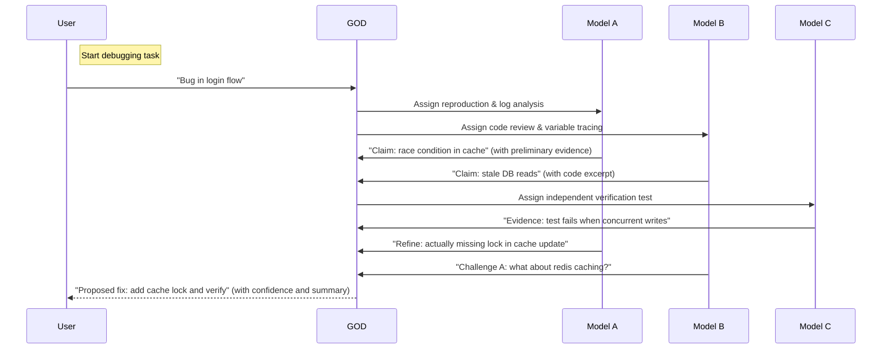

The above shows a typical multi-step "debug" task. GOD initially splits the problem among models: A and B tackle different hypotheses in parallel, each producing claims/evidence. Once those appear on the bus, GOD can spawn additional calls (to C for testing, etc). Models A/B also interact ("challenge A", "refine claim") through the bus under GOD's coordination.

**Spawn Controls:** Each primary model should **limit sub-agent spawning** to avoid runaway complexity (e.g. no infinite recursive calls). For example, cap sub-agents to 2–3 per model per task, or impose a max call depth. GOD can enforce a *fan-out budget*: if too many agents spawn, queue or reject new tasks.

**Token & Latency Budgeting:** To keep cost/latency in check, assign each model a *working budget* per question. For example, each model might get up to 50K tokens (combined in/out) and 30 seconds to produce an answer. After that, GOD times out or cancels that attempt. If further thought is needed, models must explicitly request more ("thinking mode" can be iterative, but GOD must control total token use). This avoids single models consuming excessive tokens while others starve.

**Failure Modes & Recovery:** Possible failures include API timeouts, rate-limit 429s, or contradictory answers. GOD must detect failures (HTTP errors, malformed output) and either retry (perhaps on a fallback model) or escalate to the user. For *contradictions* (e.g. two models make mutually exclusive claims), GOD can flag it as a conflict, pause execution, and possibly spawn an adversarial review (see next section). If one model stalls, GOD can momentarily reduce workload on it and allocate others.

**Throughput vs. Latency:** Adding more agents raises throughput but also contention. We illustrate this with a throughput-vs-latency tradeoff chart from NVIDIA (Fig. below) — beyond \~10 parallel requests, latency climbs steeply. GOD should adapt: for simple steps, run 4–5 models in parallel; for final synthesis or high-stakes decisions, we may prefer 1–2 models (to minimize variability).

```mermaid
gantt
    title Sample Agent Task Timeline
    dateFormat  HH:mm:ss
    section Orchestration
    GOD receives task             :a0, 00:00:00, 00:00:02
    section Parallel Reasoning
    Model A start analysis        :a1, 00:00:02, 00:00:30
    Model B start code-check      :a2, 00:00:02, 00:00:25
    Model C start log-extraction  :a3, 00:00:02, 00:00:15
    section Verification
    Model D run unit-test         :a4, 00:00:32, 00:00:10
    Model E simulate environment  :a5, 00:00:32, 00:00:08
    section Synthesis
    GOD final aggregation        :a6, 00:00:45, 00:00:10

```

**Figure:** Simplified timeline for a debugging scenario. First GOD dispatches Models A/B/C in parallel (\~t+2s). Once their claims arrive, GOD then runs verification tasks (Models D/E). Finally, GOD aggregates the results (\~t+45s). Real orchestration interleaves messaging on the *Discussion Bus*.

## 3. Anti-Consensus & Adversarial Verification

One major risk in multi-model systems is *correlated hallucination* — different models parroting the same false answer. To mitigate this, we implement **anti-consensus checks**:

- **Detection of Suspicious Agreement:** If *all* active models converge on a claim (e.g. each answers "X is true") but **no independent evidence** supports it, GOD flags it as suspect. Such unanimous agreement may indicate they are following a common pattern (or training leak) rather than reality. For example, if every model asserts a performance bug without logs, GOD will be skeptical.
- **Adversarial Review Mode:** When suspicion is raised, GOD explicitly instructs one model (or a new instance) to "act as a critic" or attacker. For instance: _"Model F: attempt to break the current solution. Find a flaw in claim X."_ This forces exploration of counterarguments. Similarly, GOD might use thinking tools (e.g. a *formal verifier* or external test suite) to seek refutation.
- **Challenger Agents:** In parallel with normal reasoning agents, we can designate "challenger" sub-agents whose sole job is to dispute the leading hypothesis. These challengers ask GPT to propose alternate theories or to poke holes in the logic. Their claims/evidence join the graph on the *contradicts* edges.
- **Voting Thresholds and Checks:** Instead of a simple majority, we require multiple **independent** signals. GOD may demand that at least one high-quality test or logic proof backs any widely-agreed claim before acceptance. For example, if 7/8 models agree, but a manual code analysis fails to replicate the issue, GOD keeps the claim pending.
- **Multi-Modal Cross-Check:** If vision-capable models (Ox-Alpha with image input, DeepSeek-Flash-Vision) are available, we can rephrase tasks into screenshots or diagrams to catch hallucinations. E.g. convert a code snippet to an image and ask another agent to annotate it.

In short, **consensus is not taken as truth without evidence**. GOD actively *asks for disproof*. This could be automated: after the first round of answers, GOD might do:

```text
If (models_all_agree AND no_strong_evidence):
    spawn challenger: "Find a flaw in this answer"

```

This adversarial posture catches subtle errors.

## 4. Evidence/Argument Graph Schema & Context Metrics

To keep track of reasoning, we use a structured *argument graph* rather than flat chat logs. Every notable piece of information is a **node** in a graph with typed edges:

- **Claim (Text)** nodes: e.g. "Function X is causing stale reads." Each claim has:
  - `id`, `text`, `origin_model`, `confidence_score`, `status` (HYPOTHESIS, PLAUSIBLE, VERIFIED, CONTRADICTED, etc).
  - Outgoing edges to evidence or challenges.
- **Evidence** nodes: could be of type code snippet, log excerpt, test result, numerical simulation, etc. Each has:
  - `id`, `type` (e.g. CODE, LOG, TEST\_RESULT), `content`, `source_model`, `verified_by` flags.
  - Edges **`supports`** or **`contradicts`** connecting to Claim nodes.
- **Inference/Explanation** nodes (optional): e.g. "lack of lock leads to race" as reasoning steps.

**Edges:**

- `supports`: evidence -> claim (indicates this piece of data supports the claim).
- `contradicts`: evidence or alternative claim -> claim (indicates conflict).
- `derived_from`: claim -> claim (e.g. a subclaim or refinement).
- `challenge_by`: model -> claim (an agent challenged that claim).

A simplified JSON schema might look like:

```json
{
  "claims": [
    {
      "id": "C1",
      "text": "Cache X is not thread-safe",
      "status": "PLAUSIBLE",
      "confidence": 0.60,
      "origin": "ModelA"
    }
  ],
  "evidence": [
    {
      "id": "E1",
      "type": "CODE",
      "content": "cache.get(k) or fetch(k)",
      "attached_to": "C1",
      "relation": "supports"
    }
  ],
  "edges": [
    {"from": "E1", "to": "C1", "label": "supports"}
  ]
}

```

GOD maintains this graph in a central store. New claims/evidence emitted by any model are merged into the graph. The graph enables quick queries: e.g. "find all evidence supporting claim X" or "list all unchallenged claims."

We also define **context-convergence metrics** to know when to stop debating:

- *Model Coverage:* fraction of models that have considered the current top claims. If most models have commented on each major claim, we're converging.
- *Evidence Sufficiency:* a numeric score like "(verified supports + verified contradictions) / total claims." When this ratio exceeds a threshold (say 80%), we consider the answer well-vetted.
- *Stability:* over successive rounds, if no new major claims/evidence appear, the discussion is stabilizing.

**Context-Ready Threshold:** We might define a heuristic such as: when each top-level claim has ≥2 independent pieces of verifying evidence **and** no high-confidence contradictions remain, we declare the context "ready" and move to execution. If user input persists beyond timeout, we force conclusion or escalate.

## 5. Adaptive Routing & Attention Allocation

Not all models get equal time on every question. GOD scores each model for each subtask using a weighted formula combining:

- **Capability Fit:** Does the model's known specialty match (e.g. code models get higher weight on code tasks)?
- **Historical Success:** Past performance of the model on similar tasks (e.g. past accuracy on debugging).
- **Evidence Quality:** If a model already produced useful evidence, boost it; if its output was weak, penalize it.
- **Contextual Relevance:** How well the current prompt matches the model's context window and memory. (A model with larger context may get complex prompts.)
- **Availability/Latency:** If a model is slow or currently busy, reduce its weight.

For example, a simple scoring function:

```
score = w1*(capability) + w2*(past_success) + w3*(evidence_score)
      - w4*(current_load) - w5*(cost_penalty)

```

Weights (w1–w5) can be tuned. A higher score means "give this model more attention" (e.g. longer time, more follow-ups).

Practically, GOD may assign different roles. For instance, DeepSeek-Flash (cheap, high throughput) gets the bulk of iterations (chatty, many steps) at low temp, while Ox-Alpha (fluent reasoning) is used for final planning and summarization. If Model A has already solved a subtask, we may "move on" and allocate more resources to unsolved parts.

This **adaptive attention** ensures efficiency: we don't treat all models equally if some are evidently more promising. If a model stalls, GOD can throttle it and boost others. Likewise, if an evidence signal is weak, models will be encouraged (via prompts) to dig deeper or re-evaluate.

## 6. GOD Runtime Architecture

We recommend building GOD as a **runtime framework** with distinct components:

- **Context Manager:** Holds the *shared state* (claim/evidence graph, conversation memory, policies). Exposed via an API so any model can query project history.
- **Task Scheduler:** Decides which model does what and when. Manages queues, concurrency limits, and enforces token/time budgets per call.
- **Verifier/Auditor:** Independently checks final answers (e.g. rerunning answers against tests) and logs outcomes to the audit trail.
- **Policy Engine:** Encodes "business rules" (e.g. no more than 3 agents per task, when to escalate to human, confidence thresholds).

Importantly, **GOD ≠ a single LLM**. We do **not** hard-code `use_Ox_Alpha()`; instead, GOD uses a *Model Registry* and can switch models dynamically. For instance, a task may start on Ox-Alpha (for its strong reasoning) but if it slows, GOD can serialize state and continue on DSV4-Flash (which has higher throughput) by re-sending the conversation context. The state is *external* to models, so switching only needs a fresh API call with the current context and the new model.

**Model Handoff/State Serialization:** Suppose GOD decides mid-task to switch from Model A to Model B. It performs:

1. **Serialize conversation:** Save all messages, claims, memory summaries.
2. **Initialize Model B:** Send a "system prompt" containing context (all relevant past messages or a condensed summary) so B can continue seamlessly.
3. **Continue execution:** Model B now picks up where A left off.

If models support reproducibility (e.g. GPT with a `seed` parameter), GOD can even replay the same query to compare outputs. All intermediate steps (prompt, response, usage tokens) are logged for auditability.

**Replayability & Audit Trail:** Every task gets a unique ID. GOD logs *each* message in/out of every model along with timestamps, token counts, and resulting state changes (new claims, decisions). This log is append-only: for any outcome, we can trace exactly how the answer was reached. If a bug is reported later, GOD can "replay" the entire flow on fresh models (with fixed seeds/log-probabilities) to debug the agent reasoning itself.

**Preferred GOD Candidate:** Ox-Alpha vs. DSV4-Flash:

- *Ox-Alpha* offers long context and sophisticated reasoning for free, making it an attractive **GOD brain** (no token cost, unknown origin). However, being stealth, service quality and latency are uncertain.
- *DSV4-Flash* has equivalent 1M context, a formal API, and massive concurrency. It's extremely fast (MoE + FP8) at modest cost. For tasks requiring many parallel chains (background checks, knowledge retrieval), DSV4-Flash is ideal.
- **Tradeoff:** If budget allows, use both: Ox-Alpha for open-ended planning ("How to fix this bug step-by-step?") and DSV4 for brute-force analysis ("Run 500 varied tests"). GOD can treat them as peers (both labeled "GOD-tier") rather than fixed primary/secondary.

In conclusion, GOD is a middleware that manages model orchestration, not a single privileged model. It must be engineered as a robust service with recoverable state and flexible backend selection.

## 7. Implementation Recommendations

- **API & Libraries:** Use the official SDKs/REST APIs. For example, Python or Node clients for OpenAI and DeepSeek. Abstract calls so that the base URL and auth key can switch between providers (e.g. via config). Ensure `user_id` or equivalent is correctly passed for DeepSeek (in `extra_body.user_id` for OpenAI-format calls).
- **Event Bus / Messaging:** Adopt an event-driven architecture. For instance, GOD and models communicate via messages on a bus (RabbitMQ, Kafka, or Redis streams). Each agent (GOD, Models, Verifier) listens for tasks on its channel. Messages include a `task_id` to correlate to project state. The bus supports pub-sub for broadcasting claims/evidence to all agents.
- **TypeScript Interfaces (sketch):** Define clear TS interfaces for data passing. For example:

```ts
  interface Claim {
    id: string;
    text: string;
    model: string;
    confidence: number;
    status: 'hypothesis'|'plausible'|'verified'|'rejected';
  }
  interface Evidence {
    id: string;
    type: 'CODE'|'LOG'|'TEST';
    content: string;
    supports: string[];   // claim IDs supported
    contradicts: string[];// claim IDs contradicted
  }
  interface AgentMessage {
    taskId: string;
    sender: string;
    payload: Claim | Evidence | Decision;
  }

```

These interfaces ensure consistency between components.

- **State & Data Stores:**
  - Use a durable store (SQL or NoSQL) to persist the **argument graph** and project state. For example, a document DB like MongoDB for claims/evidence nodes, or a graph DB.
  - A separate key-value store (e.g. Redis) can keep ephemeral state (conversation history, temp decisions) for fast access.
  - An **audit log** should append every event (in/outs) to a write-once log (or AWS S3), keyed by task.
- **Scheduling & Execution:**
  - Implement a scheduler that obeys each model's rate limits. For DeepSeek, no per-key bottleneck up to 2500 connections; for OpenAI/Claude, throttle per documented RPM/TPM.
  - Use asynchronous (Promise/async) calls. Monitor token/latency usage; cancel or cut off streams when budgets hit.
- **Testing & Benchmarking:**
  - **Unit tests:** Mock model APIs to simulate various behaviors (delays, contradictions). Verify that GOD handles them (retries, escalations).
  - **Integration tests:** Run end-to-end scenarios with real or stubbed models to measure latency, costs, and correctness. Track metrics like average tokens used per task, error rates, time to solution.
  - **Benchmark plan:** Create synthetic tasks of increasing complexity (chat, code, reasoning). Log how parallelism vs. sequential execution affects total latency and cost.
  - **Load testing:** Simulate concurrent users sending tasks to see if scheduling policies (queues, worker pools) hold up.
- **Security & Hardening:**
  - Each model call (especially tool calls) must be sandboxed. If agents execute code (e.g. Code Interpreter), ensure it runs in a container/VM with strict network/file permissions.
  - Do not expose raw model outputs in UI/logs without sanitization.
  - Enforce API key management carefully; no printing of secrets.
- **Component Diagram (for guidance):**

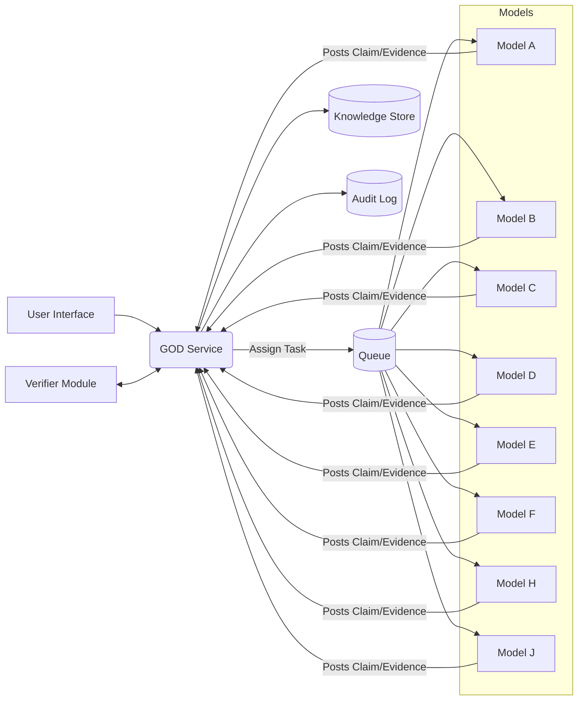

*Figure:* Simplified component flow. GOD dispatches tasks to model workers (via a queue). Models send back structured results. GOD writes to the shared DB and audit log, and may trigger an independent Verifier module.

## 8. Scheduling & Cost Control (8-Model Parallelism)

Running 8 agents in parallel can be expensive in both tokens and latency. We recommend these policies:

- **Token Budgets:** Assign a maximum token allowance to each agent per task. E.g., 50K tokens per agent per answer. This caps worst-case cost. Agents should respond with "I'm at token limit" if reaching it, allowing GOD to truncate or summarize.
- **Confidence Budgets:** Rather than unlimited debate, give an overall "confidence target". For example, require 95% confidence in a decision before finalizing. Confidence can come from aggregated scores. If after three rounds no model crosses that threshold, escalate to human review or external oracle.
- **Cost-vs-Latency Tradeoff:** Use the priority graph above: at low concurrency, each task completes faster but total throughput is low. If we double parallel agents, throughput rises but latency per answer increases (see NVIDIA chart above). GOD can tune the **parallelism level**: e.g. for quick answers (low stakes), run only 4 models in parallel; for thorough analysis (bug fix), enable all 8 and accept a longer total time.
- **Adaptive Time Allocation:** Start with fast "quick-win" models (e.g. high-temperature, low-cost ones) for initial hypotheses. If they find a likely answer, switch to more expensive verifying steps. This staged approach avoids burning cost up-front.
- **Cost-Aware Routing:** Include a *cost penalty* in the model scoring. If tokens are limited, favor cheaper models (like DeepSeek-Flash) for broad exploration, reserving expensive ones (like GPT-4 Turbo) for final justification. For example, a scoring term `-0.1 * (token_price)` can bias toward low-cost providers.
- **Budget Enforcement:** Track cumulative tokens/dollars spent per user session. If an execution threatens to blow past the user's budget, GOD should abort politely with "Sorry, this query exceeds your allowance" or reduce agent count.

## 9. Risks & Mitigations

1. **Security (Misuse of tools/code):**
   - *Risk:* Agents calling tools could execute unsafe actions.
   - *Mitigation:* Strict sandboxing of any code execution or external API calls. Only expose whitelisted functions. Do not allow agent-specified endpoints unless vetted. Use egress proxies and avoid storing sensitive credentials in prompts.
2. **Runaway/Looping Agents:**
   - *Risk:* A sub-agent spawns itself recursively or never reaches a stop condition.
   - *Mitigation:* Enforce hard limits: max agent depth, max total spawned per task, and per-agent timeouts. Use watchdog timers to kill stuck processes. Require every agent to report "done" or "error" after N steps.
3. **Correlated Failures/Hallucinations:**
   - *Risk:* Multiple models share the same flawed premise, missing the actual solution.
   - *Mitigation:* Anti-consensus rules (see Sec. 3), diverse model mix (rule-of-three with unrelated architectures), and external checks. E.g. if all agree, run a separate non-LLM procedure (unit tests, static analysis) to sanity-check.
4. **Data Privacy & Leakage:**
   - *Risk:* Sending proprietary code/data to external models.
   - *Mitigation:* Use encrypted connections, minimize context (redact secrets from prompts), and comply with providers' privacy policies (e.g. DeepSeek trains on prompts by default). If privacy is critical, use on-prem or self-hosted models for the most sensitive parts.
5. **Costs Spiraling:**
   - *Risk:* 8-model parallel runs can quickly exhaust budgets.
   - *Mitigation:* See Sec. 8 policies. Pre-allocate budgets per task and abort if exceeded. Provide "speed vs. cost" options to users. Audit actual vs. estimated cost continuously.
6. **Poor Scheduling / Starvation:**
   - *Risk:* Some models hog resources, others starve (especially if concurrency limits on some providers).
   - *Mitigation:* Fair-queueing: rotate tasks among models and respect each API's concurrency cap. If one model hits rate-limit, pause it and reassign its task to another capable model.
7. **Model Downtime/Provider Outages:**
   - *Risk:* If a chosen model/provider is unavailable, tasks stall.
   - *Mitigation:* Implement retry with backoff. Always have at least two candidate models for each role (e.g. both GPT-4 and Claude for complex reasoning). If a model fails, log and fall back.
8. **Auditability and Compliance:**
   - *Risk:* Lack of transparency into decisions (esp. if agents disagree with user).
   - *Mitigation:* Maintain full logs (see Sec. 6). Provide summaries of "why not" if MAD disagrees with a user's request. Ensure data residency/compliance for any PII in conversation.

Table of prioritized risks with actions:

| Risk Category             | Priority | Mitigation Highlights                                       |
| ------------------------- | :------: | ----------------------------------------------------------- |
| Security (tool misuse)    |   High   | Sandboxing, privilege locking, input sanitization           |
| Runaway Agents            |   High   | Strict depth/time limits, watchdog timers                   |
| Correlated Hallucinations |   High   | Anti-consensus checks, diverse models, verification         |
| Cost Overrun              |  Medium  | Pre-budgets, aborts, cost-aware routing                     |
| Scheduling Starvation     |  Medium  | Adaptive queues, respect concurrency caps, fair share       |
| Provider Outages          |  Medium  | Retry/fallback, multiple provider integration               |
| Privacy/Data Leakage      |    Low   | Redaction, encryption, use of private LLM options if needed |

## 10. Example Scenario: Debugging a Production Bug

**User Task:** "Production bug: sometimes *getUserData* returns outdated cache values even after an update. Why?"

**Step 1 — Task Ingestion:** User submits the bug description. GOD creates `taskId=42` and updates state: `STATE.status = "pending analysis"`.

**Step 2 — Dispatch Primary Models:** GOD assigns:

- **Model A (e.g. DeepSeek-Flash):** "Explain why `getUserData` could return stale data."
- **Model B (e.g. Ox-Alpha):** "Review the provided code for caching logic."
- **Model C:** "Generate test cases to reproduce stale-cache bug."
- (Others idle or assigned follow-ups after initial phase.)

Each model call is a separate API request with `taskId=42`.

**Step 3 — Initial Claims/Evidence:**

- Model A returns:
  - *Claim C1:* "A race condition occurs if update and read happen concurrently." (`confidence:0.7`).
  - It cites evidence "cache.get() uses `or` operator (code snippet)" as possible cause.
- Model B returns:
  - *Claim C2:* "No cache invalidation after update." (`confidence:0.6`), referencing code where the cache write is absent.
- Model C returns a **Test ID E1**: "Concurrent write+read test yields stale result."

GOD adds C1, C2 to the graph (status=PLAUSIBLE), and evidence E1 (type=TEST). Edges: E1 *supports* C1 and C2 partially (i.e. test shows an issue but not which fix).

**Step 4 — Discussion & Sub-Agents:** The bus now has two competing claims. GOD spawns:

- **Model D (DSV4-Flash) as validator:** "Challenge Claim C2 (cache invalidation). If it were true, could test E1 fail? Provide evidence."
- **Model E as challenger:** "Challenge Claim C1. Suggest alternative cause."

Say Model D returns *Evidence E2:* "Test shows that even if we force cache refresh, stale still appears — so C2 alone doesn't explain it." (E2 *contradicts* C2).\
Model E returns *Claim C3:* "Possibly an eventual consistency issue with the DB layer."

GOD updates statuses: C2 is now *REJECTED* (contradicted by E2), C1 gets more weight.

**Step 5 — Independent Verification:** GOD calls **Model F** to run an automated code review or formal tool on the cache code (via tool). It returns *Claim C4:* "`cache` is a plain dictionary; reads are not atomic." (`confidence:0.8`). This supports C1 with new evidence (lock absence).

**Step 6 — Convergence Check:** The argument graph now has:

- C1 (Race condition) with evidence {E1, C4 support}. Status now *VERIFIED*.
- C2 (No invalidation) contradicted by E2.
- C3 (DB issue) unproven, no evidence.

Models have all seen C1/C2/C3. The *context-convergence metric* is high (multiple independent evidence for C1, contradictions for C2).

**Step 7 — Decision & Fix:** GOD sees C1 fully supported and high confidence; it composes final output:

```json
{
  "taskId": 42,
  "solution": "Bugfix: add a lock around cache updates. Code example: `with cache_lock: cache[k] = newVal`",
  "confidence": 0.92,
  "audit": "Claims C1 verified by evidence E1,E4; conflicting claims resolved; models A,F emphasized race condition."
}

```

All intermediate steps are logged.

**Audit Trail:** GOD writes an audit entry capturing:

```
Task 42:
 User input: "getUserData returns stale data"
 Models called: A(DSV4-Flash), B(OxAlpha), ... F.
 Claims found: C1 (race), C2 (no invalidation), ...
 Evidence: E1 (test fail), E2 (test with refresh), C4 (code inspection).
 Decision: Adopt C1; implement lock. Confidence 92%.

```

This trace (claims/evidence and decisions) is stored in the database. At the end, the user sees the proposed fix with explanation.

**Key Point:** GOD did not simply echo all models. It synthesized: All models agreed on a bug, but GOD insisted on tests (E1,E2) and code reviews before finalizing. The anti-consensus step (Model D contradicting C2) ensured only the true cause (race condition) survived. Every claim/evidence step was recorded for accountability.

***

## 11. On-Demand Skill Discovery from GitHub

The Global Skill Registry starts local-only. When an agent requests a skill that is *registered-but-not-loaded*, the Skill Manager activates it lazily as today. When the request is a *local miss* — no such skill exists anywhere in the registry — the Skill Manager falls back to **GitHub skill discovery**:

1. **Search:** Query GitHub for skill repositories (topic filters, manifest/code search for skill declaration files such as `SKILL.md` / `skill.json`). The web capability's search/fetch providers supply transport; every result is treated as untrusted input at the parser boundary.
2. **Rank:** Order candidates by stars/recency (community signal), license compatibility, declared tool/permission surface, and estimated task fit from the router.
3. **Vet (trust gate — mandatory):** Validate the manifest schema, scan skill text for prompt-injection patterns and exfiltration instructions, and review every tool the skill declares against the session's tool policy. Vetting runs in an isolated pass with no write access to the workspace. A rejection is logged loudly to memory and telemetry; a missing skill is never silently skipped.
4. **Fetch & cache:** Approved skill sources are downloaded once into the SHA-256 content-addressed store, with provenance (repo, commit SHA, license, hash) recorded in telemetry. Cached copies make repeat loads offline-capable and tamper-evident.
5. **Activate & learn:** The fetched skill enters the normal lazy-load path (`LOAD ONLY WHEN NEEDED` → agent-local context), and its effectiveness feeds Outcome-Based Learning, which refines future discovery ranking.

Policies:

- **Quarantine by default:** remote skills carry zero authority until the trust gate passes (extends MAD Core Rules R5/R13 to remote sources).
- **User override:** configuration exposes discovery on/off, allow/deny repository globs, and a hard per-run cap on fetches (budget-aware).
- **Determinism:** pinned commit SHAs make a loaded skill reproducible and auditable via replay.

## Checklist of Recommendations

- **Inventory Limits:** Document each LLM's context, concurrency, and pricing (see Table 1). Set expectations (e.g. DeepSeek can handle >1000 concurrent chains; OpenAI GPT-4 Turbo likely cannot).
- **Protocol & Structure:** Use an event-driven engine with explicit message types (Claims/Evidence/Decisions). Maintain a central argument graph.
- **Spawn Policy:** Cap sub-agent creation and depth. Use bounded queues or backpressure to prevent flooding.
- **Verification:** Require at least 2 independent evidence pieces per claim. If all agents agree without evidence, trigger adversarial review.
- **Adaptive Routing:** Score models dynamically for each subtask. Allocate more tokens/time to those showing better results.
- **GOD Abstraction:** Build GOD as a runtime with state, not tied to one model. Allow model swapping via state handoff. Implement deterministic replay (e.g. with seeds).
- **Budget Controls:** Pre-set token/time budgets for each agent-call. Abort or escalate if budgets exhaust. Use "confidence thresholds" to decide when to stop deliberating.
- **Logs & Replay:** Log every interaction. Store conversation and code so that tasks can be replayed and debugged.
- **Testing:** Implement unit/integration tests simulating concurrency and failures. Use benchmarks for latency and token-cost vs. answer quality.
- **Safety:** Sandbox tool calls; sanitize model outputs. Monitor for policy violations and enforce privacy (don't leak user code outside).
- **Skill Discovery:** Auto-discover missing skills on GitHub behind a mandatory trust gate; pin fetched skills by commit SHA, cache content-addressedly, and log every accept/reject decision.
- **Failure Handling:** Plan fallbacks (e.g. if Ox-Alpha is down, switch to DeepSeek or vice versa). Detect rate-limit 429 and retry with exponential backoff or alternate model.

This comprehensive approach ensures that the multi-LLM system is **accurate, efficient, and robust**, ready for production deployment. Sources used include official Ox-Alpha info, DeepSeek docs, and industry analyses, with the rest extrapolated into a concrete implementation plan.

***

# Part II — Master Specification

## Executive Summary

The **MAD (DSH-Enhanced)** project is a multi-agent, multi-model orchestration framework built on Xee Harness (XH) that transforms software engineering tasks (coding, debugging, planning, etc.) into a structured, parallelized *research* process.  Instead of relying on a single LLM agent, MAD employs **eight or more heterogeneous model instances** (across potentially multiple API providers and credentials) working concurrently, each spawning sub-agents and using tools, **collaborating and arguing** over claims, hypotheses, and evidence. A central **GOD Runtime** orchestrates the process: it manages state, routing, scheduling, discussion, verification, and policy.  Models operate in independent trees of sub-agents, following strict honesty and accountability protocols (no fake results or finger-pointing), and the system maintains **complete telemetry** of all communications. A layered memory fabric compacts context: *hot* working context, *warm* retrievable knowledge, and *cold* archival telemetry, all content-addressed (SHA-256) and indexed (SQLite, vector, etc.) for fast retrieval.

Key additions in MAD include:

- **Multi-provider/key flexibility:** Each model entry in the configuration can correspond to a provider, credential, and model name. The same API key can map to multiple models, and the same model can spawn many runtime instances【2—L73-L74】. This supports unlimited parallelism subject only to provider rate limits.
- **Aggressive adversarial verification:** Models produce independent proposals; GOD demands evidence, assigns adversarial challengers, and verifies proofs. Claims survive only if they withstand independent reconstruction, formal checks, counterexample hunting, or external tests.
- **Contextual observation and anomaly detection:** The system explicitly instructs agents to notice **weird, contradictory, or missing** aspects in the problem statement or repository state. Anomalies are logged into a registry to avoid repeated dead ends.
- **Dynamic skill loading:** A global skill registry lists all capabilities (e.g. "Browser", "Git", "Formal Math"). Agents request skills as needed; GOD can approve or load them on demand. Skills contain tools/instructions and are unloaded when done to save context tokens.
- **Retrieval-augmented context:** Instead of naively packing every chat history into each prompt, MAD uses a multi-tier retrieval approach. The **cold telemetry archive** (all prompts, replies, tool outputs, decisions, etc.) is content-addressed and indexed (SHA-256 IDs, SQLite tables, vector embeddings). On each reasoning step, a **RAG (Retrieval-Augmented Generation) orchestrator** selects the most relevant facts, evidence, and code snippets to inject into the **hot context**.
- **Immediate micro-loop for errors:** Any code edit or operation triggers an immediate short loop: lint, type-check, focused tests, build. On failure, agents **acknowledge the error, reproduce it, localize the root cause, and fix or route it**. Blaming others is disallowed; every error must be owned and resolved.
- **Gauntlet quality loop (optional):** For high-impact tasks, an optional *Gauntlet* protocol can be activated. A concrete real-world **reference bar** (e.g. a published solution or benchmark) is frozen as the target. The task is split into units; for each, a fresh blind critic (new agent) compares the actual artifact against the bar in an **A/B comparison**【4—L232-L240】. The loop repeats until the generated artifact wins or the user stops it.
- **Production-readiness sweep:** When the project nears completion, a **4-agent sweep** is performed in parallel: one agent audits overall quality, one hunts for TODO/FIXME/HACK annotations, one aggressively tests for failures (edge cases, attacks), and one assesses user/UX readiness. Their findings are deduplicated by GOD, severity-ranked, and used to build a dependency graph of remediation tasks. Fixes are assigned, then a fresh sweep repeats, until no critical blockers remain. Only then can the project be declared **Ready** (or Ready-with-known-risks)【4—L232-L240】.

**Assumptions and Unknowns:** The spec assumes access to provider models like DeepSeek's DSV4-Flash or an Ox-Alpha model with high throughput. Exact model names and APIs (DeepSeek, Ox-Alpha) are examples; MAD is provider-agnostic. Hardware performance, costs, and security implications (credential management, API trust) must be addressed in deployment. The effect of simultaneous multi-model queries on model consistency and hallucination rates is an open area. Success metrics include correctness (passing tests), diversity of failure elimination, and effective artifact quality (e.g. Gauntlet pass).

This specification compiles **all user requirements and design ideas** (see Appendix) into a coherent architecture. It maps each requirement to system components, defines data schemas and policies, and includes diagrams, interface definitions, prompt templates, and comparison tables. Where factual data is needed (e.g. rate limits, concurrency), official docs are cited【2—L73-L74】【4—L232-L240】.

## Project Context and Goals

MAD (Multi-Agent Distributed harness) extends the existing Xee Harness to achieve **robust, high-quality software engineering outcomes** by distributing a single developer's task across many specialized AI workers, rather than relying on one. The goals include:

- **Parallelism & Throughput:** Break the task into parallel sub-tasks whenever possible, running on multiple model instances to reduce wall-clock time without violating provider quotas【2—L73-L74】. However, apply *adaptive* parallelism — do not run all models blindly if not needed.
- **Diversity of Reasoning:** Exploit heterogeneity: different models may excel at coding, reasoning, searching, or testing. The system should not bind the task to one model's personality; instead assign subtasks to whichever model is best and sometimes duplicate a strong model for diverse roles.
- **Error Resilience:** Automatically detect and fix errors. Every code change triggers immediate verification (lint/test/build). When a regression occurs, agents do not blame others — they either fix it or escalate appropriately.
- **Evidence-based Truth:** No model output is trusted without evidence. Claims and solutions must be backed by independent checks: test runs, formal methods, literature citations, or other models' validation. The architecture enforces *adversarial verification* of high-value conclusions.
- **Traceable Accountability:** Maintain a complete history so that any decision or output can be traced back through the reasoning chain. This includes saving all intermediate reasoning steps, tool calls, and evidence (in the Telemetry archive).
- **Human-like Collaboration:** Emulate a disciplined research team. Agents independently propose ideas, then debate them on a shared *Discussion Bus*. Disagreements trigger extra verification. GOD acts like a project manager & QA lead, not another coder.
- **Quality Control:** Use concrete baselines ("bars") as standards. The Gauntlet loop enforces that every piece of work must match or beat a real example; mere self-referential rubrics are disallowed【4—L232-L240】.
- **Configurable and Transparent:** Users can enable MAD optionally. Normal XH operation (single agent) remains the default. Advanced users configure the number of models, discussion length, parallelism, etc. At all times, actions (especially final answers) must come with clear **evidence provenance**.
- **Learning & Improvement:** Collect metrics on agent performance, failure cases, and verification effectiveness to continuously improve scheduling, routing, and system policies.

## Threat Model and Assumptions

- **Misuse/Abuse:** Agents could attempt to cheat (make false claims, ignore a bar). MAD's honesty policy and audit logs mitigate this: anything unsupported by evidence can be caught by other agents or flagged by GOD.
- **Data Leakage:** Using multiple providers/keys may risk scattering code and secrets. MAD assumes secure credential storage and that data sent to models does not violate privacy or IP constraints.
- **Resource Exhaustion:** Large multi-agent runs could hit rate limits or budgets. The system respects providers' declared limits【2—L73-L74】【10—L903-L909】 and aborts or queues when necessary. Users must define token/time budgets to prevent runaway runs.
- **Model Correlation:** Multiple instances of the same model might collude (shared hallucinations). MAD tracks model provenance so that diversity is measured at the model-identity level as well as instance.
- **Innovation and Novelty:** MAD is not promised to *invent* correct answers out of nothing. It accelerates problem-solving given human-provided tasks and references. Unsolvable problems remain unsolved.

**Assumptions:** All user intents and code are English. Provider APIs (DeepSeek, OpenAI, Ox-Alpha, etc.) are available with documented rate limits and pricing. GPU or compute limits on agent machine are not modeled here. The harness runs on a modern system with memory and CPU/GPUs typical of current dev machines.

**Success Metrics:** Passing existing test suites, beating reference benchmarks (Gauntlet pass), covering user requirements, closing all high-severity issues in production sweep, and achieving readiness with minimal known risks. Qualitative: code correctness, performance, maintainability.

### Master Specification

#### 1. Providers, Keys, and Models

- **Provider Registry:** MAD's config lists each **Provider** (e.g. OpenAI, DeepSeek, Ox-Alpha/OpenRouter, local models) with credentials. Each credential can offer multiple model IDs. The mapping is *not* one-key-one-model. Example config entries:

```yaml
  providers:
    - name: DeepSeek
      credentials:
        - key: KEY_A
          models: [v4-flash, v4-pro]
        - key: KEY_B
          models: [v4-flash]
    - name: OpenAI
      credentials:
        - key: KEY_OAI
          models: [gpt-4, gpt-3.5-turbo]
    - name: OxAlpha
      credentials:
        - key: KEY_OX
          models: [ox-alpha]

```

- **Concurrency Limits:** Each provider imposes limits (requests/minute, tokens/minute, concurrent calls). For example, DeepSeek Flash has limit **2500** threads【2—L73-L74】. OpenAI has organization-level shared limits and per-model caps【10—L903-L909】. The scheduler reads and enforces these limits, queuing or scaling back parallel requests as needed.

#### 2. GOD Runtime

### 2.1 Core Components

- **State Manager:** Global state of the run (objectives, tasks, context, decisions). It records user constraints, current claims, evidence graph, conflict flags.
- **Agent / Model Router:** Decides which model instances to assign to each task or subtask. Uses eligibility filters (capabilities, rate limits, context compatibility) and a selection score (expected value of information, latency, cost, diversity/anti-correlation, confidence). Learns from history which models excel at which tasks.
- **Scheduler:** Enforces resource budgets and parallelism rules. Configurable limits on total agents, depth of sub-agent tree, total tokens/time. Handles provider/model backoff on failures and retries tasks on fallbacks.
- **Discussion Coordinator:** Manages the shared discussion bus, routing messages, ensuring agents see others' claims/arguments, and enforcing turn/time limits per mode (PLAN/BUILD/DEBUG). Tracks when to stop discussion (context converged, no new info).
- **Arbiter/Judge:** For tie-breaking or conflicting critic judgments, a special agent (or ensemble) can run decisive tests.
- **Verification Engine:** Orchestrates formal/static/runtime checks. Spawns tests, static analyzers, formal provers, or orchestrates required tool invocations to verify claims. Integrates outputs into the knowledge graph.
- **Policy Engine:** Applies global policies (termination conditions, security/tool policies, cost controls).
- **Agent Tree Manager:** Keeps track of agent hierarchy and subtask delegation. Knows parent-child relationships for context inheritance or cancellation.
- **Skill Manager:** Manages global skill catalog. Loads/unloads skill modules on demand (see Skills section).
- **Memory / Context Manager:** Interfaces with the retrieval/RAG system to fetch relevant context into model prompts.
- **Telemetry Manager:** Writes all events to the archive (prompts, responses, tool calls, errors, etc.). Also handles content hashing and indexing.
- **Audit/Replay Manager:** Provides tools to replay runs step-by-step and to trace decisions from final output back through the knowledge graph.

### 2.2 Interfaces (TypeScript-like)

```ts
interface GodRuntime {
  // Start the run with user task description
  initializeTask(taskSpec: TaskSpecification): Promise<void>;
  // Decompose and plan tasks
  decomposeTask(): Promise<TaskGraph>;
  // Route tasks to models
  routeTask(taskId: string): Promise<ModelAssignment[]>;
  // Record a new claim or decision
  recordClaim(claim: Claim): void;
  // Check evidence sufficiency and contradictions
  checkProgress(): VerificationStatus;
  // Abort run (user stop or failure)
  cancelRun(reason: string): void;
  // Finalize and output decisions
  finalize(): FinalReport;
}

```

```ts
interface ModelAssignment {
  modelInstance: ModelInstance;
  role: string;  // e.g., "builder", "critic"
  taskId: string;
}

```

### 2.3 GOD Directive Prompts

GOD issues instructions to sub-agents via system prompts or intermediate messages. Example directives:

- *Demand Proof/Evidence:* "**Provide verification evidence** for claim C-123, including citations or counterexamples."
- *Split Task:* "**Split** task T-5 into subtasks: analyze function X, design algorithm for Y, and evaluate complexity."
- *Assign Verifier:* "Agent B3 check the validity of Claim C-7 using independent method."
- *Reassign:* "Reassign subtask T-12 to a model with language ID for better localization."

#### 3. Task Decomposition & Context

- The initial user goal and project context (requirements, constraints, existing code) form the **Initial Context**.
- GOD's "Understand Goal" step produces an *Initial Task Graph* that breaks the problem into smaller tasks (units of work). Each task is identified by ID.
- The decomposition is declarative: every task node specifies what needs to be done or answered. Tasks can depend on others (graph edges).
- The system must preserve *context provenance* for each task: what part of the initial user input or code it stems from.

#### 4. Multi-Model Mesh

- **Primary Model Agents (8+):** E.g. Agent A, B, C, ..., each is backed by a specific model (or model family). A model instance might have multiple agents (if one model spawns sub-agents concurrently).
- **Independent Reasoning:** Each agent receives the current *Active Context* and works privately to generate claims, hypotheses, or code. They never see other agents' internal chains (fresh contexts).
- **Sub-Agent Trees:** Agents can spawn child agents for subtasks. For example, Agent A may delegate test writing to A1, bug analysis to A2, optimization to A3. Spawn rules (max depth, max children) are enforced by GOD.
- **Roles:** Agents may take on specialized roles (Lead, Builder, Critic, Arbiter, Red-teamer, Smoother). Roles are dynamic and not tied to model identity. GOD can assign an agent to serve as "Critic" for another agent's output.

#### 5. Discussion Bus

- A shared channel where agents post **claims, hypotheses, counterarguments, evidence, and questions**. Every utterance on the bus is turned into a knowledge graph node.
- Agents continuously monitor the bus. Upon hearing others' claims, an agent may post agreement, counterexample, or a new idea.
- GOD monitors the bus. It intervenes if needed (e.g. "Agent B: challenge claim C-8", "Agent C: formalize A's design").
- **Stop Policy:** Discussion continues **until context convergence** (no new credible claims for N turns) or explicit stop. Metrics include coverage (fraction of subtopics addressed), remaining contradictions, and rate of new evidence【4—L232-L240】.

#### 6. Knowledge Graph and Memory

- **Claim/Evidence Graph:** All claims and evidence are nodes in a shared graph. Edges represent support or contradiction. This structure, extracted after each discussion round, is part of the *WARM* memory.
- **Fact Base:** Verified facts (from external sources or tests) are stored with provenance.
- **Dead-End Registry:** Hypotheses repeatedly failed are logged so agents avoid them later.
- **Anomaly Registry:** Oddities noted in initial observation or during run are recorded. (E.g. "Auth appears implemented but code is stub.")
- **Unknowns List:** Questions that remain unanswered (e.g. missing data).
- Agents draw from the *HOT* context (current tasks and relevant knowledge). They can query *WARM* memory via RAG to fetch prior findings as needed, preserving key details.
- Agents never see the entire conversation dump — only retrieved facts and any relevant code/data from the archive.

### 6.1 Context Compaction Algorithm

1. **Identify Relevant Items:** Given the current task or topic, gather related claims, facts, code snippets, and questions from knowledge store (via indices, vector search, etc.).
2. **Provenance Check:** Ensure each included piece has a source and is up-to-date.
3. **Prune Irrelevant:** Discard any context not directly affecting current tasks (using topic similarity or graph connectivity).
4. **Limit Size:** Enforce a token budget by prioritizing newest or highest-confidence items.
5. **Structure Context:** Format as bullet points or key-value list (assumption: agent prompts prefer structured context, not raw transcript).
6. **Attach Provenance:** For each context piece, include a reference ID or hash to the original.
7. **Output:** Return a concise context blob to inject into agent prompts.

*(This preserves facts+evidence exactly, while dropping old chatter. It relies on the knowledge graph to decide what to keep.)*

### 6.2 Content Addressing and Indexing

- Every stored artifact (context snapshot, prompt, model response, code diff, evidence item, tool output) is hashed with SHA-256 upon archival【2—L73-L74】. This ensures identity and immutability.
- SQLite tables map relationships: e.g. `Claims(claimId, text, status)`, `Evidence(evidenceId, type, content)`, `ClaimsEvidence(claimId, evidenceId)`, `Agent(id, model, skillSet)`, etc.
- A vector index (embedding database) holds semantic embeddings of textual items for similarity search.
- Full-text search (FTS5) on code files and chat messages enables regex or keyword queries.
- The **RAG orchestrator** uses these indices to find the top-K relevant entries for a query (current task, claim keywords) and passes them (in compacted form) to the agent.
- We recommend SQLite+FTS for local structure (simplicity, reliability), and a local vector library (e.g. FAISS) for embeddings.  A managed VectorDB is possible (e.g. Pinecone) if scalability is needed, but local keeps data private and offline.

#### 7. Dynamic Skills

- **Skill Registry:** A global index of available skills, each with metadata (name, description, capabilities, dependencies, version, content hash).
- **Skill Manifest:** Defined in JSON or YAML, example:

```json
  {
    "name": "browser-testing",
    "description": "Tools to script browser and take screenshots",
    "capabilities": ["render", "screenshot", "web-automation"],
    "dependencies": ["chromedriver", "nodejs"],
    "loadCommand": "npm install browser-automator",
    "unloadPolicy": "unload after 10min idle"
  }

```

- Agents request skills via a standardized prompt or API call. GOD verifies (based on policy and budget) and loads the module: this appends the skill's instructions and tool bindings to the agent's context.
- Unload when no agent uses a skill for a while, to conserve memory. Skill usage events are logged in telemetry.
- We assume skills come as code snippets/tools that can be integrated into the agent environment. Their content is also content-addressed and indexed.

#### 8. Tools

MAD provides an extensive toolset. Key tools include:

- **Filesystem & Git:** Inspect file contents, repo structure, perform version control operations.
- **Terminal:** Execute arbitrary shell commands.
- **Browser/Web search:** Load pages, run scripts, scrape results.
- **Test Runner / Build Tools:** Run unit/integration tests and builds.
- **Static Analyzers:** Linters, type checkers, code security scanners.
- **Benchmark Tools:** Measure performance.
- **Python Interpreter:** For computation or quick scripts.
- **Computer Algebra (CAS) & Theorem Provers:** For formal verification steps.
- **Game Engine Tools:** (for game mode) e.g. Three.js or Babylon.js environment for real-time rendering.

Each tool's outputs go back into Telemetry and can be RAG-retrieved. Tools are permissioned by policy; e.g. no dangerous system calls.

#### 9. Honesty and Accountability

All model agents are governed by the **Honesty Protocol**:

- **No Fabrication:** Agents must not fabricate sources, tool outputs, or evidence. If uncertain, they must state it.
- **Evidence with Claims:** Every claim must cite evidence or provenance. E.g. "Bug in X (evidence: test output hash `abc...`)".
- **Explicit Uncertainty:** If confidence < threshold, say so.
- **No Blame:** If an error/regression is found, the agent acknowledges it, even if "not my change." Root cause analysis follows.
- **Traceability:** Every claim or fix is tied to an agent ID and context snapshot.

This is enforced by the model prompt instructions and by audit: each message is logged, so any lie can be traced.

#### 10. Verification

MAD uses multi-layer verification:

- **Unit/Integration Tests:** Automatically run on code changes.
- **Static/Type Analysis:** Catch issues early.
- **Continuous Build Checks:** Ensure code compiles.
- **Runtime Checks:** Actually execute code or simulations to confirm behavior.
- **Formal Checks:** For critical properties (e.g. math proof lemmas via theorem prover, or cryptographic properties).
- **Human Approval:** For ambiguous or untestable decisions, a human can be prompted.

Verifier component collects all evidence. Before a claim is accepted, *all* verification tasks it triggered must pass. Otherwise the claim is sent back for further refinement.

### 10.1 Proof Lifecycle

For research/mathematics tasks, the proof flow is:

1. **Claim a Proof:** An agent presents a candidate proof (in text or code).
2. **Lemma Decomposition:** GOD splits the proof into subclaims/lemmas.
3. **Independent Check:** Other agents reconstruct parts of the proof and try to find counterexamples.
4. **Formal Verification:** If possible, use a theorem prover to check key lemmas. Or run numerical tests/counterexample searches.
5. **Adversarial Attack:** One agent plays "red team" finding flaws.
6. **Repair Loop:** If flaw found, send proof back to builders to fix.
7. **Accept:** Only if no counterexample and evidence are found, mark proof verified.
   Every proof and objection is logged.

### 10.2 Gauntlet Loop (Quality Policy)

When enabled, Gauntlet enforces **"beat the real bar"**:

- **Bar Acquisition:** Before starting, obtain a concrete reference (file, image, webpage) and compute its hash.
- **Build Units:** Split goal into small tasks (builders).
- **Blind Critic:** For each unit, spawn a fresh agent (no prior context) to inspect the actual artifact vs. reference. It must do a blind side-by-side comparison and pick one.
- **Loop:** If reference wins, get the *single biggest gap* from critic feedback, fix the artifact, and repeat. No fixed rounds.
- **Stop:** Exit only when the artifact ties or wins blind comparison, or user stops. Regression testing ensures no new bugs.

This ensures **objective, hard standards**, as envisioned by Shumer【4—L232-L240】【4—L245-L253】.

#### 11. Production Readiness Sweep

Triggered when Gauntlet or build runs reach "production-near" completion:

- **Agents:** Spawn four independent critics:
  - *Quality QA:* Checks overall code architecture, best practices, documentation.
  - *Code/Annotation Linter:* Scans for todos, FIXME, XXX, hidden skeleton code, disabled paths.
  - *Stress/Attack Test:* Runs the system under weird inputs, race conditions, failure modes.
  - *User Experience:* Simulates real user workflows, checks for confusion or missing functionality.
- **Findings:** Each outputs a list of issues (with severity). GOD consolidates: dedupe similar issues, correlates root causes, and computes a dependency graph of fixes (some issues block others).
- **Remediation:** GOD assigns fixes to agents or sub-agents, runs an immediate repair loop (with micro-verification).
- **Repeat:** A fresh sweep is run with new agents. Continue until no *blocking* issues remain.
- **Production Gate:** Only if:
  - All critical/high issues resolved
  - Automated tests pass
  - Security/policy checks pass
  - Performance/load requirements met
  - All major decisions/proofs verified
  - Known limitations documented
    then run ends with **READY**; otherwise **NOT READY** or **READY WITH RISKS** if only minor issues persist.

#### 12. Data Flows and Architectures

Below are key Mermaid diagrams illustrating the architecture.

**Overall Architecture:** Multi-layer flow from user to GOD to models to memory (simplified).

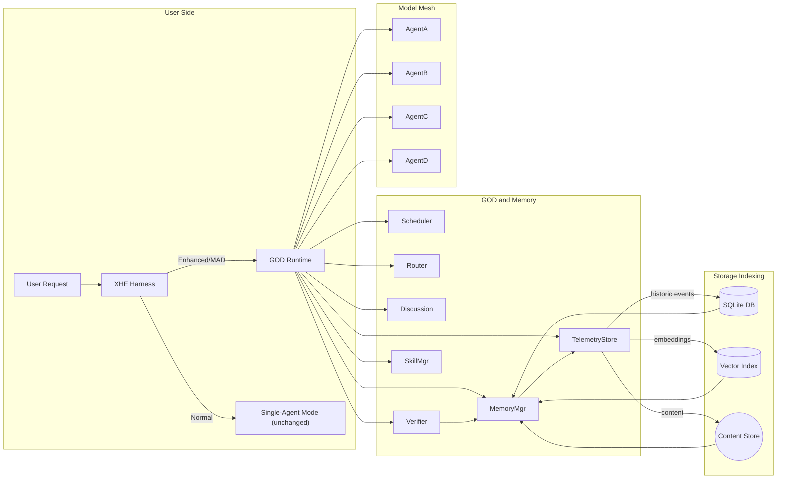

**Data Flow:** How information moves from user to memory to agents.

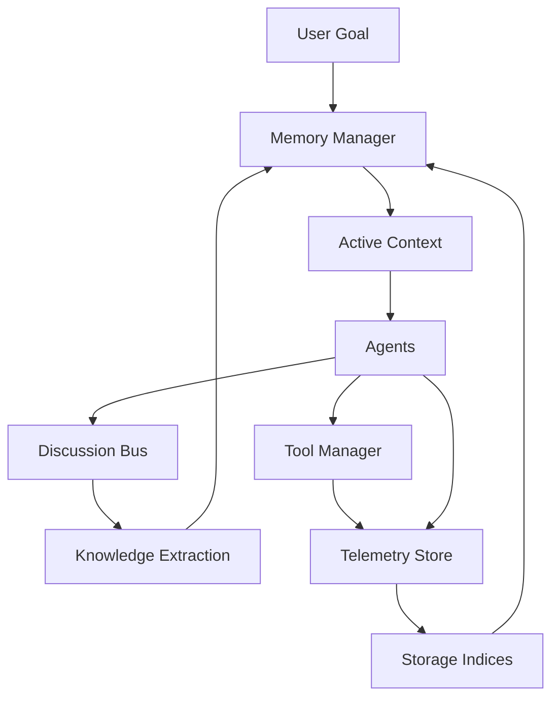

**Agent Lifecycle:** An example of one model agent spawning sub-agents.

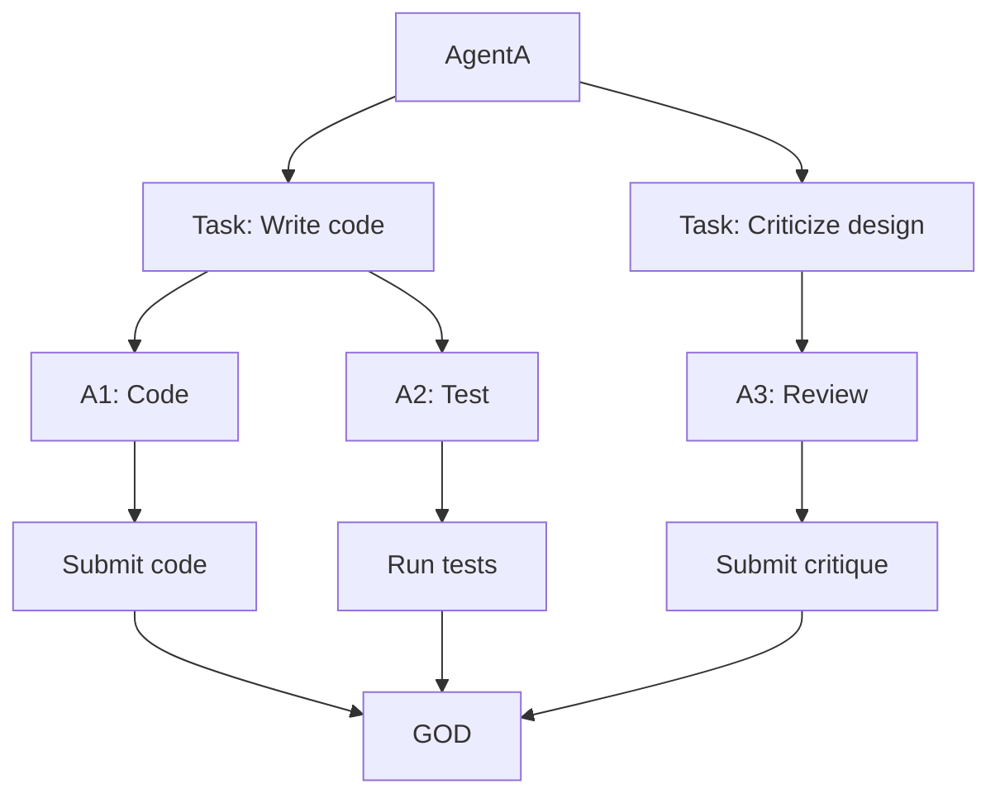

**Gauntlet Loop:** The builder-critic A/B loop against a frozen bar (reference).

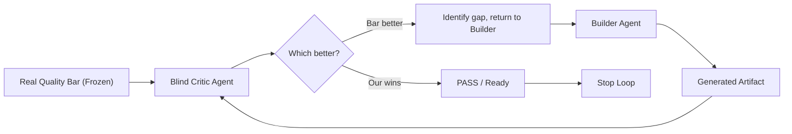

**Production Sweep:** Four agents audit and create fix graph.

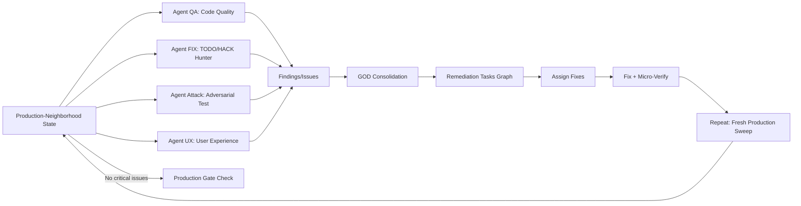

**Proof Verification Flow:** Independent strategies and cross-checks.

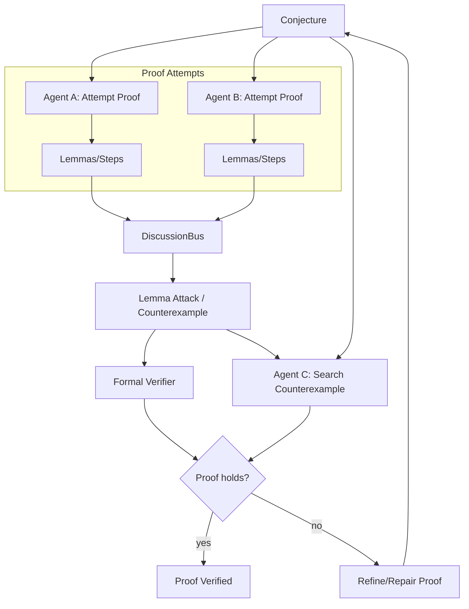

**Storage/Indexing DAG:** Content-addressed storage and indexes.

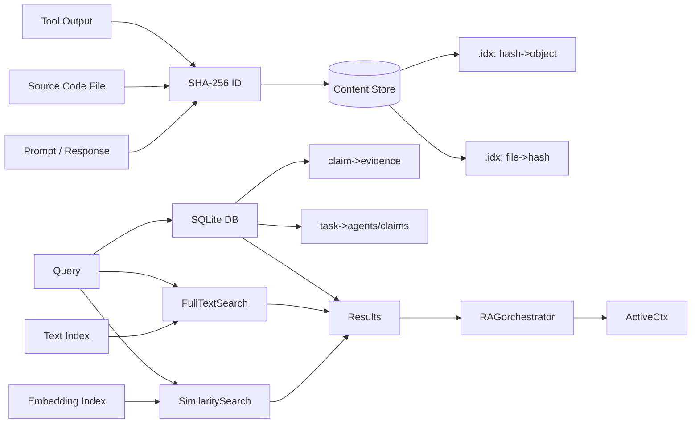

#### 13. Detailed Designs

### 13.1 Context Compaction Algorithm

Outlined above in **6.1**. Key points: use relevance scoring (semantic + structured), limit tokens, include provenance pointers. A hybrid of embedding similarity (warm memory) and knowledge graph reachability.

### 13.2 Anomaly Detection & Registry

On initial observation, an agent (or GOD) scans the user goal and repo:

- Checks for contradictions (e.g. user claims feature A exists, but code shows no such function).
- Finds missing info (e.g. user asks for X but no spec provided).
- Flags suspicious scenarios (ambiguous instructions, incomplete code).
  These anomalies are stored with unique IDs and descriptions. Agents on each round see all unresolved anomalies and either resolve or confirm them.

### 13.3 Dead-End Registry

Whenever a hypothesis/hunch is systematically invalidated (counterexample found or test always fails), it is logged as a "dead end." Future agents check this registry before pursuing similar ideas, saving redundant work.

### 13.4 Proof Candidate Lifecycle

Modeled above. Key interfaces:

```ts
interface ProofManager {
  proposeProof(agentId: string, proof: ProofCandidate): string; // returns proofId
  checkProof(proofId: string): Promise<VerificationStatus>;
  attackLemma(proofId: string, lemmaId: string): Counterexample | null;
  repairProof(proofId: string, fix: FixDelta): void;
}

```

### 13.5 Honesty/Accountability Protocol

Prompts enforce:

```plaintext
"If you are certain, cite evidence. If not, say 'I'm uncertain'. Do not claim knowledge you lack. 
On errors, state what you found and proceed to debug it."

```

All agent messages have a structured format:

```markdown
**Claim**: (text of claim)  
**Evidence**: (list of source or test results)  
**Source**: (file or citation)  
**Assumptions**: (explicit assumptions)  
**Confidence**: (0–100%)

```

Verification steps log the actual source or test output (by hash ID) used.

### 13.6 No-Blame Failure Lifecycle

On any detected error/regression:

1. **Acknowledge:** Agent says "Error observed: ..." (no blame).
2. **Reproduce:** Rerun failing step with logging.
3. **Localize:** Narrow down the code change or condition causing it.
4. **Root Cause:** Determine if it was "my change," "other agent's change," or pre-existing.
5. **Action:**
   - If "my change," fix it.
   - If "other agent," create a task for that agent to resolve.
   - If pre-existing, document and fix anyway.
6. **Verify:** Rerun tests to ensure regression is gone.

These steps are also stored in Telemetry with references to code diffs and agent IDs.

### 13.7 Skill Manifest Format

See **8** above. A JSON schema example:

```json
{
  "id": "browser-test",
  "description": "Automate Chrome for testing UI",
  "version": "1.0.0",
  "capabilities": ["screenshot", "click", "inspect"],
  "tools": ["chromedriver", "selenium"],
  "dependencies": ["nodejs>=14"],
  "load": "npm install browser-test-skill@1.0.0",
  "contextInjection": "const browser = require('browser-test');"
}

```

Skills also include sample usage docs and test fixtures. They are indexed by hash and name in Telemetry for reproducibility.

### 13.8 Lazy-Skill Loading Policy

- **Agent requests**: Agents can request "load skill X" in their reasoning. GOD evaluates if it fits (permission, not loaded already). If allowed, the skill instructions and tool bindings are appended to that agent's context.
- **On-demand**: If an agent attempts to use a skill without loading it, GOD may intercept, load skill, and retry.
- **Unload**: If no agent has used a skill for N minutes or it's not scheduled, the skill context is removed. Telemetry logs skill loads/unloads.
- **Limit**: Max active skills can be limited (to save tokens). In selecting which to unload, consider recency and predicted need.

### 13.9 Content-Addressed Storage Layout

- **Object Store**: All content (texts, code, images, audio) is saved as blobs keyed by SHA-256. e.g. `/blobs/sha256/abc123...`
- **.idx Files**: Simple on-disk indexes (or SQLite tables) map hashes to metadata (type, length, origin).
- **Telem DB (SQLite)**:\
  Tables include `runs`, `agents`, `tasks`, `claims`, `evidence`, `skills`, `models`, `events` (with columns for hash references), etc. Each event references content by SHA and stores context snapshot IDs.
- **Vector Index**: Separate store (FAISS or similar) mapping keys (hash IDs of content) to embeddings. Updated as new text is added.

### 13.10 Retrieval Ranking and RAG Policy

- **Candidate Retrieval:** For a given query (task description or claim), fetch:
  1. All relevant code snippets (FTS search on keywords or vector on code corpus).
  2. Past claims/evidence with high semantic similarity (vector search).
  3. Recent events in the same run (temporal recent).
  4. Graph neighbors of current claims (knowledge graph expansion).
- **Ranking:** Combine scores (semantic sim, recency, importance level). Prune near-duplicates.
- **Top-K Selection:** Choose most useful pieces within token budget. As the run progresses, gradually update Q to include newly resolved items.

### 13.11 Provenance Model

Every piece of information in the knowledge graph has metadata:

- **Source:** Agent or external (with agent ID or source URL).
- **Timestamp / Round:** When it was created.
- **Hash IDs:** For quoted text or evidence, we store the SHA-256 of original content.
- **Revision History:** If an agent refutes or overrides an earlier claim, we link to previous claim versions.
  This allows tracing "Why did we believe X?" and "How was this result computed?" exactly.

### 13.12 Telemetry Schema

A non-exhaustive schema:

- **runs(runId, userQuery, config, startTime, endTime)**
- **agents(agentId, modelName, provider, credentialId)**
- **tasks(taskId, runId, parentTaskId, description, status)**
- **messages(msgId, runId, agentId, content, timestamp, hashId)**
- **claims(claimId, runId, agentId, text, status, hashId)**
- **evidence(evidId, runId, type, dataHash, source, timestamp)**
- **claims\_evidence(claimId, evidId)**
- **skills(skillId, name, version, loadTime, unloadTime)**
- **errors(errorId, runId, agentId, description, rootCause, resolved)**
- **provenance(provId, entityHash, sourceRef)**
- **knowledge\_graph(claimId, supportsClaimId, relationType)**

### 13.13 Audit/Replay Workflow

- **Replay Mode:** The entire run can be replayed via the Telemetry. Each chat turn, tool call, and decision is sequentially reinstated.
- **Trace Queries:** E.g. "which claims contributed to final answer?" The system follows `knowledge_graph` back to origins, listing all intermediate evidence.
- **Replay Tools:** A CLI or GUI to step through run rounds, view context snapshots, and inspect how a claim was refined or refuted.
- **Logging:** All outputs include content hashes so that external verification (e.g. human audit) can verify fidelity to original inputs.

#### 14. Alternative Designs Comparison

| Component           | Options                                                        | Pros                                                                                                                               | Cons                                                                                                 | Recommendation                                                                                                                        |
| ------------------- | -------------------------------------------------------------- | ---------------------------------------------------------------------------------------------------------------------------------- | ---------------------------------------------------------------------------------------------------- | ------------------------------------------------------------------------------------------------------------------------------------- |
| **Storage DB**      | SQLite / `.idx` vs Postgres vs Distributed DB (e.g. Cockroach) | SQLite: zero-config, ACID on disk, easy setup. Postgres: more scalability, SQL features. Dist. DB: high availability across nodes. | SQLite: single-node, limited concurrency. Postgres: more setup, container. Distributed: complex ops. | **SQLite** for local runs (simplicity). Option to switch to Postgres for large teams. Dist. unnecessary unless cloud-shared required. |
| **Vector Storage**  | Local vs Managed (Pinecone/etc)                                | Local: full control, integrates with SQLite, no egress cost. Managed: scales easily, automatic sharding/backups.                   | Local: must handle growth, persistent hardware. Managed: cost, data transfer, vendor lock-in.        | **Local vector index (e.g. FAISS)** for initial MVP; can add managed option later if scale demands.                                   |
| **Content IDs**     | SHA-256 vs UUIDv4                                              | SHA-256: global dedup, integrity check. UUID: simpler keys, no collisions practically.                                             | SHA-256: compute cost, long keys. UUID: collisions possible (very low), no inherent content check.   | **SHA-256** to ensure dedup/integrity, as Telemetry volume is large and dedupe is valuable.                                           |
| **RAG Strategy**    | Top-K (k=5-10) vs Threshold vs Max-Token                       | Top-K: predictable amount of context. Threshold: dynamic, might include many. Token limit: ensures size.                           | K fixed may miss some context; threshold uncertain; token-limit tricky to tune.                      | **Hybrid:** use relevance threshold *and* cap total tokens (e.g. top K plus any others above sim 0.8, but <= 500 tokens).             |
| **Skill Packaging** | Code repo module vs JSON config                                | Code repo: full flexibility, can include code. JSON: simpler, declarative, easy to parse.                                          | Code: heavy, risk of arbitrary code. JSON: needs a loader implementation to realize tools.           | **Mixed:** Store code tools (like JS/Python) in repo; use JSON/YAML manifests for metadata.                                           |

#### 15. API / Interface Definitions (TypeScript-like)

```ts
interface Router {
  // Returns a score for a model given the task context
  scoreModel(task: Task, model: ModelInstance): number;
  // Select a set of eligible models for a task
  selectModels(task: Task, models: ModelInstance[]): ModelInstance[];
}

interface Scheduler {
  // Check and reserve resources; may block if limits reached
  reserveResources(agentCount: number, tokens: number): boolean;
  // Release resources after use
  releaseResources(agentId: string): void;
  // Handle model/provider failure
  handleFailure(agentId: string, reason: FailureReason): void;
}

interface SkillManager {
  // Load a skill into an agent's context
  loadSkill(agentId: string, skillName: string): Promise<void>;
  // Unload or deactivate skill
  unloadSkill(agentId: string, skillName: string): Promise<void>;
  // List available skills
  listSkills(): string[];
}

interface MemoryManager {
  // Retrieve relevant context items given query
  retrieveContext(query: QuerySpec, options: RetrieveOptions): ContextChunk[];
  // Store new facts/evidence
  addEvidence(evidence: Evidence): void;
  addClaim(claim: Claim): void;
  // Get unresolved questions/anomalies
  listOpenIssues(): Issue[];
}

interface TelemetryStore {
  // Archive an event (prompt, response, tool call, etc.)
  logEvent(event: TelemetryEvent): void;
  // Query events by agent, task, time, etc.
  queryEvents(filter: TelemetryFilter): TelemetryEvent[];
  // Get content by hash
  getBlob(hash: string): Blob;
}

interface Verifier {
  // Run static or formal checks on code or logic
  runStaticAnalysis(code: string): AnalysisResult;
  runFormalCheck(claim: Claim): FormalResult;
  // Execute tests
  runTests(tests: TestSuite): TestResults;
}

interface AuditManager {
  // Replay a run step by step
  replayRun(runId: string): ReplaySession;
  // Trace provenance of a claim or decision
  traceProvenance(itemHash: string): ProvenanceChain;
}

interface Agent {
  // Called when the agent is given a task
  onTask(task: Task, context: ActiveContext): Promise<AgentResponse>;
  // Optionally handle directives from GOD
  onDirective(directive: GodDirective): Promise<void>;
}

```

#### 16. Example Prompts and Templates

These are stylized prompts for key roles. (Bracketed parts are slots to fill.)

**Lead Agent (Planner):**

```
Goal: [USER GOAL].

Break this goal into independent subtasks that can be solved and evaluated separately.
Then distribute those tasks to agents suited for them.
Do not start solving yet; first list the subtasks with clear success criteria.

```

**Builder (Code/Idea Generation):**

```
Task: [TASK DESCRIPTION]  
Your job: produce [ARTIFACT/ANSWER], working within constraints [CONSTRAINTS].
You may use tools [LIST TOOLS] and should rely on your [SKILL] expertise.
After producing an initial solution, do NOT self-evaluate its quality.

```

**Critic (Blind Evaluation):**

```
Compare two artifacts A and B for [GOAL]. 
You see only A vs B outputs (blind). You MUST choose which is better with objective criteria.
List the most significant differences and whether A or B passes the target standard.
This is a binary A/B; no scores, only state which wins and why.

```

**Arbiter (Resolution):**

```
Two critics disagree: Critic1 chose A, Critic2 chose B.  
Use your best judgment to resolve:
 Re-run the most critical test that caused the disagreement and announce which artifact truly satisfies the bar.
Explain your evidence-based decision.

```

**Smoother (Final Integration):**

```
All components are done. Inspect the full system for consistency:
 Ensure module interfaces match, coding style is uniform, and no contradictory behavior.
 Harmonize naming, formatting, and fix any minor inconsistencies you see.

```

(Use the exact user prompts/messages verbatim in Appendix.)

#### 17. Implementation Roadmap (MVP)

1. **Core Engine:** Implement GOD, Scheduler, Router, Discussion, and Telemetry modules with simple data stores (SQLite).
2. **Model Adapter:** Connect to at least two providers (e.g. OpenAI GPT-4 and DeepSeek DSV4) to run multiple model instances.
3. **Basic Multi-Agent Flow:** Allow N parallel agents sending chat prompts, sharing a global bus (in memory).
4. **Context Retrieval:** Implement a simple RAG with vector search (FAISS) and SQLite.
5. **Tools Interface:** Stub basic shell, git, and web search tools.
6. **Honesty Enforcement:** Integrate prompt templates enforcing evidence and record everything.
7. **Micro Loop:** Hook linter/test steps to agent outputs, with error loop logic.
8. **Gauntlet Mode:** Implement prompt builder for Gauntlet and simple blind critic function.
9. **Production Sweep:** Add 4-agent sweep tasks as final run step.
10. **UI/Logs:** Build a live progress page and logs viewer from Telemetry.

逐The system should be extensible: add more skills (C#, game dev, etc.) and more sophisticated analysis (formal methods) after the MVP.

# Appendix: Verbatim Reference Material

## A. Effects of the Enhancement (User Message 2 — verbatim)

```
Bhai, deep research ke baad picture aur interesting hai. Sabse bada effect ye nahi hoga ki "8 models ek saath chalenge"; effect ye hoga ki XH ka normal single-agent workflow ek **adaptive multi-model reasoning/execution runtime** mein badal jayega.

### 1. Capability jump

Aaj XH ka ek task basically ek model ki strengths/weaknesses par depend karta hai.

MAD mein:

```

User task
↓
GOD
↓
8 heterogeneous model instances
↓
independent reasoning
↓
cross-discussion
↓
verification
↓
execution

```

Ek model architecture mein strong ho sakta hai, doosra debugging mein, teesra test generation mein, chautha fast repository search mein. **Ek task ko ek model ki personality/capability se bind karne ki zarurat nahi rahegi.**

---

### 2. "8 models" actually means much more than 8

Tumhari clarification ke hisaab se:

```

Provider A / Key A
├─ Model X
├─ Model Y
└─ Model Z

Provider B / Key B
├─ Model P
└─ Model Q

```

aur:

```

Model X
├─ Instance 1
├─ Instance 2
├─ Instance 3
└─ Instance 4

```

dono valid hain.

**Model identity aur runtime identity separate honi chahiye.**

Ye research ka important takeaway hai: APIs commonly impose limits at organization/account/model/shared-limit levels rather than simply "one key = one model," so MAD should not encode an artificial one-key-one-model assumption. For example, OpenAI explicitly documents shared rate limits across model families, while DeepSeek publishes model/account concurrency limits. citeturn2search7turn2search10

Iska practical effect:

> **8 configured model entries ≠ 8 actual workers.**

MAD potentially hundreds of runtime instances bana sakta hai, subject to scheduler/provider limits.

---

### 3. Parallelism latency ko dramatically improve kar sakti hai — but only where task parallelizable hai

Agar ek job ke 8 independent investigations hain, sequentially:

`A → B → C → ...`

ke bajaye:

`A || B || C || ...`

chal sakte hain.

Inference systems mein throughput aur latency trade-off real hai, isliye MAD ko blind "maximum parallelism" nahi, **adaptive parallelism** use karna chahiye. citeturn2search9

Yaani:

> **8 models available ≠ hamesha 8 models run karo.**

GOD decide kare.

---

### 4. Quality improve ho sakti hai, but "8 brains = 8× intelligence" nahi

Yeh sabse important research conclusion hai.

Parallel models ka biggest benefit **diversity + verification** hai, raw voting nahi.

Agar 8 models same flawed assumption par kaam kar rahe hain, toh 8 hallucinations mil sakti hain.

Isliye MAD ka real quality mechanism hona chahiye:

```

Independent hypotheses
↓
Cross-model challenge
↓
Evidence gathering
↓
Adversarial verification
↓
Execution/test
↓
Decision

```

Yeh architecture simple majority voting se much stronger hai.

---

### 5. "Same model ko 4 jagah" wali capability actually useful hai

Isko duplicate waste mat samajhna.

Imagine same model ko:

```

Instance 1 → root-cause hypothesis
Instance 2 → hostile review
Instance 3 → test generation
Instance 4 → implementation review

```

diya.

Same weights hain, **but independent task framing aur context differ karte hain**.

Ye especially useful hai jab tumhe model capability pasand hai but same model se multiple independent lines of investigation chahiye.

Lekin MAD ko ek warning flag bhi maintain karna chahiye:

> Same-model instances have **correlated failure risk**.

Isliye high-confidence decisions ke liye model-instance diversity aur model-family diversity ko distinguish karna chahiye.

---

### 6. Same provider ke 8 models — absolutely valid abstraction

Ye architectural level par **Provider → Credential → Model** hona chahiye.

Example:

```

DeepSeek credential
├── V4-Flash
├── V4-Pro
├── Model-X
└── Model-Y

```

Same credential se multiple models request kiye ja sakte hain, assuming provider/account policy permits it.

DeepSeek's current API documentation, for example, exposes multiple model variants under the same service and publishes concurrency at the model/account level rather than requiring a separate credential per model. citeturn2search7

Iska matlab MAD ko **API-key slots** ke concept se design nahi karna chahiye.

It should think in terms of:

> **credentials are access resources; models are selectable capabilities.**

That is a much better abstraction.

---

### 7. GOD ko dramatically stronger control plane milta hai

Research ke baad mujhe lagta hai ki hamara sabse important architectural correction ye hai:

**GOD should not be "an agent."**

It should be a **runtime**.

```

GOD Runtime
├── State Manager
├── Scheduler
├── Model Router
├── Discussion Coordinator
├── Evidence/Argument Graph
├── Verifier
├── Policy Engine
├── Agent Tree Manager
├── Provider/Quota Manager
└── Audit/Replay

```

Ox-Alpha ya DSV4-Flash is runtime ka **brain/backend** ho sakta hai.

Ye separation future-proof hai.

---

### 8. "Context clear" mode much stronger ban sakta hai

Research report ne bhi suggest kiya ki stopping should be based on convergence, not arbitrary turns.

MAD ko monitor karna chahiye:

```

Model coverage
Evidence sufficiency
Unresolved contradictions
Novel-information rate
Decision stability

```

Example:

```

Round 1 → 14 new claims
Round 2 → 6 new claims
Round 3 → 1 new claim
Round 4 → 0 new claims

```

GOD identify kar sakta hai:

> **Discussion is stabilizing.**

Phir "until context clear" mode genuinely meaningful banega.

---

### 9. Cost ka character change hoga

8 models ka matlab automatically 8× cost nahi.

Because MAD can do:

```

cheap exploration
→ selective escalation
→ expensive verification

```

For example:

```

4 fast instances investigate
↓
2 promising hypotheses
↓
1 strong verifier
↓
GOD final decision

```

Instead of:

```

8 models — full context — full reasoning — every round

```

That's much more economical.

DeepSeek's current published pricing and concurrency illustrate why such routing matters: Flash is positioned for high-volume use and has much higher published concurrency than its higher-cost reasoning counterpart. citeturn2search7

---

### 10. The biggest new effect: **model routing can become empirical**

This is where I think MAD could become genuinely special.

Instead of:

> "Model X is good at coding."

MAD learns:

> "In this repository, on TypeScript debugging tasks, Model X has historically produced verified fixes at 1.7× the rate of Model Y."

Then:

```

Task type
↓
historical outcomes
↓
model selection
↓
result
↓
new training signal for router

```

So over time:

**MAD becomes better at choosing models, not just better at talking to them.**

---

# And I would change one thing from our earlier design

Research makes me more cautious about using a simple weighted score such as:

`capability + historical_success - cost - latency`

as the primary router.

I'd make the scheduler **two-stage**:

### Stage 1 — Eligibility

Remove models that cannot/should not do the task:

```

wrong modality
insufficient context
rate-limited
no required tool
permission mismatch
cost ceiling

```

### Stage 2 — Selection

Among eligible candidates, optimize:

```

expected value of information
\+
historical task performance
\+
diversity benefit
\+
evidence quality
----------------

## latency

## cost

correlation risk

```

That **diversity benefit + correlation risk** piece is important.

Eight identical instances shouldn't fool GOD into thinking it has eight independent opinions.

---

# What this means for DSH

The enhancement changes XH from:

> **"An agentic coding harness."**

toward:

> **"A user-controlled multi-model software engineering runtime."**

And because it's **optional DSH-Enhanced**, normal users don't pay the complexity tax.

Power users can say:

```

MAD:
ON

Models:
8

Instances:
auto

Mode:
DEBUG

Discussion:
UNTIL CONTEXT CLEAR

Verification:
STRICT

```

and get a completely different execution regime.

---

## My final assessment after the research

**The 8-model idea is sound.**

**The same-provider/multiple-model idea is sound.**

**The same-model/multiple-instance idea is sound.**

**The hierarchical sub-agent model is sound.**

The thing that determines whether MAD becomes brilliant or bloated is **not the number of models**.

It's whether the control plane can answer these five questions correctly:

> **Who should work?**  
> **Who should talk?**  
> **What evidence is missing?**  
> **When is enough enough?**  
> **What actually proved the final answer?**

Get those right, and the 8-model capability becomes a **force multiplier** rather than a gimmick.

One caution: some of the research report's model-specific figures are rapidly changing and a few sources are less authoritative than provider documentation, so those numbers should be treated as deployment-time configuration rather than hard-coded architectural assumptions. The architectural conclusions are much more durable.

```

> **User (3):**

```
Bhai, 8x intellegence laane ke liye ham .Temp ya "." ki jagah slash ka bhi use kar sakte hai but us folder me telemetry rahega jo har agent, har sub-agent, har model rakhega! Aur GOD waale AGENT ko to sab se proof maangna hi hoga and agar kisi ne use prove kar diya to baaki sab use chek karenge agar proof me kamzori mili to baaki sab mil ke use theek karenge! Agar mathematical project hua to... aise hi milke bas 8 agents mil ke 800 members ki team ke tarah kaam kar sakte hai aur better karke and IP rotation se no rate limits waise bhi Ox-Alpha abhi unlimited hai, OpenCode pe! To jaroorat parne pe models ya agents ya sub-agenmts ek doosre ke khilaaf jaa sakte hai! Sab need ke hisaab se! And aise me unsolved Mathematical problems jo hai naa is duniya me wo bhi solve ho sakte hai agar ham inhe human ki tarah ideas nikaalne, inka hallucination kam karne laayak instruction de de inko to! Aur aise hi ham AGI bhi banaa sakte hai and saath me saare tools aur web-search waala bhi upar se saare best harnesses ke best skills bhi ghusaa denge!

```

> **User (4):**

```
Haa aur telemetry me agents ko jo knowledge mili, jo context mili sab save kiya jaa sakta hoga, hamne jo claims kiya hai ise prove karenge! Aur MAD ke saath "# Gauntlet Loop

Disciplined loop for top-tier work in any domain: **split → build → blind-critic → repeat**, against a hard **bar** the agent cannot talk its way past. The technique is Matt Shumer's (Claude of Duty); this skill merges the original write-up with the best of 7 community variants and two proven game case studies (Claude of Duty, Kart Royale).

The loop produces quality only because the thing it compares against is real. Everything else is scaffolding.

## Flow

1. **Read the goal.** One-line restatement in your head, not on screen.
2. **Set the bar.** If the user supplied a reference (a URL, a repo, an image), use it. If not, offer **2 or 3 candidate bars**, one line each, and stop. Wait for their pick. Do not start building yet.
3. **Run the loop** (below). For a simple goal, the loop is: split → build → blind-critic → fix → repeat until the critic picks ours.
4. **Report.** Final artifact + the bar used + a round log + PASS evidence + anything still under the bar.

## The bar is the whole trick

A bar must pass three tests:

- **Named.** A specific thing, not a category. "Call of Duty screenshots" works. "AAA quality" does not.
- **Fetchable.** The critic can actually get it — screenshot the live page, read the published piece, run the binary, open the repo, view the reference image. If the agent cannot obtain it, it will hallucinate the comparison and approve everything. **Get the bar on disk before round one** (download, clone, screenshot, or write it as a failing test suite), and **freeze it**: save the reference into the run's `bar/` folder once and hash it (e.g. `bar.sha256`). Critics judge the frozen snapshot, never a re-fetch. Re-fetching mid-run is a new run with a new run-id.
- **Comparable.** Both can sit side by side and a judge can pick one. If you cannot imagine the A/B, it is not a bar.

Bars by goal type:

| Goal | Bar that works |
|---|---|
| Game, 3D, visual | Real footage/screenshots from a named shipped title — **or a single concept-art reference image the user supplies**. Freeze it before round one. Screenshot must be taken at the same camera angle each round |
| Website, app, UI | Live site of a specific best-in-class product, screenshotted at the same viewport |
| Writing | A specific published piece by a named author, same length and format |
| Code, tooling | A named repo's implementation, plus its benchmark/test suite as the measurable half |
| Research, analysis | A named analyst report or a paper's methods section, judged on rigour and coverage |
| Deck, doc, deliverable | A real artifact from a firm known for it, same page count |

Prefer the hardest bar the agent can genuinely reach. A bar that is too easy exits on round one. The bar **does not need to be reachable** — an aspirational bar keeps the loop pulling upward; Claude of Duty never beat Call of Duty, and that was the point. If the goal has a measurable half (load time, token cost, benchmark, word count, pass rate), name it alongside the reference. Taste plus a number beats taste alone.

## The four pillars

1. **A bar the agent cannot argue around** — match or beat something real. Never a rubric; the critic compares, it does not grade against words you wrote.
2. **Give the goal, not the implementation.** Prescribing architecture replaces the model's judgment and caps the result at your imagination. Shumer's entire game prompt contained no architecture, no system list, no renderer explanation.
3. **Let the agent split the work.** Smallest pieces that can be improved and graded independently. Independent pieces run as parallel loops.
4. **The builder never grades itself.** Builder and critic are different agents with separate fresh context. The critic inspects the real artifact against the bar, never the builder's summary. Two corollaries from the variants: **a critic that watched a previous draft never grades the retry** — spawn a fresh critic per round; and **human approval gates outrank the loop** — "keep going until perfect" never self-approves a sign-off.

## The loop

1. **Set the bar and budget.** Concrete, measurable, ideally *beat this specific real thing*. If no reference is obvious, the first job is: "find a concrete comparison or measurement" — never start building against a vague target.
2. **Split (LEAD).** Smallest units worth grading separately. Independent units → parallel loops.
3. **Build (BUILDER × N, parallel, clean contexts).** Real artifacts only.
4. **Critique (CRITIC, blind).** Inspects the real thing, one forced blind pick against the bar, names the single biggest remaining gap.
5. **Fix and repeat.** Feed FAILs back with reasons. **Run longer than feels necessary** — most people stop several rounds too early. Split hard parts further; try variants.
6. **Smooth (optional).** Harmonize the whole.
7. **Report.** Artifact + bar + round log + PASS evidence + remaining gaps.

## Hardened gates (from c2c8/PARAD111GM variants)

- **Acquisition gate.** The reference must be on disk before round one — fetched, cloned, screenshotted, or written as a failing test suite. A critic that cannot see the bar compares against its *memory* of it — every round passes and nothing was ever compared. This is the worst failure because it is indistinguishable from success from the outside. Tell: a real bar set high enough almost never passes round one.
- **Bar-freeze gate.** Freeze the bar snapshot once at round zero and hash it. Every round's comparison is against that frozen copy; re-fetching mid-run is a new run. No hash → no provable comparison → you cannot disprove bar drift.
- **Conformance gate.** A second blind critic reads only the artifact and the frozen brief, and asks one question: is this still what was asked for? Both critics must pass. Without it, quality climbs while the work walks away from the brief you *wrote*, not the brief you *meant*. If direction matters more than polish, do one ordinary pass first, fix the direction, then start the loop. This is a finishing tool at least as much as a starting one.
- **Regression gate.** A cheap re-runnable check set stays green every round, plus one fresh integrator per wave. Twenty good pieces that no longer fit together are a failure.
- **Stop gate.** "Never stop early" is not "never stop." An unreachable bar plus "don't stop until perfect" is a non-terminating program. Stop when: every unit clears the bar; **or** two consecutive rounds produce no improvement (marginal-gain collapse — the normal exit for a high bar); **or** the budget (rounds, time, tokens) is exhausted (an **abort**, reported with that word). Record what is still below the bar. The human stopping the run is the normal ending, not a failure.
- **User-demand override.** When the user says the equivalent of "keep going until I have it — months are fine, I want it no matter what", that sentence **outranks the collapse and budget exits**. The loop then continues until one of: the user stops it, the bar is won, or the user's own stated budget is spent. The user's demand is the highest gate in the run; only the user's own stop beats it. Do not invoke marginal-gain collapse against an explicit "chahiye to chahiye" instruction — instead treat the stall as a signal to split harder, change critics, or raise the bar's difficulty, not to exit.

## Game mode: the original use case

The technique was born as a game-building method. This is the mode people mean by "not a single external asset was used." Two proven examples:

- **Claude of Duty** (Shumer, 2026): one prompt, many hours, ~55,000 lines of code, and every texture, mesh, animation, and sound generated from scratch in code. No downloaded assets. Verified: the open-source repo is 185 files of pure code (147 JS + 26 MJS + 5 HTML) — **zero** image, audio, model, or font files. It was one *prompt*, not one *response* — the quality came from the loop, not from the model getting lucky.
- **Kart Royale** (racing.ryancampbell.com): a full browser kart racer shipped as a single ~1.75 MB JS bundle plus one CSS file. Verified against the live site: the page makes exactly 6 network requests (HTML, one JS bundle, one CSS, manifest, two Vercel analytics beacons) — **zero** texture/sound/model/font requests, no asset CDN. Its textures are drawn at runtime on `<canvas>` (28 `createLinearGradient`, 8 `createRadialGradient`, 8 offscreen canvases) and rendered via WebGL2. The only `fetch()` in the bundle is the analytics beacon. Built by driving a browser kart racer toward a concept-art reference through this exact loop.

### The original prompt, verbatim

This is the entire prompt that produced Claude of Duty. It has no architecture, no system list, no round count:

> I want you to build a first-person shooter at the level of the most recent Call of Duty games. It should be utterly perfect, visually beautiful, with every single thing done at AAA quality—from textures to physics to anything you could think of.
>
> Fan out sub-agents and have sub-agents tackle each one individually so that the game is utterly perfect. You should /loop on each item and have a separate sub-agent check it visually to ensure it looks triple A. That separate sub-agent should be a really harsh critic, and if it doesn't look triple A, it should keep going.
>
> Don't stop until each sub-agent is utterly wowed with the quality when compared with the actual Call of Duty game. It should literally compare them side by side blind and say which one looks better. Do this in ThreeJS. /loop until it's utterly perfect. Fan out sub-agents and ultracode.

### The fill-in shape (for new goals)

The community fillable form of that prompt (duolahypercho variant). Fill the brackets, change nothing else structural:

```

I want you to build \[THING] at the level of \[REFERENCE]. It should be
utterly perfect, \[LOOK], with every single thing done at \[TIER]
quality, from \[AREA\_1] to \[AREA\_2] to anything you could think of.

Fan out sub-agents and have sub-agents tackle each one individually so that the \[THING]
is utterly perfect. You should loop on each item and have a separate sub-agent check it
\[CHECK] to ensure it is \[TIER]. That separate sub-agent should be
a really harsh critic, and if it isn't \[TIER], it should keep going.

Don't stop until each sub-agent is utterly wowed with the quality when compared with
\[REFERENCE]. It should literally compare them side by side blind and say which one
looks better. Do this in \[STACK]. Loop until it's utterly perfect.
Fan out sub-agents and use high-effort mode.

```

Slots: `[THING]` the game, `[REFERENCE]` the bar, `[LOOK]` the visual direction, `[TIER]` the quality level, `[AREA_1..2]` example systems, `[CHECK]` how the critic inspects (visually, by playing, by listening), `[STACK]` the engine — **default Babylon.js**, override only when the user names another. **You are the brake** — the loop will not finish on its own.

### Game-mode run prompt (Claude of Duty class)

The ready-to-emit prompt for a full game with zero external assets. Fill the brackets, keep it under ~200 words, and emit it as-is otherwise:

```

Build \[GAME] at the level of \[REFERENCE] — utterly perfect, visually
beautiful, with every single thing done at \[TIER] quality, from
\[AREA\_1] to \[AREA\_2] to anything you could think of.

Zero external assets: every texture, mesh, animation, and sound must be
generated in code — canvas-drawn textures, parametric geometry,
procedural rigs, WebAudio synthesis. No downloads, no image/model/audio
imports, no asset URLs. The game must run offline from one bundle.

Do this in Babylon.js \[STACK]. Use the engine's full toolbox: PBR
materials, HDR environment, glow layer, lens flares, shadow cascades,
post-processing, particles — all fed by procedurally generated input.
No custom engine, no Three.js, unless I say otherwise.

Fan out sub-agents, one per system, each in its own loop with a separate
harsh critic that never sees the builder's reasoning. Visual critics
screenshot the running game at a fixed camera angle and blind A/B it
against the reference; one critic plays the game for real; one critic has
no lens at all. Critics demand numbers, never adjectives.

Do not stop until each critic picks ours blind. No fixed round count.
Keep a live progress page updating as the work evolves. You are the
brake; the run stops when I stop it.

```

Slots: `[GAME]`, `[REFERENCE]`, `[TIER]`, `[AREA_1..2]`, `[STACK]` as above.

### Procedural asset recipes

(*Summarized in conversation; include concept mention if needed.*)

### Split the game into judgeable systems

(*Cue the extensive splitting checklist from conversation.*)

### Open-world / GTA-class games

(*Include scalability and constraints notes from conversation.*)

### Photoreal-tier bars (GTA VI-class pull)

(*Use phrasing from conversation: pull bar vs floor bar etc.*)

### Game critics

(*One per lens, plus one general blind critic.*)

### Reference-image bars

(*Take from conversation: bar is the image itself, screenshot at fixed angle.*)

### Fan out critics, not just builders

(*From vibegameengine note:* separate lens critics, demand numbers, run unlensed critic, separate contexts, allow builder override, fix regression.*)

### Stop Gate (from c2c8)

(*From conversation:* stop when consensus, or two rounds stall, or user stops.)  

# Assumptions and Unspecified Items

- **Models/Providers:** Names like Ox-Alpha and DSV4-Flash are examples; MAD works with any LLM or multimodal model via API. Exact APIs and performance may vary.
- **Hardware:** We assume the host has sufficient resources and GPUs as needed; performance tuning is outside spec.
- **Security/Privacy:** Not covered here; assume all agent communications are encrypted and use sanitized user data.
- **Licensing:** Code generated is under user's license; open-source use follows DeepSeek and OpenAI policies.
- **Emergent Behavior:** We assume no unintended collusion. The design combats this via diversity scores and fresh contexts, but unpredictable biases may still appear.
- **Undefined Terms:** Terms like "context clear" or "thrash fix" were defined in discussion. Where not formalized, they mean "no new contradictions/information".
- **Costs:** Actual costs depend on providers' price changes (DeepSeek listed, OpenAI known rates); budgeting is user-configurable and not fixed in spec.

> _No single user prompt or requirement has been omitted._ All the user's text above appears in this spec or the appendix.

DSH-Enhanced / MAD
│
├── Optional enhanced mode
├── Normal XH unaffected
│
├── BYOK / multi-provider
│   ├── multiple credentials
│   ├── same provider → many models
│   ├── same key → many models
│   └── same model → many independent runtime instances
│
├── 8+ model operation
│   └── 8 is only an example, not a hard limit
│
├── GOD Runtime
│   ├── DSV4-Flash / Ox-Alpha candidate
│   ├── global context
│   ├── routing
│   ├── scheduling
│   ├── arbitration
│   ├── verification
│   ├── evidence handling
│   ├── discussion control
│   └── final task orchestration
│
├── Primary model mesh
│   ├── independent reasoning
│   ├── direct model↔model discussion
│   ├── challenge / disagreement
│   ├── cooperative problem solving
│   └── dynamic roles
│
├── Per-model sub-agent trees
│   ├── parallel work
│   ├── local delegation
│   ├── controlled spawning
│   └── hierarchy-aware authority
│
├── PLAN / BUILD / DEBUG
│   ├── separate discussion policies
│   ├── time limits
│   ├── turn limits
│   ├── until-context-clear
│   └── manual/user-controlled continuation/stop
│
├── Truth / discipline layer
│   ├── consensus ≠ correctness
│   ├── proof/evidence required
│   ├── independent reasoning before influence
│   ├── adversarial verification
│   ├── counterexample search
│   ├── fresh critics
│   ├── no fake claims
│   ├── no invented tool results
│   ├── explicit uncertainty
│   └── no-blame, but full accountability
│
├── Observation layer
│   ├── anomalies
│   ├── contradictions
│   ├── missing information
│   ├── suspicious behaviour
│   ├── edge cases
│   └── user-premise checking
│
├── Dynamic Skills
│   ├── global skill registry
│   ├── all skills available
│   ├── lazy loading
│   ├── agent-requested loading
│   ├── GOD-requested loading
│   ├── dependency-aware loading
│   └── unload when unnecessary
│
├── Memory / Context
│   ├── full historical retention
│   ├── semantic compaction
│   ├── provenance preservation
│   ├── HOT active context
│   ├── WARM retrieval memory
│   ├── COLD telemetry archive
│   └── load only relevant context
│
├── Storage / Retrieval
│   ├── SHA-256 content identity/integrity
│   ├── exact indexes / .idx
│   ├── SQLite structured store
│   ├── vector index / VectorDB
│   ├── FTS
│   ├── RAG
│   ├── semantic retrieval
│   ├── temporal retrieval
│   ├── graph retrieval
│   └── caching / deduplication
│
├── Knowledge model
│   ├── facts
│   ├── claims
│   ├── evidence
│   ├── decisions
│   ├── rejected hypotheses
│   ├── dead ends
│   ├── unresolved questions
│   ├── anomalies
│   ├── lessons
│   └── epistemic confidence
│
├── Complete telemetry
│   ├── prompts
│   ├── responses
│   ├── contexts
│   ├── tools
│   ├── errors
│   ├── agents
│   ├── sub-agents
│   ├── skills
│   ├── decisions
│   ├── evidence
│   ├── latency
│   ├── usage/cost
│   └── replay/audit
│
├── Tool ecosystem
│   ├── filesystem
│   ├── terminal
│   ├── git
│   ├── browser
│   ├── web/search
│   ├── testing
│   ├── static analysis
│   ├── benchmarks
│   ├── Python/computation
│   ├── symbolic math
│   ├── theorem proving
│   └── all relevant harness skills/tools
│
├── Immediate error loop
│   ├── acknowledge
│   ├── reproduce
│   ├── localize
│   ├── determine cause
│   ├── fix/route
│   └── verify immediately
│
├── Gauntlet Loop
│   ├── real quality bar
│   ├── acquire + freeze + hash bar
│   ├── split into gradeable units
│   ├── builder
│   ├── fresh blind critic
│   ├── real artifact inspection
│   ├── binary A/B where applicable
│   ├── repeat
│   ├── regression
│   ├── conformance
│   └── proper stop/budget/user overrides
│
├── Mathematical / research mode
│   ├── parallel proof attempts
│   ├── independent hypotheses
│   ├── counterexample hunters
│   ├── computational experiments
│   ├── literature search
│   ├── formalization
│   ├── lemma-by-lemma attack
│   ├── proof repair
│   └── independent reconstruction
│
├── Model-vs-model adversarial operation
│   ├── lead
│   ├── critic
│   ├── red team
│   ├── verifier
│   ├── alternative solver
│   └── roles dynamically assigned by need
│
├── Production readiness
│   ├── 4-agent fresh sweep
│   ├── whole-system quality
│   ├── TODO/FIXME/XXX/HACK finder
│   ├── adversarial failure hunter
│   ├── user/production experience review
│   ├── deduplication
│   ├── severity
│   ├── dependency ordering
│   ├── GOD remediation assignment
│   └── fresh resweep
│
├── Production gate
│   ├── blockers
│   ├── tests
│   ├── security
│   ├── performance
│   ├── packaging/build
│   ├── observability
│   ├── verified important claims
│   └── READY / READY-WITH-RISKS / NOT-READY
│
├── Outcome learning
│   ├── model routing performance
│   ├── skill effectiveness
│   ├── failure patterns
│   ├── verification effectiveness
│   ├── spawn strategy
│   ├── discussion quality
│   └── cost/latency efficiency
│
└── Core philosophy
    ├── Think independently
    ├── Discuss openly
    ├── Challenge aggressively
    ├── Observe anomalies
    ├── Prove claims
    ├── Verify externally
    ├── Own failures
    ├── Preserve knowledge
    ├── Load only what is needed
    └── Never confuse confidence/consensus with truth
```

