# CodeFusion (CF) — Normative Specification

> **Project:** `CODEFUSION`
> **Scope:** `@origin-ai/cf-*`
> **Status:** Normative English specification derived from `TRANSCRIPT.md`.
> **Conformance:** Keywords MUST, MUST NOT, SHOULD, SHOULD NOT, MAY follow RFC 2119.

## 1. Scope and Conformance

1.1 This document normatively defines CodeFusion (CF), a plugin-based, multi-model agent harness that coordinates heterogeneous model instances through a GOD Runtime, a discussion bus, a tiered memory fabric, a dynamic skill framework, and gated verification.

1.2 CF is provider-agnostic. Provider, credential, model, and runtime instance are distinct concepts (Section 5). No implementation may assume a one-credential-one-model binding.

1.3 Existing single-agent execution remains available. CF enhanced orchestration is opt-in and governed by explicit configuration (Section 4).

1.4 All model-visible inputs MUST be reconstructable from the session log. No model-visible prompt may be synthesized solely from ephemeral in-memory state.

## 2. Terminology

- **GOD Runtime:** The control plane that owns scheduling, routing, discussion coordination, verification, policy, memory, and audit. GOD is a runtime, not an agent.
- **Provider / Credential / Model / Instance:** Four-level abstraction. A provider offers credentials; a credential grants access to one or more models; a model may have many concurrent runtime instances.
- **Task Graph:** A DAG of decomposable work units with explicit dependencies.
- **Discussion Bus:** Ordered, shared channel for claims, hypotheses, evidence, counterarguments, and questions.
- **Memory Fabric:** Tiered context management: HOT (active), WARM (retrievable), COLD (archival telemetry).
- **Skill:** A capability package (tools, instructions, schemas) loaded lazily into an agent's context.
- **Bar:** A frozen, fetchable reference artifact used by Gauntlet for blind A/B comparison.
- **Gauntlet Loop:** Split, build, blind-critic, fix loop against a bar.
- **Production Sweep:** Four-agent parallel audit performed when the system is production-near.

## 3. Architecture Overview

3.1 CF follows a layered architecture: User, Entry, GOD Runtime, Model Mesh, Skills, Discussion, Verification, Memory, and Storage.

3.2 The Master Architecture is presented as three bounded diagrams (A, B, C) plus focused diagrams. No diagram exceeds ~350 lines. All fences are left-aligned.

### 3.1 Master Diagram — Part A: Entry, Configuration, Providers, GOD Core

```mermaid
flowchart TB
    USER["USER"] --> CF["CF Harness"]
    CF --> NORMAL["Standard Single-Agent Path"]
    CF --> ENHANCED["CF Enhanced Orchestration"]
    NORMAL --> DIRECT["Direct Execution"]
    ENHANCED --> CONFIG["CF Configuration"]
    CONFIG --> MODES["Mode: PLAN / BUILD / DEBUG"]
    CONFIG --> DISCUSSION_POLICY["Discussion Policy"]
    CONFIG --> VERIFY_POLICY["Verification Policy"]
    CONFIG --> BUDGETS["Budget Policy"]
    CONFIG --> SPAWN_LIMITS["Agent Tree Policy"]
    CONFIG --> PROVIDER_CFG["Provider / Model Configuration"]
    CONFIG --> SKILL_POLICY["Skill Policy"]
    CONFIG --> TOOL_POLICY["Tool / Security Policy"]

    DISCUSSION_POLICY --> DP_TIME["Time Limit"]
    DISCUSSION_POLICY --> DP_TURNS["Turn Limit"]
    DISCUSSION_POLICY --> DP_CLEAR["Until Context Clear"]
    DISCUSSION_POLICY --> DP_DECISION["Until Decision Ready"]
    DISCUSSION_POLICY --> DP_MANUAL["Manual Stop"]

    VERIFY_POLICY --> VP_NORMAL["Normal"]
    VERIFY_POLICY --> VP_STRICT["Strict"]
    VERIFY_POLICY --> VP_ADVERSARIAL["Adversarial"]
    VERIFY_POLICY --> VP_FORMAL["Formal"]

    BUDGETS --> TOKENS["Token Budget"]
    BUDGETS --> TIME_B["Time Budget"]
    BUDGETS --> COST["Cost Budget"]
    BUDGETS --> CONCURRENCY["Concurrency Budget"]

    SPAWN_LIMITS --> MAX_AGENTS["Max Agents"]
    SPAWN_LIMITS --> MAX_DEPTH["Max Depth"]
    SPAWN_LIMITS --> MAX_CHILDREN["Max Children"]
    SPAWN_LIMITS --> MAX_PARALLEL["Max Parallel"]
    SPAWN_LIMITS --> CANCEL["Cancellation"]

    PROVIDER_CFG --> PROVIDER_REG["Provider Registry"]
    PROVIDER_REG --> P1["Provider A"]
    PROVIDER_REG --> P2["Provider B"]
    PROVIDER_REG --> P3["Provider C"]
    PROVIDER_REG --> PN["..."]
    P1 --> CRED_A["Credential A"]
    P1 --> CRED_B["Credential B"]
    P2 --> CRED_C["Credential C"]
    P3 --> CRED_D["Credential D"]
    CRED_A --> MODEL_A1["Model A"]
    CRED_A --> MODEL_A2["Model B"]
    CRED_A --> MODEL_A3["Model C"]
    CRED_B --> MODEL_B1["Model A"]
    CRED_B --> MODEL_B2["Model E"]
    CRED_C --> MODEL_C1["Model F"]
    CRED_D --> MODEL_D1["Model H"]
    MODEL_A1 --> IA1["Instance A-001"]
    MODEL_A1 --> IA2["Instance A-002"]
    MODEL_A2 --> IB1["Instance B-001"]
    MODEL_A3 --> IC1["Instance C-001"]

    ENHANCED --> GOD["GOD RUNTIME"]
    GOD --> GOD_BRAIN["GOD Brain (pluggable LLM backend)"]
    GOD --> GLOBAL_STATE["Global State Manager"]
    GOD --> GOD_ROUTER["Model / Agent Router"]
    GOD --> SCHEDULER["Global Scheduler"]
    GOD --> DISCUSSION["Discussion Coordinator"]
    GOD --> ARBITER["Arbiter / Judge"]
    GOD --> VERIFIER["Verification Engine"]
    GOD --> POLICY["Policy Engine"]
    GOD --> TREE_MANAGER["Agent Tree Manager"]
    GOD --> SKILL_MANAGER["Skill Manager"]
    GOD --> MEMORY_MANAGER["Memory / Context Manager"]
    GOD --> TELEMETRY_MANAGER["Telemetry Manager"]
    GOD --> TOOL_MANAGER["Tool Orchestrator"]
    GOD --> AUDIT_MANAGER["Audit / Replay"]

    GOD --> UNDERSTAND["1 Understand"]
    UNDERSTAND --> GOAL["Goal"]
    UNDERSTAND --> REQUIREMENTS["Requirements"]
    UNDERSTAND --> CONSTRAINTS["Constraints"]
    UNDERSTAND --> USER_INTENT["User Intent"]
    UNDERSTAND --> EXISTING["Existing Repository"]
    GOAL --> INITIAL_CONTEXT["Initial Context"]
    REQUIREMENTS --> INITIAL_CONTEXT
    CONSTRAINTS --> INITIAL_CONTEXT
    USER_INTENT --> INITIAL_CONTEXT
    EXISTING --> INITIAL_CONTEXT

    INITIAL_CONTEXT --> OBSERVER["Observation Layer"]
    OBSERVER --> ANOMALY["Anomalies"]
    OBSERVER --> CONTRADICTION["Contradictions"]
    OBSERVER --> MISSING_INFO["Missing Information"]
    OBSERVER --> EDGE_CASES["Edge Cases"]
    OBSERVER --> SUSPICIOUS["Suspicious"]
    OBSERVER --> PREMISE_CHECK["Premise Check"]
    ANOMALY --> OBS_REG["Anomaly Registry"]
    CONTRADICTION --> OBS_REG
    MISSING_INFO --> OBS_REG
    EDGE_CASES --> OBS_REG
    SUSPICIOUS --> OBS_REG
    PREMISE_CHECK --> OBS_REG
    OBS_REG --> MEMORY_MANAGER

    UNDERSTAND --> DECOMPOSE["2 Decompose"]
    DECOMPOSE --> TASK_GRAPH["Task Dependency Graph"]
    TASK_GRAPH --> T01["Task 01"]
    TASK_GRAPH --> T02["Task 02"]
    TASK_GRAPH --> T03["Task 03"]
    TASK_GRAPH --> T04["Task 04"]
    TASK_GRAPH --> T08["Task 08"]
    TASK_GRAPH --> TN["... N"]
```

### 3.2 Master Diagram — Part B: Routing, Mesh, Sub-Agents, Skills, Independent Reasoning

```mermaid
flowchart TB
    T01["Task 01"] --> GOD_ROUTER["Model / Agent Router"]
    T02["Task 02"] --> GOD_ROUTER
    T03["Task 03"] --> GOD_ROUTER
    T04["Task 04"] --> GOD_ROUTER
    GOD_ROUTER --> ELIGIBILITY["Eligibility (Stage 1)"]
    ELIGIBILITY --> CAPABILITY["Capability Fit"]
    ELIGIBILITY --> CONTEXT_FIT["Context Fit"]
    ELIGIBILITY --> TOOL_FIT["Tool Fit"]
    ELIGIBILITY --> PROVIDER_HEALTH["Provider Health"]
    ELIGIBILITY --> RATE_LIMITS["Declared Limits"]
    ELIGIBILITY --> PERMISSIONS["Permission Fit"]
    ELIGIBILITY --> AVAILABILITY["Availability"]
    ELIGIBILITY --> ADAPTIVE_ROUTING["Adaptive Selection (Stage 2)"]
    ADAPTIVE_ROUTING --> HISTORICAL["Historical Success"]
    ADAPTIVE_ROUTING --> TASK_PERF["Task-Specific Performance"]
    ADAPTIVE_ROUTING --> DIVERSITY["Reasoning Diversity"]
    ADAPTIVE_ROUTING --> VOI["Expected Value of Information"]
    ADAPTIVE_ROUTING --> LATENCY_SCORE["Latency"]
    ADAPTIVE_ROUTING --> COST_SCORE["Cost"]
    ADAPTIVE_ROUTING --> CORRELATION["Correlation Risk"]
    ADAPTIVE_ROUTING --> SELECTED_PRIMARY["Selected Primary Instances"]

    SELECTED_PRIMARY --> A["Model Agent A"]
    SELECTED_PRIMARY --> B["Model Agent B"]
    SELECTED_PRIMARY --> C["Model Agent C"]
    SELECTED_PRIMARY --> D["Model Agent D"]
    SELECTED_PRIMARY --> E["Model Agent E"]
    SELECTED_PRIMARY --> F["Model Agent F"]
    SELECTED_PRIMARY --> G["Model Agent G"]
    SELECTED_PRIMARY --> H["Model Agent H"]

    A --> A1["A1"] & A2["A2"] & A3["A3"]
    B --> B1["B1"] & B2["B2"]
    C --> C1["C1"] & C2["C2"]
    D --> D1["D1"] & D2["D2"]
    G --> G1["G1"] & G2["G2"]
    H --> H1["H1"] & H2["H2"]

    A --> TREE_MANAGER["Agent Tree Manager"]
    B --> TREE_MANAGER
    C --> TREE_MANAGER
    D --> TREE_MANAGER
    TREE_MANAGER --> SPAWN_RULES["Spawn Rules"]
    TREE_MANAGER --> DEPTH_RULES["Depth Rules"]
    TREE_MANAGER --> PARALLEL_RULES["Parallelism Rules"]
    TREE_MANAGER --> CANCELLATION_RULES["Cancellation Rules"]
    TREE_MANAGER --> RESOURCE_RULES["Resource Rules"]

    A --> HONESTY["Honesty / Accountability Protocol"]
    B --> HONESTY
    C --> HONESTY
    D --> HONESTY
    HONESTY --> NO_PRETEND["Never Pretend"]
    HONESTY --> NO_FAKE_TOOLS["Never Invent Tool Results"]
    HONESTY --> NO_FAKE_SOURCE["Never Claim Unseen Evidence"]
    HONESTY --> UNCERTAINTY["Explicit Uncertainty"]
    HONESTY --> NO_BLAME["No-Blame / Own Failure"]
    HONESTY --> TRACEABILITY["Every Claim Traceable"]

    SKILL_POLICY["Skill Policy"] --> SKILL_REGISTRY["Global Skill Registry"]
    SKILL_REGISTRY --> SK_AUTH["Auth"] & SK_BROWSER["Browser"] & SK_GIT["Git"] & SK_TEST["Testing"] & SK_SECURITY["Security"] & SK_PERF["Perf"] & SK_DATABASE["DB"] & SK_MATH["Math / Proof"] & SK_UI["UI / UX"] & SK_MANY["..."]
    SK_MATH --> SK_FORMAL["Formal Verification"] & SK_SYMBOLIC["Symbolic Math"]

    A --> SKILL_REQUEST["Skill Request"]
    B --> SKILL_REQUEST
    C --> SKILL_REQUEST
    SKILL_REQUEST --> SKILL_MANAGER["Skill Manager"]
    SKILL_MANAGER --> SKILL_CHECK{"Local Skill Available?"}
    SKILL_CHECK -- HIT --> SKILL_LOAD["Load Only When Needed"]
    SKILL_LOAD --> ACTIVE_SKILLS["Agent-Local Active Skill Context"]
    ACTIVE_SKILLS --> A
    SKILL_MANAGER --> SKILL_GOD["GOD Can Force / Approve Skill Load"]
    SKILL_LOAD --> SKILL_UNLOAD["Unload When Idle"]
    SKILL_UNLOAD --> SKILL_MANAGER
    SKILL_CHECK -- MISS --> GH_DISCOVERY["GitHub Skill Discovery"]
    GH_DISCOVERY --> GH_SEARCH["Search (topic / manifest / code)"]
    GH_SEARCH --> GH_RANK["Rank: stars, recency, license, task fit"]
    GH_RANK --> GH_VET["Security Vetting"]
    GH_VET --> GH_TRUST{"Trust Gate Pass?"}
    GH_TRUST -- NO --> GH_REJECT["Reject + Log"]
    GH_TRUST -- YES --> GH_FETCH["Fetch: SHA-256 cache + provenance"]
    GH_FETCH --> SKILL_REGISTRY
    GH_FETCH --> SKILL_LOAD

    A --> INDEPENDENT["Independent Reasoning"]
    B --> INDEPENDENT
    C --> INDEPENDENT
    D --> INDEPENDENT
    INDEPENDENT --> CLAIMS["Claims"] & HYPOTHESES["Hypotheses"] & ASSUMPTIONS["Assumptions"] & PROPOSALS["Proposals"] & INITIAL_EVIDENCE["Initial Evidence"]
```

### 3.3 Master Diagram — Part C: Discussion, Evidence Graph, Memory Fabric, Verification, Gauntlet, Sweep

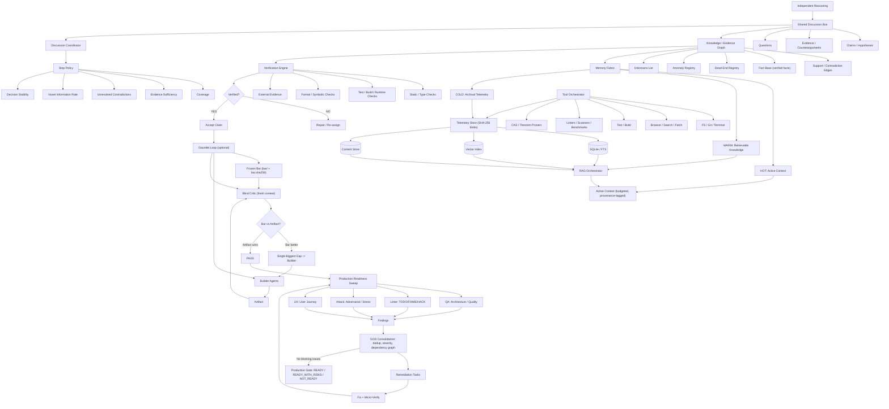

## 4. Entry and Configuration

4.1 CF MUST support two entry paths from the same harness invocation: standard single-agent execution and enhanced orchestration. The enhanced path MUST be explicit in configuration; absence of enhanced configuration MUST NOT change standard behavior.

4.2 Configuration is declarative and validated at load time. An invalid configuration MUST fail fast with a diagnostic that names the offending field.

4.3 Configurable dimensions:

- **Mode:** `PLAN`, `BUILD`, `DEBUG`. Mode influences discussion limits, tool grants, and verification strictness.
- **Discussion Policy:** `TIME_LIMIT`, `TURN_LIMIT`, `UNTIL_CONTEXT_CLEAR`, `UNTIL_DECISION_READY`, `MANUAL`. `UNTIL_CONTEXT_CLEAR` MUST be defined as convergence (Section 8.3), not a fixed turn count.
- **Verification Policy:** `NORMAL`, `STRICT`, `ADVERSARIAL`, `FORMAL`.
- **Budget Policy:** token, time, cost, and concurrency ceilings. Every run MUST have at least one budget ceiling.
- **Agent Tree Policy:** `maxAgents`, `maxDepth`, `maxChildren`, `maxParallel`, cancellation semantics.
- **Provider / Model Configuration:** list of providers with credentials and model inventories (Section 5).
- **Skill Policy:** allowlists, discovery toggle, fetch caps, repository globs.
- **Tool / Security Policy:** per-tool grants, filesystem scope, egress rules.

4.4 Example configuration shape:

```yaml
cf:
  enabled: true
  mode: BUILD
  discussion: UNTIL_CONTEXT_CLEAR
  verification: STRICT
  budgets:
    tokens: 500000
    timeMs: 600000
    costUsd: 20
    concurrency: 8
  agentTree:
    maxAgents: 32
    maxDepth: 3
    maxChildren: 4
    maxParallel: 8
  providers:
    - name: provider-a
      credentials:
        - id: cred-a1
          models: [model-alpha, model-beta]
        - id: cred-a2
          models: [model-alpha]
    - name: provider-b
      credentials:
        - id: cred-b1
          models: [model-gamma]
  skills:
    discovery: true
    maxFetchesPerRun: 3
    allowRepos: ["org/*"]
```

## 5. Provider, Credential, Model, and Instance Abstraction

5.1 Providers, credentials, models, and instances MUST be modeled as four distinct entities. Credentials are access resources; models are selectable capabilities; instances are concurrent runtime workers.

5.2 The following combinations MUST be valid:

- One credential maps to many models.
- Many credentials map to one model name (via different providers).
- One model maps to many concurrent instances.

5.3 The scheduler MUST enforce provider-declared limits (requests per minute, tokens per minute, concurrency, cost). Limits MUST be treated as configuration, not hard-coded constants.

5.4 Instance identity MUST be independent of model identity. Telemetry, claim provenance, and correlation-risk scoring MUST record both `modelId` and `instanceId`.

## 6. GOD Runtime

6.1 GOD is the sole control plane for cross-agent coordination. GOD MUST NOT be implemented as a peer agent; it is a runtime composed of cooperating managers.

6.2 Required GOD components:

- **Global State Manager:** owns objectives, tasks, context, evidence graph, and conflict flags.
- **Model / Agent Router:** applies 2-stage routing (Section 7).
- **Global Scheduler:** enforces budgets, parallelism, backoff, retry, and fallback.
- **Discussion Coordinator:** routes bus messages, enforces discussion policy, detects convergence.
- **Arbiter / Judge:** resolves conflicting critic judgments via decisive tests or ensemble.
- **Verification Engine:** runs static, runtime, formal, and external checks.
- **Policy Engine:** enforces termination, security, and cost policies.
- **Agent Tree Manager:** tracks parent-child relationships, spawn rules, depth, and cancellation.
- **Skill Manager:** owns the global skill catalog and lazy activation.
- **Memory / Context Manager:** interfaces with the memory fabric and RAG retrieval.
- **Telemetry Manager:** writes every event to content-addressed storage and indexes.
- **Tool Orchestrator:** dispatches tool calls under policy.
- **Audit / Replay Manager:** supports step replay and provenance tracing.

6.3 GOD core loop:

1. **Understand:** normalize goal, requirements, constraints, user intent, and existing repository state into an Initial Context.
2. **Observe:** detect anomalies, contradictions, missing information, edge cases, suspicious premises; write to the Anomaly Registry.
3. **Decompose:** produce a Task Dependency Graph with explicit dependencies and provenance per task.
4. **Route and Dispatch:** assign tasks to eligible model instances via the router.
5. **Collect and Coordinate Discussion:** gather claims and evidence on the bus until the stop policy fires.
6. **Verify:** demand evidence, assign adversarial checks, and collect verification results.
7. **Decide or Repair:** accept, reject, or send back for repair; optionally run Gauntlet and Production Sweep.
8. **Finalize:** emit a final report with provenance.

6.4 GOD directive prompts MUST be explicit, evidence-demanding, and traceable. Examples: demand proof for a claim, split a task, assign a verifier, or reassign a subtask to a better-fit model.

## 7. Routing — Two-Stage Logic

7.1 Routing MUST be two-stage. A single weighted sum MUST NOT be the primary router.

### 7.1 Stage 1 — Eligibility (filter)

A model instance is eligible only if it satisfies all of:

- Capability fit (modality, language, task type)
- Context fit (window, file scope)
- Tool fit (required tools declared)
- Provider health (not in backoff)
- Rate limits (not exhausted)
- Permission fit (tool and data grants)
- Availability (reachable)

Ineligible candidates MUST be excluded before scoring. Exclusion reasons MUST be logged.

### 7.2 Stage 2 — Selection (scored)

Among eligible candidates, selection optimizes:

- Expected Value of Information (VOI)
- Historical task-specific performance (empirical outcomes per model and per task type)
- Diversity benefit (preference for uncorrelated reasoning)
- Evidence quality of prior outputs
- Minus latency
- Minus cost
- Minus correlation risk (penalty for same-model or same-family over-representation)

Diversity benefit and correlation risk are mandatory terms. Eight correlated instances MUST NOT be scored as eight independent opinions.

### 7.3 Focused Diagram — Two-Stage Routing

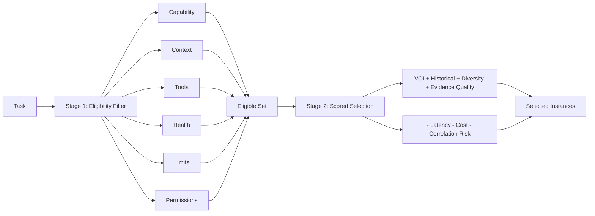

### 7.4 Learning Loop

The router MUST record per-task outcomes and update historical performance. Routing therefore improves empirically over time rather than relying on fixed priors such as "model X is good at coding."

### 7.5 Cost Character

Cost is not linear in instance count. CF SHOULD implement cheap exploration, selective escalation, and expensive verification. Example: N fast instances explore, K promising hypotheses escalate, one strong verifier decides.

## 8. Discussion Bus

8.1 The bus is the single shared channel for claims, hypotheses, assumptions, proposals, evidence, counterarguments, and questions. Every bus utterance MUST become a node in the knowledge graph.

8.2 Agents MUST reason independently first, then publish to the bus. Agents MUST NOT see other agents' private chains before independent reasoning completes.

8.3 Stop policy — `UNTIL_CONTEXT_CLEAR` is defined by convergence signals:

- Model coverage (fraction of subtopics addressed)
- Evidence sufficiency per claim
- Count of unresolved contradictions
- Novel-information rate (new claims per round)
- Decision stability

Example convergence: 14 new claims in round 1, 6 in round 2, 1 in round 3, 0 in round 4 implies stabilization. GOD MUST declare stabilization only when all configured convergence metrics satisfy thresholds for N consecutive turns.

8.4 GOD monitors the bus, intervenes to request challenges or formalization, and enforces turn and time limits. A run MUST NOT busy-loop on the bus; every waiting path MUST have a timeout and a budget check.

## 9. Memory Fabric — HOT / WARM / COLD

9.1 The memory fabric is tiered:

- **HOT (Active Context):** The budgeted, structured context injected into the current agent turn. MUST include provenance pointers per item and MUST respect a token budget.
- **WARM (Retrievable Knowledge):** The claim/evidence graph, fact base, dead-end registry, anomaly registry, and unknowns. Kept indexed for retrieval.
- **COLD (Archival Telemetry):** Append-only archive of every prompt, response, tool output, decision, skill load, and verification result.

9.2 Content addressing: every stored artifact MUST be hashed with SHA-256 at archival time. Hashes are the canonical IDs for deduplication, integrity, and provenance.

9.3 Indexing: SQLite (with FTS) for structured and full-text queries, a vector index for semantic similarity, and a content store for blobs. The RAG orchestrator queries all indices and returns ranked, compacted context.

### 9.1 Focused Diagram — Memory Fabric

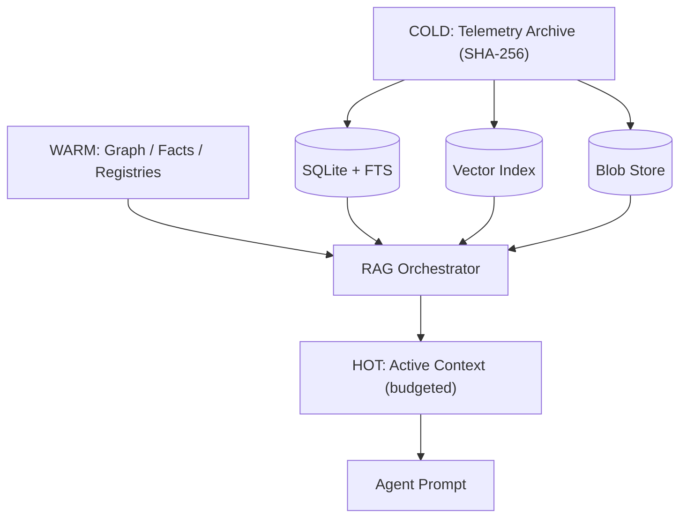

9.4 Context compaction algorithm:

1. Gather candidates related to the current task via vector similarity, FTS, recency, and graph reachability.
2. Provenance-check each candidate (source, freshness, hash).
3. Prune items not connected to the current task graph or discussion.
4. Enforce token budget by priority: recency and confidence first; deduplicate near-duplicates.
5. Structure output as keyed, provenance-tagged chunks (not raw transcript dumps).

### 9.2 Content-Addressed Storage Layout

- Blobs at `blobs/sha256/<hex>`.
- Index files or SQLite tables for `hash -> object`, `file -> hash`, `claim -> evidence`, `task -> agents/claims`, `agent -> skills`.
- Telemetry DB tables at minimum: `runs`, `agents`, `tasks`, `messages`, `claims`, `evidence`, `claims_evidence`, `skills`, `errors`, `provenance`, `knowledge_graph`.

## 10. Skill Framework

10.1 Skills are capability packages indexed in a Global Skill Registry. Each skill MUST declare:

- `id`, `description`, `version`, `capabilities`, `tools`, `dependencies`, `loadCommand`, `contextInjection`, `unloadPolicy`, content hash.

10.2 Skill manifest example:

```json
{
  "id": "browser-test",
  "description": "Automate browser for UI testing",
  "version": "1.0.0",
  "capabilities": ["screenshot", "click", "inspect"],
  "tools": ["chromedriver", "selenium"],
  "dependencies": ["nodejs>=22"],
  "loadCommand": "npm install browser-test-skill@1.0.0",
  "contextInjection": "const browser = require('browser-test');",
  "unloadPolicy": "unload after 10m idle"
}
```

10.3 Lifecycle: agents request skills; GOD approves under policy and budget; the skill's instructions and tool bindings are appended to the agent-local context only when needed. If no agent uses a skill for N idle minutes or the scheduler evicts it, the context is removed. All loads and unloads MUST be logged in telemetry.

10.4 Resource limits: the number of concurrently active skills MAY be capped. Eviction SHOULD consider recency and predicted need.

### 10.1 GitHub Auto-Discovery and Trust Gate

10.5 When a skill request is a local miss (no entry in the registry), the Skill Manager MAY fall back to GitHub discovery. Discovery MUST be gated; remote skills carry zero authority until they pass the trust gate.

10.6 Discovery pipeline:

1. **Search:** query GitHub for skill repositories via topic filters, manifest search, and code search for `SKILL.md` or `skill.json`. Transport is provided by the web search/fetch capability. All search results are untrusted input.
2. **Rank:** order candidates by community signal (stars, recency), license compatibility, declared tool and permission surface, and estimated task fit.
3. **Vet (mandatory trust gate):** validate manifest schema, scan skill text for prompt-injection and exfiltration patterns, and review every declared tool against the session's tool policy. Vetting runs isolated with no workspace write access.
4. **Fetch and cache:** approved sources are downloaded once into the SHA-256 content-addressed store with provenance (repo, commit SHA, license, hash).
5. **Activate and learn:** the skill enters the normal lazy-load path; its downstream effectiveness feeds outcome-based ranking for future discovery.

10.7 Policies:

- Quarantine by default. Rejection MUST be logged loudly to memory and telemetry; a missing skill MUST NOT be silently skipped.
- Configuration MUST expose discovery on/off, allowed and denied repository globs, and a per-run cap on fetches.
- Fetched skills MUST be pinned by commit SHA for reproducibility and audit replay.

### 10.2 Focused Diagram — Skill Discovery Trust Gate

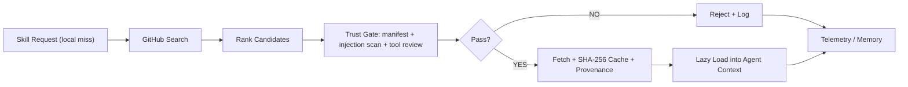

## 11. Verification

11.1 No claim is accepted without evidence. Every claim MUST cite evidence or provenance (tool output hash, file hash, citation, or test result).

11.2 Verification layers (all outputs feed telemetry and the knowledge graph):

- Unit and integration tests
- Static and type analysis
- Build and runtime checks
- Formal and symbolic checks (theorem provers, CAS) for high-value claims

11.3 Proof lifecycle (for research and mathematical tasks):

1. Propose proof candidate.
2. Decompose into lemmas and subclaims.
3. Independent reconstruction by other agents; counterexample search.
4. Formal verification of key lemmas where applicable.
5. Adversarial attack by a designated red team.
6. Repair loop on flaw; acceptance only when no counterexample survives.

### 11.1 Honesty and Accountability Protocol

11.4 All agents MUST follow:

- Never fabricate sources, tool outputs, or evidence.
- State uncertainty explicitly when confidence is below threshold.
- Never invent a tool result; every tool result MUST be provenance-tagged.
- Own failures without blame; route or fix the root cause.
- Make every claim traceable to an agent, task, and content hash.

11.5 Structured claim format (required when emitting claims):

```markdown
**Claim:** <text>
**Evidence:** <hashes or citations>
**Source:** <file or URL>
**Assumptions:** <explicit assumptions>
**Confidence:** <0-100%>
```

### 11.2 No-Blame Failure Lifecycle

1. Acknowledge error (no blame).
2. Reproduce with logging.
3. Localize the change or condition.
4. Determine root cause (own change, peer change, pre-existing).
5. Act (fix, or create a task for the owning agent).
6. Verify via micro-loop (lint, typecheck, focused tests, build).

### 11.3 Immediate Micro-Loop

Every code or operation edit MUST trigger a short verification loop (lint, typecheck, focused tests, build) before the change is considered done. Failures MUST follow the failure lifecycle above.

## 12. Gauntlet Loop

12.1 Gauntlet is an optional quality policy that gates progress on a frozen bar. It MUST NOT grade against a rubric; it compares artifacts blind against a real reference.

12.2 Bar requirements (all three MUST hold):

- **Named:** a specific thing, not a category. Example: screenshots from a named shipped title at a fixed camera angle, a live best-in-class product page at a fixed viewport, a specific published piece, a named repository plus its benchmark suite.
- **Fetchable:** the critic can actually obtain it. The bar MUST be materialized on disk before round one (download, clone, screenshot, or failing test suite) and frozen under `bar/` with `bar.sha256`. Critics judge the frozen snapshot; re-fetching mid-run is a new run with a new run ID.
- **Comparable:** both artifacts can sit side by side and a judge can pick one. If A/B comparison is not imaginable, the bar is invalid.

12.3 Loop:

1. Set bar and budget.
2. Split goal into smallest independently gradable units (lead). Independent units MAY run as parallel loops.
3. Build real artifacts in clean, isolated contexts.
4. Critique with a fresh, blind critic per round (a critic that saw a previous draft MUST NOT grade the retry). Forced binary pick against the bar; name the single biggest remaining gap.
5. Fix and repeat. No fixed round cap; exit only when the artifact ties or wins, or the user stops. Human approval gates outrank the loop; the loop MUST NOT self-approve a sign-off.

### 12.1 Focused Diagram — Gauntlet

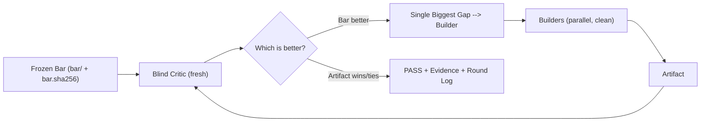

## 13. Production Readiness Sweep

13.1 When the run is production-near (post-Gauntlet or post-build convergence), CF MUST run a four-agent parallel sweep:

- **QA:** architecture, best practices, documentation, interfaces.
- **Annotation Linter:** `TODO`, `FIXME`, `HACK`, disabled paths, skeleton code.
- **Attack / Stress:** edge cases, race conditions, failure modes, security probes.
- **UX:** real user journeys, confusion, missing functionality.

13.2 Consolidation: GOD MUST deduplicate findings, correlate root causes, severity-rank issues, and build a remediation dependency graph (some fixes block others).

13.3 Remediation: assign fixes, run micro-verification per fix, then repeat the sweep with fresh agents. The loop continues until no blocking issues remain.

13.4 Production gate:

- **READY:** all critical and high issues resolved, automated tests pass, security and policy checks pass, performance targets met, major decisions verified, known limitations documented.
- **READY_WITH_RISKS:** only minor issues remain; limitations are explicitly documented.
- **NOT_READY:** any blocking issue remains.

### 13.1 Focused Diagram — Production Sweep

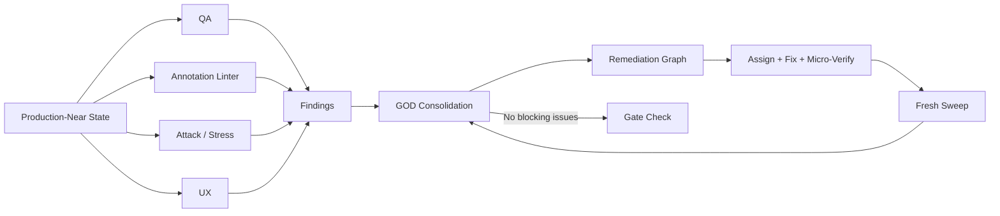

## 14. Data Flows

### 14.1 Overall System

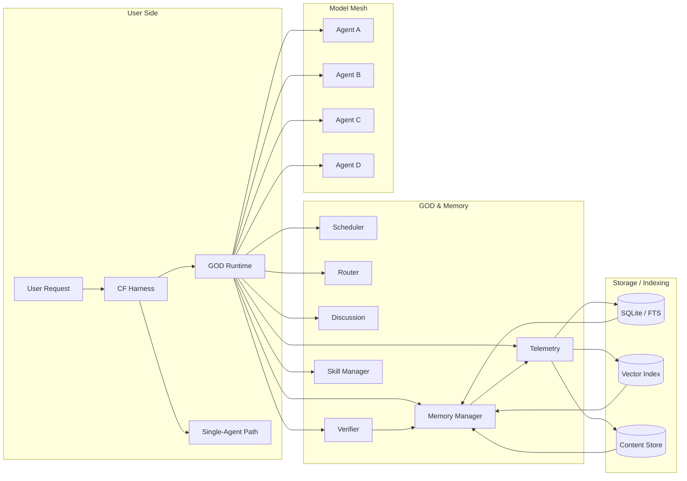

### 14.2 Information Flow

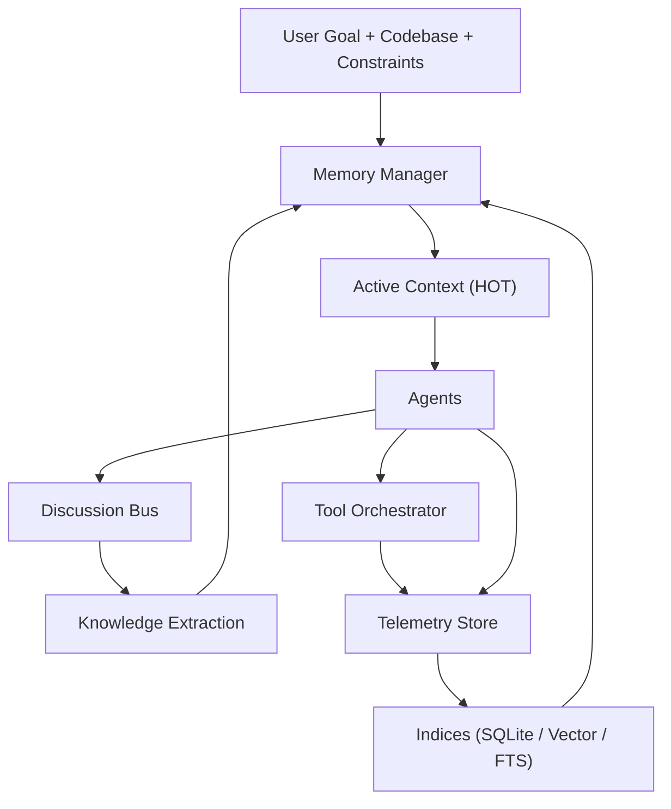

### 14.3 Agent Lifecycle (Sub-Agent Tree)

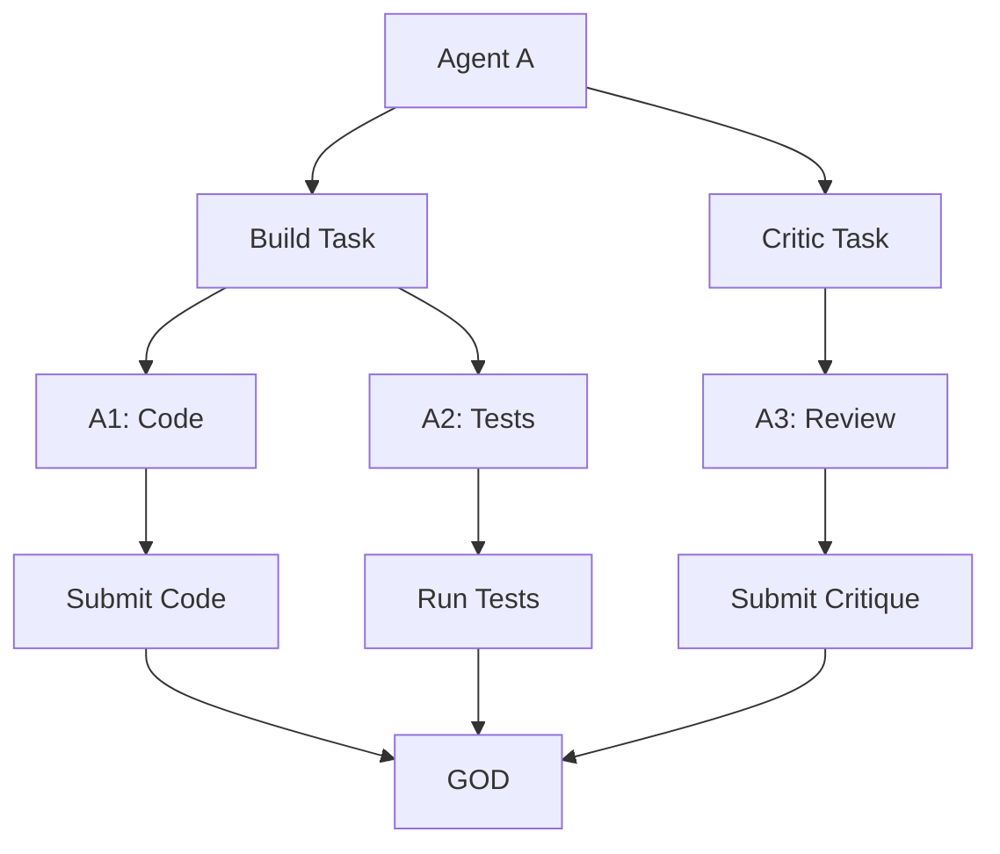

### 14.4 Storage and Indexing

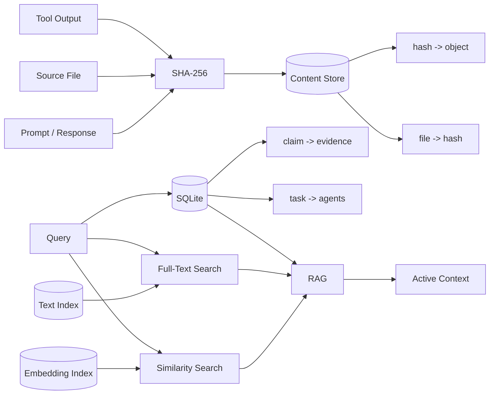

## 15. Interfaces (TypeScript-like)

Interfaces are normative for in-process boundaries. Implementations MAY add fields but MUST NOT remove required fields.

```ts
interface GodRuntime {
  initializeTask(spec: TaskSpecification): Promise<void>;
  decomposeTask(): Promise<TaskGraph>;
  routeTask(taskId: string): Promise<ModelAssignment[]>;
  recordClaim(claim: Claim): void;
  checkProgress(): VerificationStatus;
  cancelRun(reason: string): void;
  finalize(): FinalReport;
}

interface ModelAssignment {
  modelInstance: ModelInstance;
  role: string; // builder, critic, arbiter, red-team, smoother
  taskId: string;
}

interface Router {
  scoreModel(task: Task, model: ModelInstance): number;
  selectModels(task: Task, models: ModelInstance[]): ModelInstance[];
}

interface Scheduler {
  reserveResources(agentCount: number, tokens: number): boolean;
  releaseResources(agentId: string): void;
  handleFailure(agentId: string, reason: FailureReason): void;
}

interface SkillManager {
  loadSkill(agentId: string, skillName: string): Promise<void>;
  unloadSkill(agentId: string, skillName: string): Promise<void>;
  listSkills(): string[];
}

interface MemoryManager {
  retrieveContext(query: QuerySpec, options: RetrieveOptions): ContextChunk[];
  addEvidence(evidence: Evidence): void;
  addClaim(claim: Claim): void;
  listOpenIssues(): Issue[];
}

interface TelemetryStore {
  logEvent(event: TelemetryEvent): void;
  queryEvents(filter: TelemetryFilter): TelemetryEvent[];
  getBlob(hash: string): Blob;
}

interface Verifier {
  runStaticAnalysis(code: string): AnalysisResult;
  runFormalCheck(claim: Claim): FormalResult;
  runTests(suite: TestSuite): TestResults;
}

interface AuditManager {
  replayRun(runId: string): ReplaySession;
  traceProvenance(itemHash: string): ProvenanceChain;
}

interface Agent {
  onTask(task: Task, context: ActiveContext): Promise<AgentResponse>;
  onDirective(directive: GodDirective): Promise<void>;
}

interface ProofManager {
  proposeProof(agentId: string, proof: ProofCandidate): string;
  checkProof(proofId: string): Promise<VerificationStatus>;
  attackLemma(proofId: string, lemmaId: string): Counterexample | null;
  repairProof(proofId: string, fix: FixDelta): void;
}
```

## 16. Configuration and Policies

16.1 Defaulting MUST be explicit: a `resolve(request): Spec` step in the owning implementation resolves defaults. No `?? default` inside `run()`.

16.2 Deployment-varying tunables (budgets, limits, thresholds) MUST be validated Config fields changeable from configuration. Protocol constants and security invariants remain fixed.

16.3 Misconfiguration MUST fail loud at load time when self-contained, otherwise at the earliest resolvable point. Silent skipping of a missing referent is forbidden.

## 17. Provenance and Telemetry

17.1 Every knowledge-graph item MUST carry:

- Source (agent ID or external source)
- Timestamp and round
- Content hash for quoted text or evidence
- Revision links when a claim supersedes a prior claim

17.2 At least the following tables MUST exist: `runs`, `agents`, `tasks`, `messages`, `claims`, `evidence`, `claims_evidence`, `skills`, `errors`, `provenance`, `knowledge_graph`, `events`.

17.3 Replay MUST be deterministic given stored hashes and frozen bars. Each turn, tool call, and decision MUST be re-instantiable from the log.

## 18. Roadmap (MVP to Full)

1. Core engine: GOD, scheduler, router, discussion, telemetry with SQLite.
2. Model adapter: at least two providers to exercise multi-model and multi-instance paths.
3. Basic multi-agent flow: N parallel agents with a shared in-memory bus.
4. Context retrieval: RAG with vector search plus SQLite/FTS.
5. Tool interface: filesystem, git, terminal, web search/fetch, test/build stubs.
6. Honesty enforcement: evidence-typed prompts and full logging.
7. Micro-loop: lint, typecheck, focused tests, build on every edit.
8. Gauntlet mode: bar freezing, builder/critic prompts, round log.
9. Production sweep: four-agent sweep, consolidation, remediation graph.
10. UI and log viewer over telemetry; then incremental skills (e.g., formal methods, domain-specific toolchains).

The system MUST remain extensible: new skills and verification backends are added via the skill framework without changing the GOD runtime contract.

## 19. Risks and Mitigations

| Risk Category | Priority | Mitigation |
|---|:---:|---|
| Tool misuse and sandbox escape | High | Sandboxing, allowlists, egress proxy, no workspace writes during vetting, input sanitization |
| Runaway or looping agents | High | Hard caps on depth, breadth, and parallelism; per-agent timeouts; watchdog timers; cancellation tokens |
| Correlated hallucinations | High | Anti-consensus checks, heterogeneous model mix, mandatory diversity terms in routing, independent verification |
| Cost overrun | Medium | Pre-declared budgets, cost-aware routing, early abort, cheap-explore then escalate |
| Scheduling starvation | Medium | Fair queuing, respect per-provider concurrency caps, backoff and reassignment |
| Provider outage | Medium | Retry with backoff, fallback to alternate provider/model, at-least-two candidates per role |
| Data privacy and leakage | Low | Redaction of secrets from prompts, encrypted transport, minimal context, private-model option for sensitive tasks |
| Auditability gaps | Medium | Complete append-only log, SHA-256 addressing, frozen bars, provenance on every artifact |

## 20. Prompt Templates (Normative Slots)

**Planner (Lead):**
```
Goal: [USER GOAL].
Break this goal into independent subtasks that can be solved and evaluated separately.
Then distribute those tasks to agents suited for them.
Do not start solving yet; first list the subtasks with clear success criteria.
```

**Builder:**
```
Task: [TASK DESCRIPTION]
Your job: produce [ARTIFACT], within constraints [CONSTRAINTS].
You may use tools [LIST] and your skill [SKILL].
After producing an initial solution, do NOT self-evaluate its quality.
```

**Blind Critic:**
```
Compare artifacts A and B for [GOAL].
You see only A vs B outputs (blind). You MUST choose which is better with objective criteria.
List the most significant differences and whether A or B passes the target standard.
This is a binary A/B; state which wins and why.
```

**Arbiter:**
```
Two critics disagree: Critic 1 chose A, Critic 2 chose B.
Re-run the most critical test that caused disagreement and announce which artifact satisfies the bar.
Explain your evidence-based decision.
```

## 21. Worked Example (Normative Flow)

User: "getUserData sometimes returns stale cache values after an update. Why?"

1. GOD creates a task and dispatches independent investigators with distinct framings.
2. Claims appear: race condition on cache access versus missing invalidation; each with provenance and an initial evidence pointer.
3. GOD assigns validators: one challenges each dominant claim with an independent method and a targeted reproduction test.
4. Evidence that survives contradiction (e.g., lack of atomicity in the cache structure) gains verification status; contradicted claims are rejected; dead ends are recorded.
5. GOD emits a fix with confidence and an audit entry that cites supporting evidence hashes and rejected alternatives.

This flow MUST be reproducible from the log and MUST show competing claims and adversarial checks, not mere majority voting.

## 22. Normative References

- Runtime composition via Cordis-style effects and registries (effects are the only registration path; typed events use declaration merging; waterfall listeners delegate via `next()`).
- Content addressing uses SHA-256.
- Persistence uses SQLite with FTS and a vector index (e.g., FAISS) for MVP; managed alternatives are deployment choices.

---

*End of CodeFusion normative specification.*
